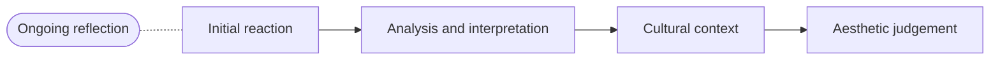

# AVI1O — independent adversarial re-review, 2026-08-20

**Why this exists.** AVI1O had a Growing Success conformance pass and an
independent review; the fix round was interrupted and the findings were lost
with the conversation. Commit `56a7e6f4` claims "the confirmed findings are
applied" and nothing on disk can check that claim. This is a review of the
CURRENT state from scratch, by a reviewer who never saw the old findings.

**Verdict in one line.** This is the most carefully built payload I have
reviewed in this sweep — all nine triangulation blocks tell the truth about
their days, every counted claim I could count is right, and the Growing
Success prohibitions are honoured without a single exception. What it has
instead is one defect class, run four times: **the last thing the course
does is the one thing it does not finish.** The Exhibition, the artist
statement, the final evaluation and the "cultural context" stage each get
the treatment every earlier item got, minus one leg.

---

## The question I was asked first: did the dance wording get in?

**No. Answered, closed.** All nine overall-expectation pages in
`shared/Curriculum/` carry the correct AVI1O text from *The Ontario
Curriculum, Grades 9 and 10: The Arts* (2010), pp. 119–125. Checked
word by word against the Ministry text and side by side against ATC1O's
files, which are the plausible contaminant:

| Page | AVI1O now reads | ATC1O reads |
|---|---|---|
| `A1. The Creative Process.md` | "apply the creative process to create a variety of art works, individually and/or collaboratively;" | "use the creative process, the elements of dance, and a variety of sources to develop movement vocabulary;" |
| `B1. The Critical Analysis Process.md` | "demonstrate an understanding of the critical analysis process by examining, interpreting, evaluating, and reflecting on various art works;" | "use the critical analysis process to reflect on and evaluate their own and others' dance works and activities;" |
| `C3. Responsible Practices.md` | "demonstrate an understanding of responsible practices related to visual arts." | "demonstrate an understanding of safe, ethical, and responsible personal and interpersonal practices in dance activities." |

The word "dance" appears **zero** times anywhere in the AVI1O payload —
the only three case-insensitive hits in the whole tree are inside
"guidance" (twice) and "abundance". The other six overall pages —
`A2. The Elements and Principles of Design`, `A3. Production and
Presentation`, `B2. Art, Society, and Values`, `B3. Connections Beyond the
Classroom`, `C1. Terminology`, `C2. Conventions and Techniques` — are
correct AVI1O text and do not even share a *title* with ATC1O, whose
strand A has four overalls with different names. All 26 specific
expectations are also verbatim-correct, including the italic Ministry
examples.

Worth saying plainly, because it is the strongest single page in the
payload: `shared/Curriculum/About These Expectations.md` documents two
typographical errors in the source and reproduces them deliberately
("`C1.1` prints 'Eva Hess's' where the artist is Eva Hesse"), and
documents that the 2010 document prints **two conflicting
elements-and-principles lists** and states which one this course follows.
That is the correct handling and I would not touch it.

---

## Mechanical gates at time of review (they pass, and they prove little)

```
201 pages checked; 86 class pages
coverage: 26/26 expectations addressed; 0 addressed exactly once
note     no class links shared/Setup/Getting Help.md ...
note     no class links shared/Style/How This Site Is Organised.md ...
note     no class links shared/Style/What This Site Can Do.md ...
note     no class links shared/Tutorials/Scavenger Hunt.md ...
clean
```

Scripted checks I ran, so the next reviewer does not repeat them. Every
search flattened whitespace first, so a zero here is real absence, not a
line wrap. Every filename loop iterated over files rather than piping
through `xargs`.

- No `[[wikilink]]` or `![[transclusion]]` inside any `%%` block —
  **0 hits** across 201 files.
- Agendas numbered 1..N with no gaps — **0 violations** across 86 class
  pages.
- `_DUPLICATE ME.md` guidance comment OUTSIDE the curriculum markers —
  **7 of 7 correct** (addendum #16 satisfied). Curriculum, Setup and Style
  have no `_DUPLICATE ME.md`, which matches ADA1O and ICS3U.
- **No sentence is shared between any two triangulation blocks, or with
  any ICS3U block**, except the mandated header line and one 11-word
  `Record:` instruction that appears in two blocks. No copy-paste
  boilerplate, and no synonym boilerplate either — see the "found
  nothing" section.
- **All 26 specific expectations are transcluded by a page in
  `shared/Tasks/`.** Addendum #4's coverage-map lie is structurally
  impossible here. Thirty-seven non-`Tasks/` content pages also carry
  curriculum blocks; every code on them has a `Tasks/` home as well.
- No "participation", "punctuality", "professionalism", "attitude",
  "effort", "group mark", "late penalty" or "attendance" anywhere in the
  payload's mark language.
- ~80-column wrap and no H1 outside the standard `per_section/index.md`
  banner: **one** body line over 82 characters
  (`per_section/All Classes/Unit 1, Day 1.md:21`, 85 chars). Everything
  else long is shared boilerplate (`_DUPLICATE ME.md`, `Scavenger
  Hunt.md`) or verbatim Ministry text, neither of which is AVI1O's to fix.
- Every folder index lists every page in its folder, exactly once. (The
  Tutorials index omits `Scavenger Hunt` — see "do not over-correct".
  `Techniques/index.md` links `Materials and Safety` twice, but once is
  in the blurb's prose — "read [[Materials and Safety]] before any of
  them" — and once in the Unit 1 list, which is not a duplicate listing.)
- Every "next class" / "tomorrow" reference checks out against the real
  next class. **0 violations** (addendum #8 clean).

---

## CONFIRMED

**Fix round applied 2026-08-20, same day.** Every finding below carries a
status line: APPLIED, REJECTED with the reason, or DEFERRED with the
reason. The fix round's own adversarial pass is recorded at the end of
this file. `shared/Curriculum/` was not touched.

### 1. The Exhibition runs for eight periods, carries five criteria rows, and has no feedback checkpoint of any kind

> **APPLIED.** `Unit 4, Day 16` item 1 now reads "Period 5 of 8: curating,
> and each of you takes a wall or a bay — conferences on your plan and
> your statement as I come round", and `Unit 4, Day 17` item 1 reads
> "Period 6 of 8: installation, starting from what the conference sent you
> back to". That is the checkpoint-and-landing shape the other six use,
> named on the receiving day's agenda, with no new period and no new
> agenda item. The checkpoint is also visible to students on the task
> page: period 5 of the table now says "and a conference with me at your
> own wall, on the plan and on your statement", and period 6 says "acting
> on what the conference said". The conference covers the statement as
> well as the wall because the statement's only landing before this was a
> homework checkbox. `Unit 4, Day 12` item 1 was left alone, as the
> over-correction note says.

This is the most serious finding in the file, and it is a promise broken
on the page a student opens to find out how they are judged.

`shared/Setup/How Marks Work.md`:

> On every task you hand in during the semester there is a critique or a
> conference that looks at the work while it is still unfinished, and at
> least one working period after it and before the due date whose job is
> acting on what you heard.

`The Exhibition` is one of the eight tasks that sentence covers — it is
named in the same page's list of the seventy. Its run is `Unit 4, Day 12`
to `Day 19`. I searched all eight of those agendas, whitespace flattened,
for `conference`, `critique`, `feedback`, `acting on`, `revis`. The
complete result is **one line**, `per_section/All Classes/Unit 4, Day 15.md`:

> 3. Workshopping statements in pairs

That is a peer workshop on one of six deliverables, and the period that
acts on it is a homework checkbox on the same page —

> - [ ] Redraft your statement.

— not a class period. There is no teacher conference and no critique
anywhere in the eight periods, and none of the four scheduled
`Judging Your Own Work` episodes (`U1 D12`, `U2 D15`, `U3 D7`, `U4 D8`)
falls inside the Exhibition's run either. So the task gets no peer ruling
against its criteria table, no teacher ruling, and no self-ruling.

**This is the "half a job" shape exactly.** Six of the eight tasks do it
perfectly, and — the harder half of addendum #5 — every one of them names
the landing on the RECEIVING day's agenda, not just on the checkpoint day:

| Task | Checkpoint | Landing period, quoted from the receiving agenda |
|---|---|---|
| The Elements Study | `U1 D13` critique | `U1 D14` — "What the critique said, written into the sketchbook here — then studio time acting on it" |
| The Sketchbook Habit | `U1 D18` check | `U1 D18` — "Studio time, with the book open at whatever the check flagged" |
| The Information Piece | `U2 D15` mid-point critique | `U2 D16` — "Studio time: acting on the mid-point critique" |
| The Interpretation | `U3 D6` peer reading | `U3 D7` — "Studio time: acting on the peer reading and on your own judgement" |
| Art and Society Study | `U3 D11` conferences | `U3 D12` — "Acting on the conferences: the presentation and your half-page reworked" |
| The Body of Work | `U4 D8` critique | `U4 D9` — "Studio time: finishing, and acting on the critique" |
| **The Media Trials** | `U2 D7` conferences | **none — see finding 2** |
| **The Exhibition** | **none** | **none** |

Seven pairs written to a standard most payloads never reach, and then the
culminating task gets none of it.

**Smallest correct fix**: `Unit 4, Day 16` (period 5, curating) already
has the teacher walking the room while each student takes a wall; adding
"Conferences on your wall as I come round" there, and naming it on
`Unit 4, Day 17` ("Installation — start with what yesterday's conference
said about your grouping"), writes the leg with no new period. Do not fix
it by softening the sentence on `How Marks Work` to "on most tasks": the
Exhibition is the one where a student most needs to hear it wrong early,
because by period 6 the work is on a wall and unfixable.

**Where a fixer might over-correct**: `Unit 4, Day 12` item 1 is
"Exhibition period 1 of 8: selection defended", and it is arguable that
this is the critique. It is not — the thing defended (which works you
chose) is not on the criteria table at all (finding 3), the task's own
hidden block says that item is chaired and unusable
(`shared/Tasks/The Exhibition.md`: "NOT the selections item — that one is
chaired and the room is listening"), and nothing on `Day 13` names acting
on it.

### 2. The Media Trials has two conferences and no period whose job is acting on them

> **APPLIED, on a different day from the one suggested.** `Unit 2, Day 8`
> item 3 now reads "Studio time: a maquette, with the press open for
> anyone acting on the printmaking conferences" — Day 8 rather than Day 10
> because
> all six of the pairs this payload already writes land on the VERY NEXT
> class (`U1 D13`→`D14`, `U2 D15`→`D16`, `U3 D6`→`D7`, `U3 D11`→`D12`,
> `U4 D8`→`D9`), and copying the shape means copying that. Day 10's last
> fifteen minutes was already carrying the digital annotation and the
> Unit 1 mark-making; a third errand in the same quarter-hour would have
> been addendum #6. Day 8's studio period is fifty minutes and a re-cut
> block wants the press, which is still set up from Day 6.

The sibling instance of finding 1, and the reason to call this a class of
defect rather than one slip.

`shared/Tasks/The Media Trials.md` is launched on `Unit 2, Day 3` and its
own block says "The product evidence is the annotated trials, handed in on
Unit 2, Day 11." The conferences in that window are:

- `Unit 2, Day 3` — "Studio time: the same subject painted a second time,
  differently, **with conferences as I come round**"
- `Unit 2, Day 7` — "3. Conferences"

`Unit 2, Day 7` is the printmaking second state. The three periods that
follow it before the hand-in are:

- `Day 8` — "Three dimensions: [[Sculpture]] / Additive and subtractive;
  armatures and balance / Studio time: a maquette"
- `Day 9` — "Studio time: sculpture / Working around a form / Last fifteen
  minutes: the sculpture trial annotated"
- `Day 10` — "Digital and photographic work / Layers / Studio time: the
  digital trial; last fifteen minutes annotating it, and your Unit 1
  mark-making brought up to trial standard"

Every one is a new medium. Nothing returns to the print, and no agenda
item in the task's nine-period run contains the words "acting on". A
student who is told on Day 7 that their second state did not read has no
period in which to cut a third.

**Smallest correct fix**: `Day 10`'s last fifteen minutes already gather
up the Unit 1 drawing trial; "and anything Day 7's conference sent you
back to" costs nothing and is true to the payload's own "Last fifteen
minutes:" idiom.

### 3. The Exhibition names seven things that carry the mark and publishes a criteria row for four of them

> **APPLIED, two rows as suggested; the third component folded rather than
> given a row.** `shared/Tasks/The Exhibition.md` now opens its table with
> "The selection | You can say why these works and not your other ones,
> and the wall bears the reason out" and carries "The statement | A
> visitor who reads it looks back at the work rather than asking you what
> you meant" — the criterion `Artist Statements.md` already teaches
> ("If they ask what you meant, it is not finished; if they look back at
> the work, it is"). The labels went into the Presentation row instead of
> an eighth row — "…and a correct label beside every piece" — because a
> label is four facts, not a judgement, and the row already governs the
> wall — and A3.2, which this page carries, names labels in its own
> verbatim text ("sign and date and/or number their works and prepare
> appropriate labels for them"), so the clause is the expectation's own
> language rather than an invention. Seven declared components, seven
> rows. Nothing elsewhere quotes
> these rows verbatim; over-correction note 7 was checked, and
> `Judging Your Own Work`'s worked example quotes `The Elements Study`,
> which was not touched.

Addendum #20 in its literal form. `shared/Tasks/The Exhibition.md`:

> In period 5 you take **a wall or a bay of your own**, and that is what
> your mark comes from: the works you chose for it, how you prepared them,
> your labels, your statement, your permissions note, how you hung it, and
> what you can say about those decisions.

The criteria table on the same page, in full:

| Criterion | What it looks like |
| --- | --- |
| Preparation | The work is genuinely ready for an audience |
| Presentation | Your own section reads as a considered wall — height, spacing and sight lines serving the work |
| Audience | You can say who this show is for, and what would have to change to reach a different one |
| Ethics | Sources credited; nothing shown that you do not have the right to show, and your note says what you changed or left out because of it |
| Environment | Materials and waste handled responsibly, and you can say what you changed |

Mapping the seven declared components onto the five rows: *how you
prepared them* → Preparation; *your permissions note* → Ethics; *how you
hung it* → Presentation; *what you can say about those decisions* →
Audience. Three have no row at all:

- **The artist statement.** A whole period (`Unit 4, Day 15`, "Period 4 of
  8: artist statements drafted"), a peer workshop, a homework redraft, its
  own tutorial page (`shared/Tutorials/Artist Statements.md`), and a line
  in "What you deliver" — "**An artist statement** of about 150 words that
  a visitor can read in a minute". No row judges it. This is the sharpest
  of the three: it is the deliverable the course spends the most time on
  inside this task, and a student cannot see what it is judged against or
  appeal the judgement.
- **The selection.** "the works you chose for it" is the first item in the
  mark sentence, and period 1 of 8 is given over to defending it
  (`Unit 4, Day 12`: "selection defended", "Why these works, in this
  order"). No row.
- **The labels.** "**A label** for each piece: title, medium, dimensions,
  year" is a deliverable; the Presentation row judges "height, spacing and
  sight lines", and the warning callout mentions "labels at a readable
  height" — nothing judges whether the label is right.

Note how deliberately the other three deliverables were handled, which is
what makes this a half-done job rather than an oversight: "Three lines on
your audience" → the Audience row; "Your share of the environmental audit"
→ the Environment row; "A permissions and credit note" → the Ethics row.
Someone walked that list and stopped at three.

**Smallest correct fix**: two rows — a statement row ("The statement | A
visitor who reads it looks back at the work rather than asking you what
you meant" — that criterion is already written on `Artist Statements.md`),
and a selection row ("The selection | You can say why these works and not
your other ones, and the wall bears the reason out"). Both already have
their period (Day 15 and Day 12) and their section, so this writes the
missing leg rather than inventing work.

### 4. The thirty per cent is named on exactly one class agenda, at class 85 of 86

> **APPLIED.** `Unit 1, Day 2` item 4 — the item that already hands out
> `Learning Goals` and `How Marks Work` — now also reads "what June
> itself asks for, and why you keep everything:
> [[The Portfolio and Reflection]]". No new agenda item, so the four-item
> day stays a four-item day. The mid-course reminder went on
> `Unit 2, Day 22`, class 42 of 86, whose item 1 was already "What we can
> do now that we could not in September" and now ends "and what
> [[The Portfolio and Reflection]] will ask you to prove in June".

`shared/Tasks/The Portfolio and Reflection.md` is the final evaluation and
30% of the grade. Grepping every class page for its title gives one hit,
`per_section/All Classes/Unit 4, Day 23.md`:

> 3. What the examination period asks for: [[The Portfolio and Reflection]]

`Unit 4, Day 23` is the 85th of 86 class pages. The task's six criteria
rows — including "**Routes** | Four real ones — a course, a program or
job, and two things in this community — named accurately enough that
somebody could act on them" — reach students two classes before the
examination.

The other eight tasks all have a real launch on an agenda: `U1 D2`, `U1
D7`, `U2 D3`, `U2 D12`, `U3 D4`, `U3 D10`, `U4 D1`, `U4 D11`. Eight of
nine, and the ninth is the biggest one.

What makes this more than paperwork is that this task, uniquely, requires
things a student must have been doing since September and cannot
retro-fit:

> - The drawing you made on the first day, before anything was explained
> - The sketchbook, complete
> - Photographs of every finished work
> - ...
> - Critique notes, including feedback you received and what you did about
>   it

and `shared/Portfolios/The Portfolio.md` says so in as many words: "**You
cannot point at what you threw away in November.**" The same page is
itself first named on an agenda at `Unit 4, Day 20` — class 82.

Three of the payload's own sentences are on the wrong side of this:

- `shared/Setup/How Marks Work.md`: "Every task page ends with a table of
  what earns the marks ... **published before you start rather than after
  you finish** ... Read both on **launch day**, not on the due date."
- `shared/Portfolios/index.md`: "This is the final evaluation, so it is
  **built from September** rather than assembled in June."
- `shared/Setup/How This Studio Works.md`: "[[The Portfolio and
  Reflection]] **you have been building since September**."

**Being fair to the payload**: the task is *linked* from Setup pages that
are read on `Unit 1, Day 2` ("how it is all marked: [[How Marks Work]]"),
and the habits it depends on are genuinely built into the arc — critique
notes go into the sketchbook on `U1 D14`, photography is taught on `U1
D15`. So the machinery exists; what is missing is the day a student is
told what it is for.

**Smallest correct fix**: one agenda item on `Unit 1, Day 2`, where
`How Marks Work` is already read — "and what June asks for:
[[The Portfolio and Reflection]], which is why you keep everything" — plus
a mid-course reminder. This is `addendum #9` applied to a final
evaluation, and the fix is a line, not a restructure.

### 5. The course teaches two different four-stage critical analysis processes, and the stage it drops is one it otherwise spends half a unit on

> **APPLIED, by moving the task pages onto the Ministry's four — the
> option this review says to prefer.** The Concepts page was not touched
> except to add a closing pointer; Cultural context is still there, as
> over-correction note 6 requires.
>
> `shared/Tasks/The Interpretation.md`'s "## The four moves, labelled"
> is now "## The four stages, labelled", introduced with "The same four as
> [[The Critical Analysis Process]], with the same names", and the four
> are Initial reaction / Analysis and interpretation / Cultural context /
> Aesthetic judgement. Description was not dropped — it is named inside
> stage 2 ("Description first: what is actually there … and no judgement
> yet. Then how the parts work together…"), which keeps the Description
> first row honest and keeps the discipline the course cares about.
>
> The leg for the new stage already existed and is now named on the
> agenda: `Unit 3, Day 5` item 1 is "Historical work: what changes when
> you know the date" and item 3 now ends "and your work's date, place and
> original purpose looked up here". That went into the CLASS period
> rather than into the homework line, deliberately — see finding 14.
>
> The examination moved too rather than being left as a second list.
> `The Portfolio and Reflection` part one now hands the student the work
> "together with its label — artist, title, date, place, medium" and asks
> for "all four stages under their own names", saying why the label is
> there. `Unit 4, Day 23` item 1 now reads "on an unseen work and its
> label". Without that the third stage would have been unanswerable in a
> silent room — a half-written leg, addendum #21.

`shared/Concepts/The Critical Analysis Process.md` — the page `Unit 3,
Day 1` puts in students' sketchbooks ("[[The Critical Analysis Process]] —
the four moves, labelled in your sketchbook as we use them"):



with a bold paragraph for each, including:

> **Cultural context.** Who made this, when, for whom, and under what
> conditions? Works are not made in a vacuum, and a work that seems
> strange often becomes sensible the moment you know what it was for.

`shared/Tasks/The Interpretation.md`, "## The four moves, labelled":

> 1. **Initial reaction.** ...
> 2. **Description.** ...
> 3. **Analysis and interpretation.** ...
> 4. **Judgement.** Is it effective, and by what standard?

`shared/Tasks/The Portfolio and Reflection.md`, the examination:

> you run the critical analysis process on it in writing: reaction,
> description, analysis and interpretation, judgement.

Two different fours, both called "the four moves". The phrase "cultural
context" appears **nowhere else in the payload** — not on a criteria row,
not on any of the 86 agendas, not in the examination. Meanwhile the stage
is exactly what the second half of Unit 3 is about: `Art and Society
Study` asks "**What does each tell you** about the society that produced
it", `Unit 3, Day 5` is "Historical work: what changes when you know the
date", and `Unit 3, Day 9` is "Sorting works by function rather than by
style".

This matters because **C1.3 is marked** — on `The Sketchbook Habit`, whose
Terminology row reads "The stages of the creative process and of a
critique named with the right terms, and used to say where a page sits" —
and the expectation's verbatim text is "identify the stages of the
creative process **and the critical analysis process** using appropriate
terminology". A student naming four stages has two lists to choose from
and the course does not say which is the right one.

The creative process is handled correctly by contrast:
`shared/Concepts/The Creative Process.md` gives all eight Ministry stages
(Challenge and inspiration → Reflect and evaluate) and `Unit 1, Day 11`
labels them. Only the critical analysis process was flattened.

**Smallest correct fix, and the one to prefer**: on `The Interpretation`,
rename move 3 or insert a fourth so that cultural context is asked for —
`Unit 3, Day 5` already teaches it and the task's work is chosen by the
student, so the leg exists. If instead the simplification is deliberate
(and it is defensible for the examination, which hands students an unseen
work), then say so on `The Critical Analysis Process` — "when you write it
up, cultural context lives inside analysis and interpretation" — rather
than leaving two lists on the site with no relation between them. **Do
not** fix it by deleting the Cultural context stage from the Concepts
page; it is the Ministry's.

### 6. `The Interpretation`'s fourth required move has no criteria row

> **APPLIED.** Two rows added: "Judgement | You say whether the work
> succeeds on its own terms before you say whether you like it" and
> "Context | You find out when, where and for whom the work was made, and
> say what knowing it changed" — the second because finding 5 made
> cultural context a required stage, and a required stage with no row is
> this same defect. The Terminology row now ends "including the names of
> the four stages", which is where C1.3 actually rests.

Same page, smaller. The four moves are the structure of the piece; the
criteria table is:

| Criterion | What it looks like |
| --- | --- |
| Description first | Evidence before opinion; the commonest failure is the reverse |
| The elements | Identified accurately and connected to their effect |
| Interpretation | An argument supported by what is visibly there |
| Terminology | Correct, and used because it is precise |
| Change | You say how your reading shifted between first and second look |

Move 4 — "**Judgement.** Is it effective, and by what standard?" — is
required and unjudged. (Move 1 is at least reachable through "Change".)
Listed separately from finding 3 because a fixer working on the Exhibition
will not see it, and it is the same defect.

### 7. "The last eight periods of Unit 4" is five periods short of the end

> **APPLIED.** "**The culminating task. Eight periods near the end of
> Unit 4 — numbered 1 to 8 below — ending with a public opening.**"

`shared/Tasks/The Exhibition.md`, first line:

> **The culminating task. The last eight periods of Unit 4, ending with a
> public opening.**

Unit 4 has 24 class pages. The eight periods are `Day 12` through `Day 19`
(the page's own table numbers them 1–8, and the hidden block pins period 6
to `Unit 4, Day 17` and the opening to `Day 19`). Days 20, 21, 22, 23 and
24 all follow, all tagged `unit-4`.

**Smallest correct fix**: "Eight periods near the end of Unit 4" — or
better, name them, since the page already numbers them.

### 8. The two Unit 2 tasks have their due-date descriptions effectively swapped

> **APPLIED.** `The Media Trials` reads "**Due: the middle of Unit 2.**"
> and `The Information Piece` reads "**Due: late in Unit 2.**" The other
> two were re-checked as the review suggests and left alone:
> `The Elements Study` "Due: the end of Unit 1" (handed in D15, writing
> D17, of 20) and `The Interpretation` "Due: mid-Unit 3" (D8 of 20) are
> both fair.

Unit 2 has 22 class pages.

`shared/Tasks/The Media Trials.md`: "**Due: the end of Unit 2.**" It is
handed in on `Unit 2, Day 11` — its own block says so ("The product
evidence is the annotated trials, handed in on Unit 2, Day 11") and
`per_section/All Classes/Unit 2, Day 11.md` says so ("1. [[The Media
Trials]] handed in"). Day 11 of 22 is the exact middle of the unit.

`shared/Tasks/The Information Piece.md`: "**Due: mid-Unit 2.**" It is
handed in on `Unit 2, Day 17` ("1. [[The Information Piece]] handed in and
posted where it belongs"). Day 17 of 22 is the last quarter.

Both bold headers are the first thing a student reads on the task page,
and both are wrong in opposite directions. **Smallest correct fix**: "Due:
the middle of Unit 2" and "Due: late in Unit 2". Check the other two while
you are there — `The Elements Study` "Due: the end of Unit 1" (D15 and D17
of 20) and `The Interpretation` "Due: mid-Unit 3" (D8 of 20) are both fair.

### 9. `How Marks Work` says a thing is not an exception, and the next paragraph calls it the exception

> **APPLIED, as the one clause.** "…and the next paragraph says why." The
> policy underneath it was not touched — over-correction note 2.

`shared/Setup/How Marks Work.md`, consecutive paragraphs:

> So there is no mark here for turning up, for how tidy your bench is, or
> for how hard a piece of work looked to make. What you do with a blade, a
> solvent and a sink IS marked, and **the next paragraph says why that is
> not an exception to this.**
>
> **There is one exception, and it is narrow.** Where a habit is written
> into the curriculum itself, it is marked like anything else in the
> curriculum...

The reasoning is right and the sentences fight. **Smallest correct fix**:
"and the next paragraph says why". One clause.

The substance underneath it is sound and I checked it: the exception is
tied to C3.1, C3.2 and C3.3 and nothing else; each has a criteria row (the
Safe practice row on `The Media Trials`, the Ethics and Environment rows
on `The Exhibition`); and each verbatim text genuinely is about conduct —
C3.2 says "demonstrate safe and conscientious practices ... demonstrate
respect for property, including classroom facilities, tools, equipment".
This is one of the few payloads where addendum #3's narrow exception
genuinely applies.

### 10. `Learning Goals` leaves a dangling sentence for a curriculum-free install

> **APPLIED, by splitting rather than moving.** The opening line is now
> "What you should be able to do by the end of AVI1O, in plain words."
> The section inside the markers already carries its own heading and its
> own explanatory sentence, so nothing is lost on a curriculum install
> and nothing dangles on a curriculum-free one.

`shared/Learning Goals.md`, opening line, outside the markers:

> What you should be able to do by the end of AVI1O, in plain words first
> and **in the Ministry's words underneath**.

`strip_curriculum_blocks()` in `scripts/setup_course.py` deletes
everything between `%%curriculum-start%%` and `%%curriculum-end%%` when a
teacher installs without curriculum pages, which removes the whole "In the
Ministry's words" section. The sentence then promises something the page
does not have. **Smallest correct fix**: move that half-sentence inside
the markers, or split it. This is the only page in the payload with the
shape — I checked the text immediately preceding all 55 curriculum blocks.

### 11. Minor, listed without argument

> **ALL SEVEN APPLIED.** In order: `Writing About Art` now says the
> intention-against-result sentence "is the move [[Assessing Your Own
> Work]] teaches" rather than that it earns marks there.
> `Working in a Series` now says "When there are three, the second can be
> the reckless one" and "Keep the failures — in the sketchbook, not on the
> wall. A set of three whose record shows the attempts that did not
> survive…", matching the three `The Body of Work` asks for. The first
> attempt at that second sentence kept the failures in the SET, which
> fought the task's Craft and Development rows; the fix round's own
> adversarial pass caught it — see the end of this file. `Unit 1, Day 20` says "four media in about
> a month" (22 classes, `class_weekday_step` 1, ≈ 4.4 weeks).
> `How Marks Work` says "the eight tasks you do during the semester", and
> the feedback promise it makes is now "On every one of those eight
> tasks". `The Sketchbook Habit`'s header now reads "again in Unit 4, in
> the period where the portfolio is being assembled. Both markings belong
> to the seventy; neither is part of the final evaluation."
> `The Portfolio and Reflection` gained a "Transfer" row for question 3,
> which is B3.1's home. The shared `Record:` line on `The Exhibition` was
> rewritten to "two words against each name as you come round — the
> pairing they refused, and the visitor they described", so no sentence
> is now shared between two blocks.

- `shared/Style/Writing About Art.md`: "'I wanted it crowded, and it reads
  as busy instead' is stronger than either half alone, and it is what
  **earns marks in [[Assessing Your Own Work]]**." `Assessing Your Own
  Work` is a Critiques routine page that carries no mark; its own last
  line says "[[The Portfolio and Reflection]] is where this writing is
  assessed", and `How Marks Work` says "Your own judgement of your work is
  not part of your mark". The page name in that sentence is wrong.
- `shared/Studio Time/Working in a Series.md` describes a **five**-piece
  series twice — "When there are five, the third can be the reckless one";
  "A series in which two pieces did not work and three did" — and then
  links `[[The Body of Work]]`, which asks for **three** related works. A
  student reading it for the Body of Work is told to plan for a set twice
  the size.
- `per_section/All Classes/Unit 1, Day 20.md`: "3. Looking ahead: four
  media in **eight weeks**." Unit 2 is 22 class pages and the manifest
  sets `"class_weekday_step": 1`, so 22 classes is 22 school days ≈ 4.5
  weeks. "Half a term" would be true.
- `shared/Setup/How Marks Work.md` calls the seventy "the eight tasks you
  **hand in** during the semester". Five are handed in; `The Sketchbook
  Habit` is checked and marked in the room, `Art and Society Study` is
  presented, `The Exhibition` is installed and stood beside.
- `shared/Tasks/The Sketchbook Habit.md` says it is "marked twice: at the
  end of Unit 1, and again in Unit 4 **when the portfolio is assembled**",
  and `Unit 4, Day 21` runs that second marking in the same period as the
  portfolio work. The sketchbook mark is in the seventy and the portfolio
  is the thirty; the sentence invites a student to think the second
  marking is part of the examination.
- `shared/Tasks/The Portfolio and Reflection.md` part two question 3
  ("What skills has this course built that are not about art") is the
  home of B3.1 and has no criteria row of its own; the nearest is
  "Insight | You notice something not obvious about your own year".
- One `Record:` line is identical in two blocks — "Record: one line per
  student on the class list, in the period." (`The Elements Study` and
  `The Exhibition`), with a third near-identical in `The Information
  Piece` ("...on the day plan..."). Cosmetic.

---

## SUSPECTED

### 12. A3.1's second clause is only assessed by a task that says it is not producing art works

> **APPLIED — a second home, not a rewrite, exactly as the review
> proposes.** `![[A3.1]]` added to `shared/Tasks/The Body of Work.md`.
> All three legs were checked on the page before adding it: the section
> ("in at least two of drawing, painting, printmaking and sculpture …
> this is where the course checks that you can work in the four it is
> built on"), the row ("Range | At least two of drawing, painting,
> printmaking and sculpture, each chosen for a reason"), and the periods
> (`U4 D3`–`D9`, seven of them). `The Media Trials` keeps A3.1 as well —
> it honestly evidences "explore and experiment", which is the first
> clause.

`shared/Curriculum/A3.1.md`, verbatim:

> explore and experiment with a variety of media/materials and traditional
> and/or emerging technologies, tools, and techniques, **and apply them to
> produce art works**

Its only `Tasks/` home is `The Media Trials`, whose own text is emphatic
about not being that:

> For **each** of drawing, painting, printmaking, and sculpture: a short
> trial that tests what the medium does — **not a finished picture, a
> test.**

This is addendum #18 — a code whose text spans more than the task
delivers. The task honestly evidences "explore and experiment"; "apply
them to produce art works" is done by `The Body of Work` ("Three related
works ... in at least two of drawing, painting, printmaking and
sculpture"), which does not carry A3.1.

**The cheap honest fix is a second home rather than a rewrite.** All three
legs already exist on `The Body of Work`: a section ("in at least two of
drawing, painting, printmaking and sculpture ... this is where the course
checks that you can work in the four it is built on"), a criteria row
("Range | At least two of drawing, painting, printmaking and sculpture,
each chosen for a reason"), and seven working periods (`U4 D3`–`D9`).
Only the transclusion is missing. I flag it as suspected rather than
confirmed because a reader could fairly say a pulled print and a built
maquette are art works.

### 13. A1.3's second clause has no criteria row on its only task

> **APPLIED, with the leg written rather than assumed.** `![[A1.3]]` added
> to `shared/Tasks/The Portfolio and Reflection.md`, and part two
> question 1 was widened from "What changed between your September
> sketchbook and your June one?" to "…, and where in it can you see the
> creative process working better than it did in September?" — so the
> page now asks in as many words for the refer-back-and-reflect clause it
> is being given the code for. Section, row ("Self-assessment", and
> "Insight" behind it) and periods (`U4 D21` and `D22`) all present.
> `The Sketchbook Habit` keeps A1.3: it evidences the documenting clause.

`shared/Curriculum/A1.3.md`:

> document their use of the creative process in a portfolio ..., **and
> refer to this portfolio to reflect on how effectively they have used the
> creative process**

Its `Tasks/` home is `The Sketchbook Habit`, whose five rows are "A record
over time", "Thinking", "Range", "Terminology" and "What did not work".
None of them asks a student to refer back and judge how well the process
went. The task's own hidden block is aware of this and gathers it in
conversation instead — "the expectation asks for a portfolio the student
can REFER BACK to and reflect on, and a labelled page proves only the
label" — which is a real leg (a period: `Unit 3, Day 19`) but not a
published standard.

The page that does evidence the second clause is `The Portfolio and
Reflection` ("What changed between your September sketchbook and your June
one?", rows "Self-assessment" and "Insight"), which does not carry A1.3.
Same shape and same cheap fix as finding 12.

### 14. `The Interpretation` is drafted mostly at home, against the payload's own standard everywhere else

> **DEFERRED, deliberately.** The review says plainly this is not a
> policy breach — three real in-class drafting periods exist (`U3 D5`,
> `D6`, `D7`) — and closing it properly means moving writing out of
> homework and into periods that are already full, which is a restructure
> rather than a fix. Left for the payload's next pass, with the diagnosis
> above intact.
>
> **Honest qualification, from the fix round's own adversarial pass.** No
> fifth homework line was added, and the cultural-context RESEARCH went
> into `Unit 3, Day 5`'s class period. But `Unit 3, Day 6`'s homework did
> grow — "Draft the interpretation section." became "Draft the
> interpretation, and what the context changes about it." — so the drafting
> of a newly-required stage is homework, which is the thing this finding is
> about. The other new stage was NOT left there: the aesthetic judgement
> section is written in class, on `Unit 3, Day 7` ("with the aesthetic
> judgement stage written here"). Net effect on the pile: one homework line
> widened, one new stage kept out of it.

The 600 words are launched `U3 D4` and handed in `U3 D8`. In-class
drafting exists — `D5` "Studio time: interpretation drafting", `D6`
"Studio time: drafting, with the work in front of you", `D7` "Studio time:
acting on the peer reading" — but so does every homework line in the
window:

- `U3 D4` — "Choose your work; write your first reaction before research."
- `U3 D5` — "Draft the description section."
- `U3 D6` — "Draft the interpretation section."
- `U3 D7` — "Finish the interpretation."

Not a policy breach — there are three real in-class periods, so this is
not evaluated work done only at home. I record it because the payload is
conspicuously careful about exactly this everywhere else, in the same
unit: `Art and Society Study` says the half-page is "written in the
research and drafting period **rather than at home** ... so that I can see
whose thinking it is", and `The Sketchbook Habit` says "What you add
between classes is yours ... it is still not what I mark." The
Interpretation is the one marked piece of writing whose finishing is
assigned as homework.

### 15. `Writing About Art`'s two opening claims are looser than they read

> **APPLIED in the half that was false; the other half verified and left.**
> "and it is marked the same way each time" became "and one standard runs
> through all of it", which is what the rest of the page then states and
> what the five different row sets do share. The "every unit" claim was
> checked rather than softened and it holds: Unit 1 the elements-study
> page, Unit 2 the trial annotations, Unit 3 the interpretation and the
> society half-page, Unit 4 the artist statement and the examination.

`shared/Style/Writing About Art.md`, first sentence: "You will write about
art in **every unit** of this course, and it is **marked the same way each
time**." Unit 2's writing is the annotations on `The Media Trials` (which
are about technique and materials rather than about a work) — the
Information Piece asks for no writing at all. And the five criteria tables
that judge writing use five different row sets. The *standard* the page
then states is genuinely constant; the two claims in the first sentence
are not.

### 16. `The Sketchbook Habit` says "a critique" where the expectation and the class page say "the critical analysis process"

> **APPLIED, in all four places on the page** — the "Which pages carry the
> mark" paragraph, the sentence about the second marking, the "The stages
> named" bullet (which now links both process pages), and the Terminology
> row itself. `Unit 3, Day 1` item 2 also now says "the four stages"
> rather than "the four moves", so the day that labels them uses the word
> C1.3 uses. `shared/Critiques/The Class Critique.md` was left alone: its
> six steps are how a critique is RUN, not a competing list of the
> process's stages, and nothing marks a student on naming them.

Its Terminology row — the row C1.3 rests on — reads "The stages of the
creative process **and of a critique** named with the right terms". The
page body says the same ("the stages of the creative process labelled in
Unit 1 and **of a critique** in Unit 3"). What `Unit 3, Day 1` actually
labels is "[[The Critical Analysis Process]] — the four moves", and
`shared/Critiques/The Class Critique.md` is a different thing with a
different six-step list. On a row about naming things with the right
terms, the row uses the wrong term. Related to finding 5 and probably
fixed with it.

---

## WHERE I FOUND NOTHING

Said plainly, because a reviewer who reports only hits is not reporting.
Several of these are categories that have failed in every previous payload
in this sweep.

- **Every triangulation block's named day exists, runs that task, and is
  the kind of period claimed.** All nine checked line by line against
  `per_section/All Classes/`: Elements Study (`U1 D12` revision after the
  silent look-around ✓, `U1 D14` conferences ✓, studies `D15` ✓, writing
  `D17` ✓); Sketchbook Habit (`U2 D13` thumbnail period ✓, `U3 D19` third
  check with conferences ✓); Information Piece (`U2 D15` revision after
  the small-group critique ✓, `U2 D16` conferences ✓, posted `D17` ✓);
  Media Trials (`U2 D5` block-cutting ✓, `U2 D7` conferences ✓, handed in
  `D11` ✓); Art and Society Study (`U3 D11` research and drafting ✓, `U3
  D12` conferences ✓, presented `D13`/`D14` ✓); The Interpretation (`U3
  D6` studio before the peer reading ✓, `U3 D5` conferences ✓, handed in
  `D8` ✓); Body of Work (`U4 D2` the period that plans the set ✓, `U4 D9`
  conferences ✓, handed in `D10` ✓); Exhibition (`U4 D17` period 6
  installation ✓, `U4 D12` studio time ✓, audit `D18` ✓, opening `D19`
  ✓); Portfolio and Reflection (`U4 D21` portfolio work period with the
  second sketchbook marking ✓, `U4 D22` writing period after the evidence
  hunt ✓). **Nine of nine. This is the category that has failed every
  time and it does not fail here.**
- **No OBSERVE line contradicts its day** (addendum #13). Three of them go
  further and say in as many words that they are corroborating a
  self-report rather than discovering something — `The Sketchbook Habit`
  ("This is corroboration rather than discovery — the book does show
  several options, and the Range row asks for them"), `The Exhibition`
  ("The three lines they hand in will name a viewing distance, so this is
  corroboration of a self-report rather than a discovery"), `The Body of
  Work` ("The Process row will be satisfied either way"). That is
  addendum #1 answered before it was asked.
- **No block gathers evidence on a performance day**, and three say so:
  "Do NOT try to gather this during the presentations on Days 13 and 14 —
  you will be chairing the questions from the class"; "Do NOT try to
  gather either of these at the opening on Day 19. You will be hosting";
  "NOT the selections item — that one is chaired and the room is
  listening".
- **No probe question is already printed where the students would have
  read it** (addendum #11). Two blocks explicitly guard against it: "Do
  NOT ask what a stranger reads: they tested that on somebody as homework
  the night before and the answer is printed on the task page"; "Do NOT
  ask where the two of them disagreed — the task page requires that in
  writing, so the answer is already drafted."
- **No synonym boilerplate** (addendum #14). Read as a list, the nine
  first questions ask nine different things: a decision already taken and
  a refusal; a selection plus what a stranger would miss; a third party's
  objection; how you would teach a novice; what a museum did to a work's
  job; what would falsify your own reading; what you abandoned; whose work
  should not hang beside yours; what you notice before you read a row. The
  nine second questions are equally varied.
- **Growing Success prohibitions.** No participation, effort, conduct,
  attitude, attendance or "studio habits" mark. No common group mark: both
  pair tasks name the individually-evaluated element and say so twice
  (`The Information Piece`: "The piece you hand in is your own ... nothing
  your partner makes moves your mark in either direction"; `Art and
  Society Study`: "Every row below is judged on your half"). Self- and
  peer-judgement are out of the mark and the payload says so on three
  pages — `Judging Your Own Work` ("**Grading yourself.** This is not a
  mark and it never becomes one"), `The Class Critique` ("A critique is
  not a verdict on you and not where marks are decided"), `How Marks
  Work`. Marked reflection is written in class at milestones. This is the
  TEJ3M/MCV4U trap (addendum #15) and the payload is clean on it.
- **Clean-up is marked and it is legitimate.** `How Marks Work` says
  "Handling, clean-up, sourcing, and credit are assessed, not assumed",
  and that is inside C3.2's verbatim text, which names "respect for
  property, including classroom facilities, tools, equipment". It is
  carried by a real criteria row ("Safe practice | Hazards named,
  precautions taken, and tools, waste and the sink dealt with"), a section
  of the task, and studio periods that name it (`U1 D8`, `U2 D2`, `U2
  D6`, `U2 D9`). Do not strip this out — see "do not over-correct".
- **`review` tags are on the last three class pages** — `Unit 4, Day 22`,
  `Day 23`, `Day 24`, and nowhere else. Three tags, correctly positioned.
  The sister payload failed this and this one does not.
- **The per-unit Growing Success arc.** A diagnostic whose purpose is
  named on the class page in all four units: `U1 D1` ("a drawing before
  anything is explained — not for marks: it tells me where this class is
  starting from"); `U2 D1` ("paint before anything is explained — what you
  can already do with a brush tells me where this unit starts"); `U3 D1`
  ("first reactions to three works, written before discussion — I read
  them to find out what this class already notices"); `U4 D1` ("Your three
  ideas up on the wall and read cold — not marked; it tells me who has a
  question and who has a subject"). Genuinely diagnostic, not relabelled.
- **The modelled first self-assessment is on a class page**, for both
  self-assessment routines and in the right order. `Unit 1, Day 12`: "1.
  [[Judging Your Own Work]] — **we do it together first**, on an anonymous
  study, row by row against the criteria", matching the page's own "We do
  it together the first time, on somebody else's study". `Unit 3, Day 5`:
  "[[Assessing Your Own Work]] — judging against intention, **modelled on
  a piece of mine**", then `Unit 3, Day 7` "turned on a Unit 2 piece of
  your own".
- **The worked example on `Judging Your Own Work` still quotes a live
  criteria row** (addendum #17's second trap): it quotes *"The element —
  clearly dominant, and pushed rather than mentioned"* and `The Elements
  Study` still reads `| The element | Clearly dominant, and pushed rather
  than mentioned |`.
- **Counted claims, counted rather than trusted.** `The Portfolio and
  Reflection`'s block asks "You have judged work against a criteria table
  **four times** this term — **somebody else's once, and your own three
  times**." The four are `U1 D12` (together, on an anonymous study),
  `U2 D15` ("on your own this time"), `U3 D7` (against `The
  Interpretation`'s table), `U4 D8` (against `The Body of Work`'s). One
  else's, three own. **Exactly right.** `The Sketchbook Habit`'s "checked
  three times ... once in each of Units 1, 2 and 3" = `U1 D18`, `U2 D18`,
  `U3 D19` ✓, and all seven of the mark-bearing sketchbook pages it names
  are on an agenda and made in class: thumbnails `U1 D2` ✓; creative
  process stages `U1 D11` ✓; critique stages `U3 D1` ✓; both print states
  `U2 D7` ("both states into the sketchbook before you leave") ✓; four
  media, one texture `U2 D19` ("compared on one sketchbook page here") ✓;
  the body-of-work plan `U4 D2` ✓; the notes after pieces one and two `U4
  D5` and `U4 D7` ✓. Seven for seven.
- **The Exhibition's eight periods deliver all six of its "What you
  deliver" items**, each on the period the task page names: prepared work
  `D13` (period 2), permissions note `D13` ("your permissions and credit
  note written here"), photographs `D14`, statement `D15`, three lines on
  audience `D16` ("your three lines on who it is for"), environmental
  audit `D18` ("the audit of what we used, and your own share of it
  written here"). What is missing is the criteria rows (finding 3), not
  the periods.
- **No deliverable elsewhere is built at home.** I checked every task's
  components against the agendas meant to produce them; every one has a
  studio period. `The Elements Study`'s paragraph on a classmate's work is
  the case that could easily have gone wrong and does not — the gallery
  walk is `U1 D15` item 2 ("notes for the paragraph you will write on
  somebody else's study"), the homework is "Bring your notes from the
  gallery walk", and the writing period is `U1 D16` item 3.
- **Three-legged test on the task transclusions.** All 26 read against a
  section, a criteria row and a period. C1.1's "**and the works of
  others**" clause is met deliberately on `The Elements Study` (the
  "Somebody else's one" section, and the Terminology row says "about your
  own five studies **and about the classmate's study you write on**").
  C3.1/C3.2/C3.3 each have their row and their day. B3.3's "on the basis
  of **exploration**" has `U4 D11` ("Pathways and opportunities in this
  community") and `U4 D10` ("[[Where Visual Arts Leads]] — pathways and
  careers", homework "Find one course or program and one job that use
  this, and read about both"). Only A3.1 and A1.3 have a clause I would
  argue with (findings 12 and 13).
- **All nine overall expectations are reachable through a task**, and so
  is every one of the 26 specifics.
- **Success criteria on every task page**, in student language, on the
  page a student opens on launch day. Nine of nine.
- **`How Marks Work` has no pie**, and correctly does not invent one. Its
  arithmetic is the 70/30 story and nothing contradicts it.
- **`per_section/index.md`'s teacher comment names the right pages** —
  it transcludes `Unit 4, Day 23` and the comment says "It stops at Unit
  4, Day 23 because Day 24 is the held-back example", which is exactly
  right (`Unit 4, Day 24.md` is the single `publish: false` page and
  carries the held-back explanation). The sister payload got this wrong.
- **`Key Links` carries no link into a content folder** and closes in the
  required order (`What This Site Can Do`, the curriculum link inside
  markers, `Scavenger Hunt`).
- **Period load.** Eighty-three of the 86 agendas have exactly three
  items; the only fours are `Unit 1, Day 2`, `Unit 1, Day 15` and
  `Unit 3, Day 5`, and none of those four-item days carries two large
  things. `How a Studio Period Works` publishes the budget they are
  written against (5 / 10 / 50 / 10 = 75 minutes). Addendum #6 is clean.

---

## Where a fixer might over-correct — read this before touching anything

1. **Do not strip curriculum blocks out of the non-`Tasks/` pages.**
   Thirty-seven pages in `Concepts/`, `Critiques/`, `Portfolios/`,
   `Studio Time/`, `Techniques/` and `Tutorials/` carry transclusions. Every code
   on them also has a `Tasks/` home, so there is no coverage-map lie and
   addendum #4 does not apply. `Studio Time/Clearing Up.md` (C3.2, C3.3)
   and `Critiques/Judging Your Own Work.md` (B1.4) are the two most
   likely to be "fixed"; leave them.
2. **Do not take clean-up or safe practice out of the mark.** It is
   inside C3.2's verbatim text, it has a row and a period, and `How Marks
   Work` already draws the line correctly. Fix the sentence in finding 9,
   not the policy behind it.
3. **Do not add `Scavenger Hunt` to `shared/Tutorials/index.md`.** ADA1O,
   ICS3U, ICD2O and TEJ2O all omit it from their indexes and link it only
   from `Key Links`. AVI1O matches the convention.
4. **Do not "fix" A1.2 on `The Body of Work`.** The expectation says "in
   each of the following areas: drawing, sculpture, painting, and
   printmaking" and the task asks for "at least two". That is fine,
   because A1.2's other home is `The Media Trials`, which does all four
   explicitly and keeps a second attempt in each.
5. **Do not delete the Unit 3 "response piece"** (`U3 D12`, `D15`, `D16`,
   `D17`). It carries no criteria row and no code and is not in the
   seventy — it is unmarked studio work by design, which is legitimate
   and good.
6. **Do not remove the Cultural context stage from `The Critical Analysis
   Process`** to resolve finding 5. It is the Ministry's stage; the task
   pages are the side that should move, or the relationship between the
   two lists should be stated.
7. **When you write the missing criteria rows in finding 3, check what
   they break.** `Judging Your Own Work`'s worked example quotes `The
   Elements Study`'s "The element" row verbatim; if you renumber or
   rewrite tables, re-read that page. Adding rows to `The Exhibition` also
   changes what "row by row against the criteria" costs in a period.

---

## The single most important finding

**Finding 1, with findings 3 and 4 behind it.** AVI1O writes a
feedback-and-revision arc better than any payload I have read — seven
checkpoint-and-landing pairs, each named on the receiving day's agenda,
which is the half that usually goes missing. Then the culminating task
runs for eight periods with no critique, no conference and no
self-assessment at all; three of the seven things it declares to carry a
mark have no criteria row; and the thirty-per-cent final evaluation is
named on one agenda, eighty-five classes in. A student's last eight weeks
in this course are the only stretch of it where nobody tells them how they
are doing before it counts — and they are the weeks that carry the
Exhibition and the portfolio, which between them are most of the grade.


---

## The fix round's own adversarial pass, 2026-08-20

Two passes were attempted. **The first stalled** — it ran for twenty
minutes, produced 800 KB of transcript and never wrote a report — so
what follows is in two parts: the defects the fixer found by sweeping
its OWN diff while that agent was running, and the twelve findings the
second, time-boxed reviewer returned.

**A correction that belongs at the top, because this folder exists to
stop exactly this.** An earlier draft of this section credited the
self-sweep findings below to a briefed reviewer, and did so BEFORE any
reviewer had reported. The findings were real and were each verified
against the files before being acted on — but the attribution was
invented, and a review record that misstates where a finding came from
is worse than no record, because the next reviewer calibrates on it.
The account below is what actually happened.

### Part one — the fixer's sweep of its own diff (nine, all fixed)

Every one verified against the files before acting.

1. **The labels row marked a deliverable made only at home.** Adding
   "a correct label beside every piece" to the Exhibition's Presentation
   row promoted labels into the mark (addendum #23), and a grep of all 86
   agendas for "label" returned only `Unit 4, Day 16`'s homework — "Bring
   labels, printed and checked". That would have made AVI1O's first
   exception to a category this review found clean. Fixed by writing the
   leg: `Unit 4, Day 14` item 3 is now "Filing so you can find it in five
   years, and your labels drafted from the record" — the period that
   photographs everything already produces title, medium, dimensions and
   year — and period 3 of the task's table says the same.
2. **The widened conference had no landing for the half it was widened
   for.** The Day 16 conference was justified partly on the statement, and
   Day 17 then hung statements with no period to act in. `Unit 4, Day 17`
   item 1 now reads "installation, starting with the statement and the
   grouping the conference sent you back to", which precedes the hanging
   item.
3. **Aesthetic judgement became a marked row with no period.** Grepping
   `Unit 3, Day 7` showed the stage written only in homework, on a day
   whose item 2 sends students to self-check against that very table.
   Item 3 now ends "with the aesthetic judgement stage written here".
4. **The five-to-three fix missed a paragraph.** "Fix ALL instances"
   applies inside one page.
5. **The new closing sentence on the Concepts page was wrong three ways** —
   "Those last two" pointed at a five-item list; it named two of the three
   places stage-naming is marked, omitting `The Sketchbook Habit`'s
   Terminology row, where C1.3 actually rests; and it ended "learn the
   names as well as the moves", reintroducing the exact word the round had
   just removed from the payload.
6. **A1.3's newly-written clause had no row**, on the same page where
   B3.1's had just been given one. The Self-assessment row now ends "and
   says where the portfolio shows the creative process serving you better
   than it did in September".
7. **"The final evaluation is the one exception" stopped parsing** once
   the promise was rescoped to "those eight tasks" — the final evaluation
   is not a member of that set. Now "the one piece of work with no such
   period".
8. **The Media Trials landing was a permission, not a period's job.**
   `How Marks Work` promises a period "whose job is acting on what you
   heard" (addendum #10); "with the press open for anyone acting on…"
   reads as leave granted. Now "Studio time: whatever the printmaking
   conferences sent you back to, then a maquette".
9. **A `Record:` line fixed into a third instance of one shape.** Removing
   the exact duplicate produced "two words against each name", which two
   other blocks already use — addendum #14. Both that line and `The
   Information Piece`'s near-identical one were rewritten to match their
   own questions.

Three more were caught by the mechanical sweep and are worth naming
because two were self-inflicted:

10. **The first attempt at `Working in a Series` reintroduced a worse
    problem than it fixed** — "A series in which one piece did not work
    and two did is a more honest and more useful record than three safe
    pieces" tells a student, against a marked three-work set with a Craft
    row and a Development row, that a failure belongs on the wall.
    Rewritten to "Keep the failures — in the sketchbook, not on the wall."
11. **A wikilink was split across two lines** on `Unit 2, Day 22` in the
    first draft, and two body lines went over 82 characters as a side
    effect of rewrapping. The same sweep picked up the one pre-existing
    85-character line this review names, `Unit 1, Day 1`'s homework, now
    wrapped.
12. **The stage rename left two homework lines naming things that no
    longer existed** — "Draft the description section." and "Draft the
    interpretation section." Both reworded.

### Part two — the briefed reviewer's twelve findings

**Six applied.**

- **The examination could not supply what the stage it marks requires.**
  Part one handed students "its label — artist, title, date, place,
  medium" while the cultural-context stage, as this round defined it, asks
  "who made this, when, **for whom, and under what conditions**", and the
  Analysis row demands "all four stages are there and named". A student
  following the page exactly was marked on a stage the materials could not
  answer — addendum #21, and addendum #24's test failing. Part one now
  supplies "its label and a short piece of wall text — artist, title,
  date, place, medium, who it was made for and what for". The same
  mismatch on the task side is closed too: `Unit 3, Day 5`'s lookup now
  says "date, place and who it was made for", matching the Context row's
  own words.
- **The Interpretation's OBSERVE stuck signal now flagged assigned work.**
  Addendum #13 exactly: the stuck line was "the paragraph being written is
  about the artist's life rather than about the picture", and this round
  made who-and-what-for a required stage drafted that same week. Rewritten
  to separate on-task context drafting from a biography that never returns
  to the picture.
- **`Unit 3, Day 5` was the fullest period in the unit** and the lookup was
  added to it as a second job. Not moved — the day was already one of the
  three four-item days before this round and no item was added — but the
  wording now reads as one activity with an order ("interpretation
  drafting, beginning with your work's date, place and who it was made
  for") rather than two errands.
- **The revised statement had nowhere to be reprinted before it went on
  the wall.** The chain is now complete: drafted and workshopped `D15`,
  conference `D16`, revised in period 6 `D17`, printed that night, up
  beside the work in period 7 on `D18`. `Unit 4, Day 17` item 2 went back
  to "labels at readable height" and period 7 of the task's table now says
  "statements up beside the work".
- **"four media in about a month" over-stated by roughly double.** The four
  media are done by `Unit 2, Day 10` — painting D1–4, printmaking D5–7,
  sculpture D8–9, digital D10 — so "a fortnight", which is also the
  payload's own word (`How a Studio Period Works`).
- **Ragged rewrap** left three lines at 75–79 characters in a file that
  otherwise wraps at 63–75. Rewrapped.

**Three were already fixed by the sweep above** before the reviewer ran:
the `Working in a Series` opening definition, the missing row for the
widened A1.3 clause, and the Judgement row with no period. Independent
confirmation of three of the nine.

**Three rejected, with the reason.**

- **"`Learning Goals` now under-promises: the Ministry section is still
  visible."** REJECTED, and this is the useful one to record. The reviewer
  read `strip_curriculum_blocks`' docstring — "With keep_content True,
  only the marker lines are removed" — and concluded the content survives.
  It read the signature and not the CALL. `scripts/setup_course.py:1633`
  is `strip_curriculum_blocks(text, keep_content=include_curriculum)`, so
  on a curriculum-free install `keep_content` is False and everything
  between the markers goes, exactly as finding 10 above says. The original
  finding was right and the fix stands. **A docstring is not a call site.**
- **"`![[A3.1]]` on `The Body of Work` is a staple-on"**, because the page
  does not ask anyone to explore or experiment. REJECTED: that is the
  point. A3.1 has two clauses, `The Media Trials` carries "explore and
  experiment" and cannot carry "apply them to produce art works" (its own
  text says "not a finished picture, a test"), and `The Body of Work`
  carries the second with a section, the Range row and seven periods. Two
  homes covering one clause each is addendum #18's prescribed resolution,
  not a coverage grab — and the reviewer's own supporting point, that
  coverage was already "0 addressed exactly once", is the evidence that
  nothing was being gamed.
- **"`Unit 1, Day 2` item 4 now carries four documents."** REJECTED as a
  load observation rather than a defect: no numbered item was added, the
  day's item count is unchanged at four, and item 4 is signposting rather
  than an activity. This review proposed that exact placement, and the
  reviewer's preferred alternative — leaving it to `Unit 2, Day 22` and
  `Unit 4, Day 23` — is finding 4 reopened.

### Categories checked and found clean

All seven over-correction warnings hold: 55 `%%curriculum-start%%` blocks
payload-wide, the same count as at review time; Cultural context still on
the Concepts page in both the diagram and its own paragraph; `Scavenger
Hunt` still absent from the Tutorials index; clean-up and safe practice
still in the mark; A1.2 on `The Body of Work` untouched; the Unit 3
response piece intact; and no modified file under `shared/Curriculum/`.
Nothing anywhere quotes a criteria row that changed — `Judging Your Own
Work`'s worked example still quotes `The Elements Study`, whose table was
not touched. The reviewer independently confirmed there are now zero hits
for the old four stages anywhere in the payload, that no wikilink is split
across lines, that no wikilink or transclusion sits inside a `%%` block,
and that every agenda is numbered 1..N. Period load is unchanged from this
review's own count: 83 agendas of three items, three of four, the same
three days.

One caveat kept rather than acted on: A3.1's examples name digital images
and found objects, which are on `The Media Trials` and not on `The Body of
Work` — which is why the second home was the right shape rather than a
move.

### Gates at the end of the fix round

```
201 pages checked; 86 class pages
coverage: 26/26 expectations addressed; 0 addressed exactly once
clean
=== AVI1O: 9 tasks, 86 class pages
    lint: clean | ['coverage: 26/26 expectations addressed; 0 addressed exactly once']
    mechanical checks: pass
```
