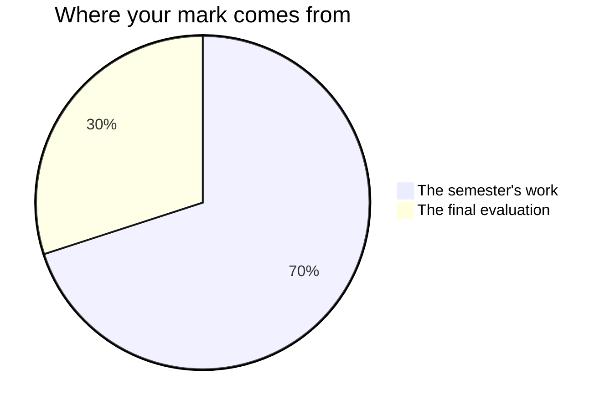

Marks in drama worry people, usually because of one misunderstanding: that
you are marked on talent. You are not. You are marked on **choices, process,
and growth** — things entirely inside your control.

## The seventy and the thirty

Every Grade 9 credit in Ontario is built to the same shape, and this one is
no exception. Seventy per cent of your mark comes from the work you do
across the semester, weighted towards your **most recent and most
consistent** work rather than averaging the start of the course against the
end of it — the freeze that collapsed in week two is not held against the
actor you become by week fifteen. The remaining thirty per cent comes from
one final evaluation at the end of the course.

**The seventy** is two things. Three quarters of it is the tasks you
perform and hand in during the semester, in the order you meet them:
[[Tableau Story Sequence]], [[Improvisation Showcase]],
[[Scene Study from a Story]], [[Drama in the World]], and
[[Production Roles Interview]]. Each lists its success criteria before you
start, phrased as things an observer could see rather than as numbers.
They are not equally weighted — the two that occupy the most class time,
the improvisation showcase and the scene study, carry more than the tableau
sequence you made in your third week — and where a task asks for writing,
like the scene study's half-page justification, that writing is marked as
part of the task rather than separately.

The remaining quarter of the seventy is [[Milestone Journal Entries]]: four
pieces of writing, each done in class at the end of a unit, the last of
them being [[Final Reflection]]. That page carries their criteria — the
same five rows all four times — and explains why the journal is weighted
like a strand rather than like a diary. Nothing else you write in your
[[Drama Journal]] is marked; see below. Ask me for the exact split whenever
you want it. It is not a secret; it is just not the useful thing to
memorise.

**The thirty** is the [[Culminating Performance]]: one piece rehearsed
across the whole of Unit 4 and performed for an invited audience, in which
you both perform and hold a production role. It sits at the end because it
is the only work in the course that asks for everything at once — a form
chosen, an ensemble that works, a body that reads from the back row, and a
production that runs.

## Four kinds of thinking

Every task asks for more than one of these, and the balance shifts from
task to task. A performance that goes well is never the whole of it.

| What is being judged | What it means in this room |
| --- | --- |
| What you know | The elements, the conventions, the vocabulary, what a form was for |
| How you think | Choosing five moments and not six, choosing the convention, solving a staging problem |
| How you communicate | Voice, body, and the piece an audience actually receives — and how you write and talk about it |
| Where you apply it | Making it work in a story, a form, or a room nobody rehearsed you for |

The fourth is why [[Drama in the World]] exists, and why a revival in the
[[Culminating Performance]] has to grow rather than repeat. Anyone can run
the exercise they were taught; the course is asking whether you can work in
a form, a story, or a job that nobody demonstrated for you first.

## Three kinds of evidence, and two of them are not paper

**What you make** is the obvious one: the performances, the scripts, the
written notes, the presentations. **What I watch you do** is the second,
and in this subject it is the biggest of the three — rehearsal is where I
see whether a group tests an image or hopes for it, who steps out to look,
who changes something after a note and who nods and changes nothing.
**What you tell me** is the third: the two-minute conferences on working
days are not a progress check, they are evidence in their own right, and
some of what you understand will only ever appear there.

If you are quiet and your group's piece is half-built, the conference is
often where the strongest evidence of the day comes from. That is not a
consolation prize. It is how the mark is meant to work.

It is also why rehearsal time is class time. Every task from
[[Tableau Story Sequence]] onwards gives you working periods with me in the
room, because two of the three kinds of evidence only exist while the work
is being made.

## What is not in your mark

How you work is reported separately, on the same report card, as **E, G, S
or N** — six habits: responsibility, organization, independent work,
collaboration, initiative, and self-regulation. Warm-up focus, generosity
as an audience member, and arriving ready to work belong in that column.
They matter enormously, we will talk about them all term, and they do not
move your percentage. Your mark is about the work; that column is about the
worker, and mixing the two tells you less about both.

Drama has one genuine exception, and it is written into the curriculum
rather than invented here. Working with other people is not a side effect
of this subject — it is part of what the course is required to teach. The
skills and attitudes that get a production made are
[[C3.2|expectation C3.2]], theatre and audience etiquette is
[[C3.3|expectation C3.3]], and safe and ethical practice is
[[C3.1|expectation C3.1]]. Where a task asks you to show one of those — the
production role you hold in the [[Culminating Performance]], the
professional you build in [[Production Roles Interview]] — it is marked
like anything else in the curriculum, against criteria you can read first.
What is never marked is a general impression of how keen you seemed.

Your own judgement of your work is not part of your mark, and neither is a
classmate's. You will judge your own work against the criteria often — see
[[Judging Your Own Work]] — and notes from another group are how a piece
improves between the run and the performance. Both are how the work gets
better; neither is a mark. Determining the mark is my job, from evidence.

> [!important] Rough early work is never penalised
> Shares of unfinished work are how the work gets good. The mark comes from
> where the work ends up and how you got it there — not from how it looked
> the first time anyone saw it.

## Four entries carry a mark, and you write all four in class

Your [[Drama Journal]] runs after every workshop day, and most of it is
practice: what you write between classes is yours, it is worth doing, and I
do not mark it. What I mark is the four [[Milestone Journal Entries]] — one
at the end of each unit, written **in class, in the period**, with
[[Journal Checklist]] beside you. Marked writing is not homework in this
course, and never will be.

That is deliberate, and it protects the rest of the journal. You can write
in an ordinary entry that a rehearsal went badly, that you froze, that your
group is not working, and it costs you nothing. But a milestone entry is
only as good as the record behind it: it asks you to quote your earlier
self, the way [[Showing Growth]] describes, and there is nothing to quote if
the earliest entries say nothing. The practice is not marked and it is what
makes the marked writing possible.

If a mark ever surprises you, ask — the criteria on each task page, and on
[[Drama Journal]], are the whole story, and [[Getting Help]] explains the
best ways to reach me.

%%curriculum-start%%
## Curriculum connection

![[B1.1]]

![[B3.2]]
%%curriculum-end%%
