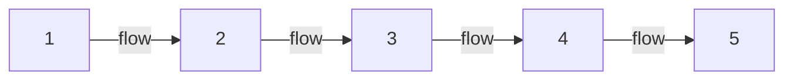

> [!abstract] At a glance
> Groups of 4 · rehearsed in class over six workshop days · performed on
> Unit 1, Day 15 · roughly 90 seconds on stage

## What you are making

Your group will tell one complete story in exactly five
[[Tableau|tableaux]] — no more, no fewer. The limit is the assignment:
choosing which five moments a story cannot live without is a director's
judgement, and your audience must follow the story with no narration.

Between pictures, the group moves slowly and silently — freeze, flow, freeze:

Two requirements sit inside the sequence. Levels and
[[Focus and Emphasis|focus]] must be deliberate in every image — "why is
she the highest body in tableau three?" should have an answer. And exactly
one moment of [[Thought Tracking]] happens somewhere in the piece.

## How to work

1. Choose a story everyone already knows — a fairy tale spares you the plot.
2. Argue about the five moments before you stage anything. That argument is
   the most important rehearsal you will have; it is the exploring stage of
   [[The Creative Process]].
3. Build each image one at a time. Sculpt each other. Step out and look.
4. Rehearse the transitions as carefully as the freezes — the flow is
   performed too, and rushing it breaks the spell.
5. Decide where the [[Thought Tracking]] moment lands, and why there. The
   thought should say what the picture cannot — often the
   [[Tension|tension]] between what a character shows and what they think.

Rehearsal time is class time, and it is where most of what I judge actually
happens — see [[How Marks Work]].

> [!note] You work in a four, and you are marked as yourself
> There is no group mark here. Before you perform, your group tells me
> which images each of you led — sculpted them, argued for them, and can
> say why they belong in the sequence. Four of you and five pictures means
> somebody leads two; sort that out early. Your mark comes from the image
> you led, from your body's work in the others, and from what you say in
> the conference during the first working period. A group can be uneven and
> you can still meet every criterion below.

## Success criteria

| Quality | What it looks like from the audience |
| --- | --- |
| Story clarity | A stranger could retell the story after one viewing |
| Deliberate images | Levels and focus are choices, and the group can say why |
| Stillness | Freezes are truly still — eyes, hands, breath under control |
| Transitions | Flow is slow, silent, and controlled from first freeze to last |
| Thought tracking | The spoken thought reveals what the image alone could not |
| Ensemble | Every body in every image is doing work — take one out and the picture loses something |

> [!success]- If your group is stuck (click to expand)
> Stuck groups almost always chose their five moments too fast. Ask: which
> picture could we cut with the story still surviving? If you find one, it
> is the wrong picture — replace it with the moment just before or just
> after the biggest change in the story.

%%curriculum-start%%
## Curriculum connection

![[A1.2]]

![[A2.2]]

![[C1.2]]
%%curriculum-end%%

%%
Triangulation — the evidence you will not have unless you go and get it.

OBSERVE — Unit 1, Day 11, the working period on building the five images
  Watch for who is deciding. A sequence built by one director and a
  sequence genuinely argued out can arrive at the same five pictures, and
  the performance will not tell you which one you are watching. The group
  hands you a list on performance day saying which image each of them led;
  this period is where you find out whether that list is true.
  Going well: three or four different people have moved somebody's body
  within the first ten minutes, and at least one of them was overruled.
  Stuck: one student placing everyone and nobody objecting — or four
  students standing still, waiting to be placed.
  Record: one name per group on your day plan, the student doing the
  placing, and a star if it changed hands during the period.

TALK — Unit 1, Day 9, the two-minute conference already on that agenda
  The agenda tells them the conference is about their climax, so they will
  arrive with that answer polished. Ask for the ones underneath it.
  Ask: "Which moment did you argue about longest, and who changed their
  mind?"
  Then: "What happens between picture two and picture three that we will
  never see?"
  A strong answer treats the gaps as something the audience is being asked
  to fill, and names the moment the story turns on rather than the moment
  with the most action. That is A1.2 heard while the choice is still live —
  a form chosen to suit a purpose — and it is the one part of this task the
  ninety seconds on stage cannot show you, because by then the choosing is
  over. C1.2 is on this task too, but correct terminology is not what this
  conversation gives you; listen for it, do not ask for it.
  Record: two words per group in the margin of your day plan — the moment
  argued about, and the name of whoever gave way.

The product evidence is the performance on Day 15, plus the image-lead list
handed to you before it. That part arrives on its own.
%%
