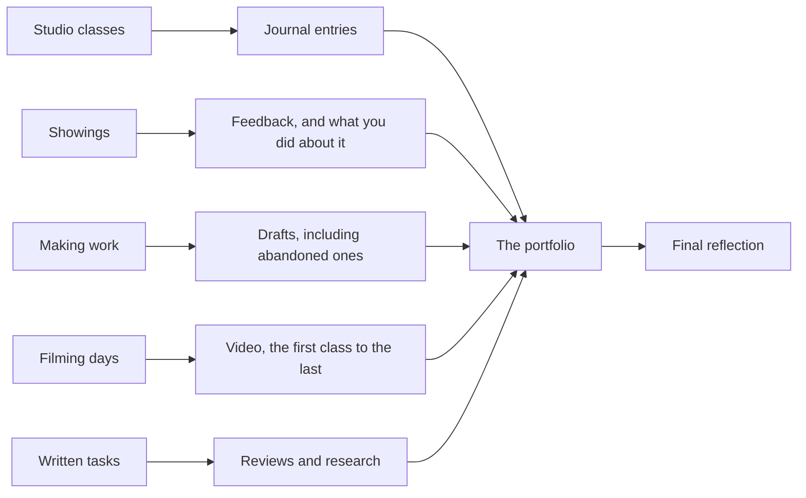

Your portfolio is the container for the whole semester. It is not a folder
you assemble at the end of the course out of whatever survived — it is built
one class at a time from the first week, and it ends up the only full record
of your work here.

## What goes in

Five kinds of thing, arriving from different places:

Abandoned drafts matter as much as finished phrases. A portfolio containing
only successes cannot show anybody how you work, including you.

## How it is organised

One folder per unit, in order. Name files so the name tells you what and when:
`unit1-signature-draft2-oct14`. Date everything. Keep a second copy somewhere
that is not your phone — and if you work on paper, note where the video lives.

Once a unit ends, spend ten minutes tidying it. Portfolios fail at the end
of the course because nobody could tell what the files were, not because
work was missing.

> [!tip] Two minutes at the end of a unit beats two hours at the end of the course
> Write one line at the front of each unit folder: what the unit was, and what
> you would point at if asked what you learned. Those four lines are most of
> your final reflection already.

## Why this and not an essay

Because an essay asks you to describe a semester of physical work in the one
medium that cannot hold it. Growth in dance shows up in a body over time, so
the evidence has to be the body over time — your first video against your most recent,
the second draft against the fourth, an early correction against what you now
do without thinking.

The portfolio is assessed as [[The Portfolio and Reflection]], the final
evaluation for this course. Its two halves are built in
[[Your Movement Journal]] and [[Video of Yourself]]; how it weighs against
everything else is in [[How Marks Work]].

%%curriculum-start%%
## Curriculum connection

![[B3.3]]
%%curriculum-end%%
