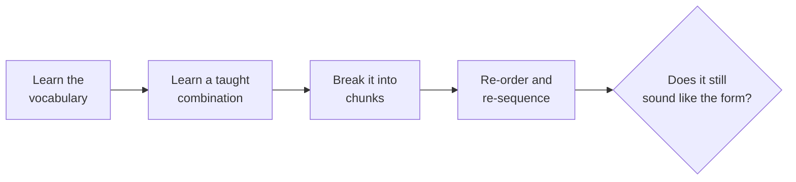

Sampling many forms is useful. Returning to a few is what builds technique.
This course works in three all semester, chosen because they teach different
things and because a beginner can start any of them at the start of the course.

## Contemporary

Contemporary descends from the modern dance that developed in North America
and Europe in the early twentieth century, made largely by choreographers
arguing with ballet about what a dancing body should look like. It asks you
to give weight to the floor rather than always resisting it: falling and
recovering, spiralling through the spine, moving on the breath. A sequence
usually travels through levels — standing, down, and back up — so the joins
between levels are the part to rehearse.

## Jazz

Jazz dance grew out of African diasporic social dance in the United States
and was later taken into theatre and studio training. It asks for
isolations — one part moving while the rest waits — a low, ready centre, and
a sharp relationship with the beat, especially the off-beat. A jazz sequence
is built on counts and accents: learn where the accents land and the rest
follows.

## Hip hop

Hip hop dance emerged among Black and Latino young people in the Bronx, New
York, in the 1970s, alongside the DJing, MCing, and writing that grew up
with it. It asks for groove before steps — a bounce or rock that runs
underneath everything — plus grounded footwork and your own flavour inside a
shared vocabulary. It also carries its own etiquette about the cypher and
about credit, which is part of the form and not an extra.

## Building a sequence in a form

For your [[The Form Study|form study]] you will take material apart and put
it back together. That is the same process in all three.

That last question is the real test. Re-sequence a jazz combination until no
syncopation is left and you have made something else. Keep what the form
insists on; change what it merely happens to do. [[Learning a Sequence]]
covers the memorising, and [[Forms From Around the World]] puts these three
in wider company.

%%curriculum-start%%
## Curriculum connection

![[A3.1]]

![[A3.3]]
%%curriculum-end%%
