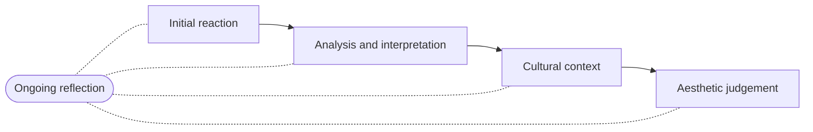

You look at a work and you have a reaction within about a second. Good — keep
it. The critical analysis process does not ask you to give up your opinion.
It asks you to earn it, by working through the stages in an order that stops
you deciding what a work means before you have finished looking at it.

Reflection is drawn off to the side because it is not a stage. It runs
underneath the whole thing, and it is what makes the process worth doing on
your own work as well as on somebody else's.

**Initial reaction.** What happened to you — bored, unsettled, delighted,
confused? Write it before you analyse anything. It is evidence, and by the
fourth look you no longer have access to it.

**Analysis and interpretation.** First what is there, then what it means.
Analysis is the elements and principles doing their job: which values carry
the composition, where the emphasis falls, what repeats. Interpretation is
the claim about meaning, and it has to be built out of the analysis rather
than arriving from nowhere.

**Cultural context.** Who made this, when, for whom, and under what
conditions? Works are not made in a vacuum, and a work that seems strange
often becomes sensible the moment you know what it was for.

**Aesthetic judgement.** Does it succeed — first on its own terms, then on
yours? "It didn't do what it was trying to do" and "it did it well and I
still dislike it" are both legitimate conclusions. "I liked it" on its own is
not one.

The process is deliberately flexible: you will loop backwards, and your first
reaction will often survive intact. What changes is that you will be able to
say why. You will run it slowly in [[Describing What You See]] and
[[Interpreting a Work]], in public in [[The Class Critique]], in writing
in [[The Interpretation]], and once against a work you have never seen
before, in [[The Portfolio and Reflection]]. Naming the four stages
correctly is marked — on both of those, and in the terminology row of
[[The Sketchbook Habit]] — so learn the names as well as the order.

%%curriculum-start%%
## Curriculum connection

![[B1.1]]
%%curriculum-end%%
