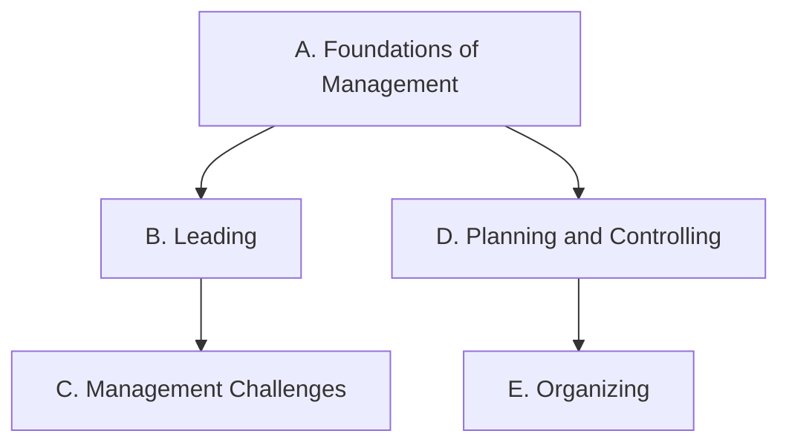

Everything this course does points at one or more of these expectations,
from **BOH4M — Business Leadership: Management Fundamentals, Grade 12,
University/College Preparation**. Lesson pages, cases, and tasks link
here, so you can always see *why* we are doing something.

> [!info] Where these come from
> The wording below is the Ontario curriculum's own. See
> [[About These Expectations]] — including a note about the codes, which
> this document does not print.

The four managerial functions this course is built on — leading,
planning, organizing, controlling — are the strands themselves, and the
foundations strand is where they all start.

## Overall and specific expectations

### Strand A. Foundations of Management
*By the end of this course, students will:*

![[A1. Management Fundamentals]]
![[A1.1]]
![[A1.2]]
![[A1.3]]
![[A2. Business Communication]]
![[A2.1]]
![[A2.2]]
![[A2.3]]
![[A2.4]]
![[A2.5]]
![[A3. Issues of Ethics and Social Responsibility]]
![[A3.1]]
![[A3.2]]

### Strand B. Leading
*By the end of this course, students will:*

![[B1. Human Behaviour]]
![[B1.1]]
![[B1.2]]
![[B1.3]]
![[B1.4]]
![[B2. Group Dynamics]]
![[B2.1]]
![[B2.2]]
![[B2.3]]
![[B2.4]]
![[B3. Leadership Techniques]]
![[B3.1]]
![[B3.2]]
![[B3.3]]

### Strand C. Management Challenges
*By the end of this course, students will:*

![[C1. The Communication Process in the Workplace]]
![[C1.1]]
![[C1.2]]
![[C1.3]]
![[C2. Stress and Conflict Management]]
![[C2.1]]
![[C2.2]]
![[C2.3]]
![[C2.4]]
![[C3. Motivation]]
![[C3.1]]
![[C3.2]]
![[C3.3]]

### Strand D. Planning and Controlling
*By the end of this course, students will:*

![[D1. The Importance of Planning]]
![[D1.1]]
![[D1.2]]
![[D1.3]]
![[D2. Planning Tools and Techniques]]
![[D2.1]]
![[D2.2]]
![[D2.3]]
![[D3. Strategic Planning]]
![[D3.1]]
![[D3.2]]
![[D3.3]]
![[D3.4]]
![[D4. The Management of Change]]
![[D4.1]]
![[D4.2]]
![[D4.3]]
![[D4.4]]
![[D5. Controlling]]
![[D5.1]]
![[D5.2]]
![[D5.3]]
![[D5.4]]

### Strand E. Organizing
*By the end of this course, students will:*

![[E1. Organizational Structures]]
![[E1.1]]
![[E1.2]]
![[E1.3]]
![[E1.4]]
![[E2. The Changing Nature of Work]]
![[E2.1]]
![[E2.2]]
![[E2.3]]
![[E3. Human Resources]]
![[E3.1]]
![[E3.2]]
![[E3.3]]
![[E3.4]]
![[E3.5]]
![[E3.6]]
