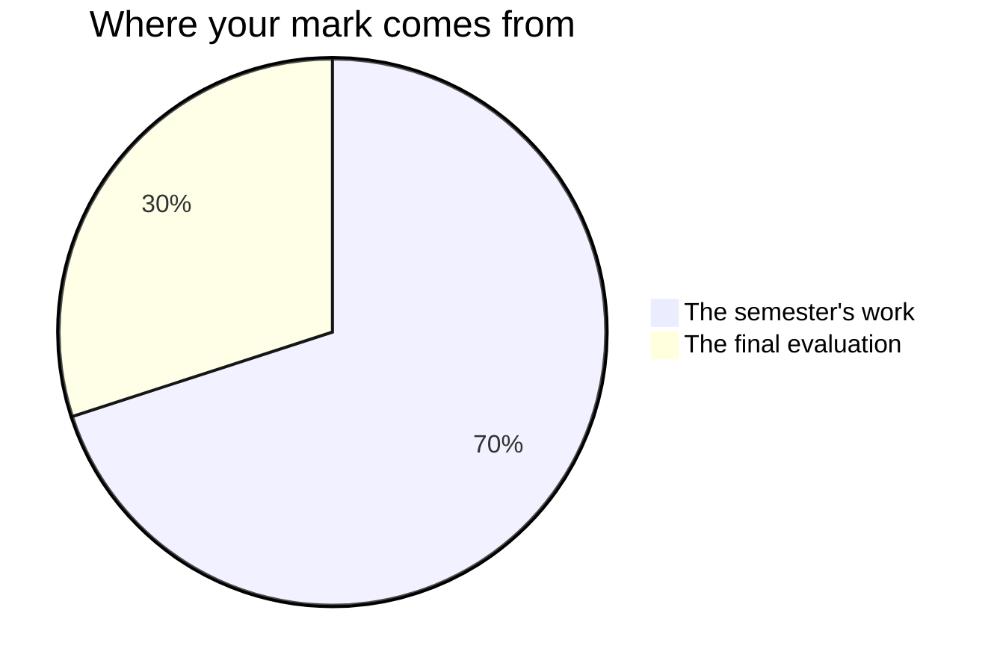

Your mark comes from what you can do, not from what you have accumulated.

## The seventy and the thirty

Every Grade 12 credit in Ontario is built the same way.

| Part | Weight | When |
| --- | --- | --- |
| The term's work | 70% | Spread across the whole semester |
| The final evaluation | 30% | [[The Case Examination]], three hours, at the end |

The seventy is not an average of everything you have ever handed in. It
leans towards your **most recent and most consistent** work, because the
question a mark answers is what you can do now, not what you could do in the
start of the course. A strand you were weak in and then got good at is
marked where you ended up.

**The seventy** is the assessed work of the four units, in the order you
meet it: [[The Organization Study]] and [[The Ethics Brief]] in Unit 1;
[[The Leadership Profile]], [[The Team Project]] and
[[The People Problem]] in Unit 2; [[The Strategic Review]] and
[[The Change Plan]] in Unit 3; [[The Management Review]] in Unit 4 —
plus [[The Management Portfolio]], the four entries you write about
yourself as the units go by.

They are not equally weighted. The Management Review is worth several of
the smaller ones on its own, because it runs for eight periods with a
real client and asks for everything at once; the earlier tasks are the
rehearsals that make it possible. Ask me for the exact split whenever
you want it — it is not a secret, it is just not the useful thing to
memorise, and the numbers move a little with the class.

**The thirty** is [[The Case Examination]]: one unseen organization,
three hours, and the whole course. It is deliberately not a fifth unit
test. A case does not tell you which unit it belongs to, which is why it
can ask whether you have the course rather than whether you revised the
last part of it.

## Four kinds of judgement, not one

Every task asks for more than one of these, and the balance shifts with
the task.

| What is being judged | What it means here |
| --- | --- |
| What you know | The vocabulary, the theories, the law, what each tool is for |
| How you think | Telling the symptom from the cause, choosing between tools, weighing evidence that points both ways |
| How you communicate | The memo, the deck, the twelve minutes, the answer to a hostile question |
| Where you apply it | Making it work in an organization nobody walked you through |

The fourth is why [[The Management Review]] exists. Anyone can analyse
the case we worked together on Tuesday; the course is asking whether you
can walk into an organization that has never been in a textbook and say
something useful about it.

## Three kinds of evidence, and two of them are not paper

**What you make** is the obvious one: memos, decks, plans, reviews,
portfolio entries. **What I watch you do** is the second: how a pair
handles two sources that contradict each other, what a team does with a
blocker once it has been named out loud, whether a control measure gets
tested against who would actually collect it. **What you tell me** is
the third — the conferences and checkpoints on the class pages are not
progress checks, they are evidence in their own right.

That is why the seminars in [[Discussions/index|Discussions]] and the
cases in [[Cases/index|Cases]] are not a separate slice of your mark.
What you say in them is evidence about the same expectations the tasks
are judged against, and it is judged the same way — for the reasoning,
not for how often you spoke. A student who says one thing in a seminar
that changes how the room understands a case has produced better
evidence than one who spoke six times.

If your written work is thinner than your thinking, the conversation is
often where the strongest evidence of the week comes from. That is not a
consolation. It is how the mark is meant to work.

## What is not in your mark

**How you work is reported separately**, on the same report card, as
**E, G, S or N** — six habits: responsibility, organization, independent
work, collaboration, initiative, and self-regulation. Being on time,
prepared and discreet in someone else's organization belongs there, and
it matters more in this course than in most. It does not move your
percentage. The mark is about the work; that column is about the worker,
and mixing the two tells you less about both.

There is one narrow exception, and it is written into this course's
expectations rather than invented here. Two expectations are themselves
about a habit:

- **B2.4** asks you to *apply business teamwork skills to carry out
  projects and solve problems*. So on [[The Team Project]], how you
  worked with your team **is** the curriculum, and it is marked.
- **D2.3** asks you to *demonstrate the ability to use time-management
  techniques*. So on [[A Week of Your Time]], using a technique and
  showing what it did **is** the curriculum, and it is marked.

The boundary is the verb. Applying teamwork skills to get a project done
is marked; being a pleasant person to work with is not. Using a
time-management technique and reporting what happened is marked; being
organised in general is not.

**Your own judgement of your work, and your classmates', are not part of
your mark.** You will judge your own work against the criteria often —
see [[Judging Your Own Work]] — because it is the fastest way to get
better, and teams will tell each other hard things. None of it becomes
anyone's mark. The mark is mine to determine, from evidence.

**Work done in a team is marked individually.** There is no common team
mark in this course. Every task done in pairs or teams names the piece
that is yours — the section you wrote, the part of the briefing you
delivered, the recommendation you own, the answer you gave at the
checkpoint. Read that line on the task page before you divide the work
up, because it decides how you should divide it.

**Practice is not marked.** The "things to do before our next class"
list is preparation — reading, drafting, tracking, getting your evidence
in order. I never mark it. It sometimes reminds you to hand in something
the class periods were for, which is a reminder, not homework being
marked. Everything that counts is written in class wherever it can be,
which is why the tasks have working periods.

## What earns a high mark here

- **Evidence.** A claim with a source beats a confident assertion, every
  time.
- **Judgement.** A recommendation that could be acted on this month, with
  its cost named.
- **Use of the course.** The right tool for the situation, not every tool
  in the course applied to everything.
- **Honesty about limits.** "This is what I could not find out, and here
  is what I would need" is a strength.

## Feedback, and the period after it

Each of the eight assessed tasks has a checkpoint with me before it is
handed in, and a later class page names a period for acting on what the
checkpoint found — the very next class on seven of the eight, and the
next team working period on [[The Team Project]]. On most of them that
period is fifteen or twenty minutes, not a whole class: long enough for
the one change you and I named, which is the change worth making. Look
for it on the agenda; it is written there so that you can hold me to it.

The portfolio entries work differently: they are short, they are written
in class, and I read them over your shoulder while you write. That is
the checkpoint.

## Late work, and re-doing things

Talk to me before the deadline and we will find a date. After the
deadline, the conversation is harder and the mark eventually reflects the
work I have, not the work you meant to hand in.

Some tasks can be revised after feedback — the ones where revision is the
skill. It says so on the task page when it applies.

> [!tip] The rubric is on the task, not here
> Every task page ends with what earns the marks for that specific piece
> of work. Read it before you start, not after you finish.
