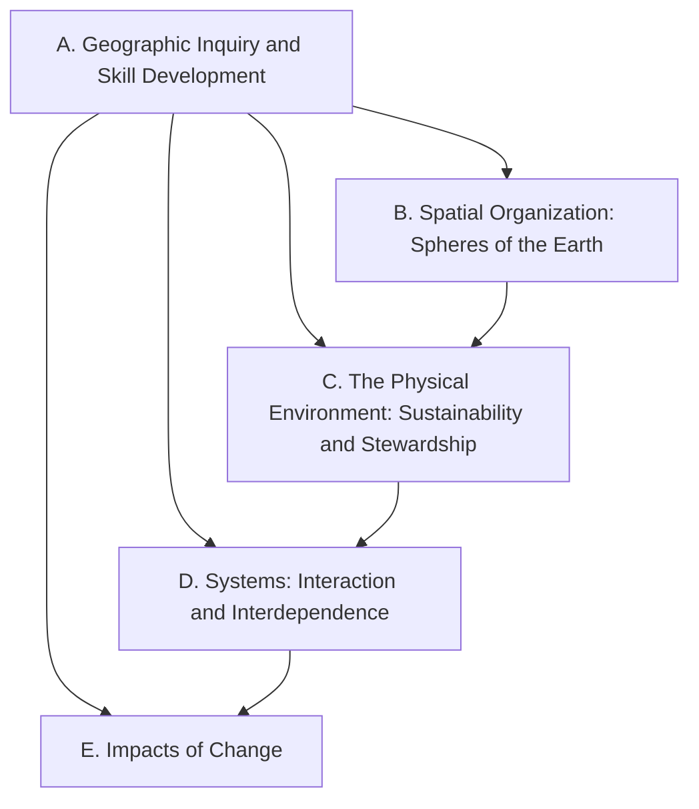

Everything this course does points at one or more of these expectations,
from **CGF3M — Forces of Nature: Physical Processes and Disasters, Grade
11 University/College Preparation**. Every concept, case, field day, and
task links back to the codes it addresses.

> [!info] Where these come from
> The wording below is the Ontario curriculum's own, from the 2015
> Canadian and world studies document, which has not been revised or
> replaced for this course. See [[About These Expectations]] — including
> why the printed prerequisite names a Grade 9 course that no longer
> exists.

Strand A is not a unit. Its own stem reads *throughout this course*, and
the curriculum says plainly that instruction on strand A is to be
interwoven with the other four and assessed across the whole course — so
inquiry, mapping, source judgement and spatial technologies appear in
every unit here rather than in a block at the start of the course.

Strands B to E each ask a different question of the same planet: how it
is organised, what we take from it and repair, how its systems reach
across boundaries, and how it changes.

## Overall and specific expectations

### Strand A. Geographic Inquiry and Skill Development
*Throughout this course, students will:*

![[A1. Geographic Inquiry]]
![[A1.1]]
![[A1.2]]
![[A1.3]]
![[A1.4]]
![[A1.5]]
![[A1.6]]
![[A1.7]]
![[A1.8]]
![[A1.9]]
![[A2. Developing Transferable Skills]]
![[A2.1]]
![[A2.2]]
![[A2.3]]
![[A2.4]]

### Strand B. Spatial Organization: Spheres Of The Earth
*By the end of this course, students will:*

![[B1. Physical Processes and Natural Hazards]]
![[B1.1]]
![[B1.2]]
![[B1.3]]
![[B2. Spatial Connections]]
![[B2.1]]
![[B2.2]]
![[B2.3]]
![[B2.4]]
![[B3. Physical Characteristics of the Earth]]
![[B3.1]]
![[B3.2]]

### Strand C. The Physical Environment: Sustainability and Stewardship
*By the end of this course, students will:*

![[C1. Renewing the Physical Environment]]
![[C1.1]]
![[C1.2]]
![[C1.3]]
![[C1.4]]
![[C1.5]]
![[C2. Human Impact on the Physical Environment]]
![[C2.1]]
![[C2.2]]
![[C2.3]]
![[C3. Human Use of the Physical Environment]]
![[C3.1]]
![[C3.2]]

### Strand D. Systems: Interaction and Interdependence
*By the end of this course, students will:*

![[D1. Sharing the Physical Environment]]
![[D1.1]]
![[D1.2]]
![[D1.3]]
![[D2. Population and Disasters]]
![[D2.1]]
![[D2.2]]
![[D3. Earth’s Planetary Characteristics and Life]]
![[D3.1]]
![[D3.2]]
![[D3.3]]

### Strand E. Impacts Of Change
*By the end of this course, students will:*

![[E1. Impacts of Processes and Disasters]]
![[E1.1]]
![[E1.2]]
![[E1.3]]
![[E2. Disaster Preparedness]]
![[E2.1]]
![[E2.2]]
![[E2.3]]
![[E3. Processes of Change]]
![[E3.1]]
![[E3.2]]
![[E3.3]]
