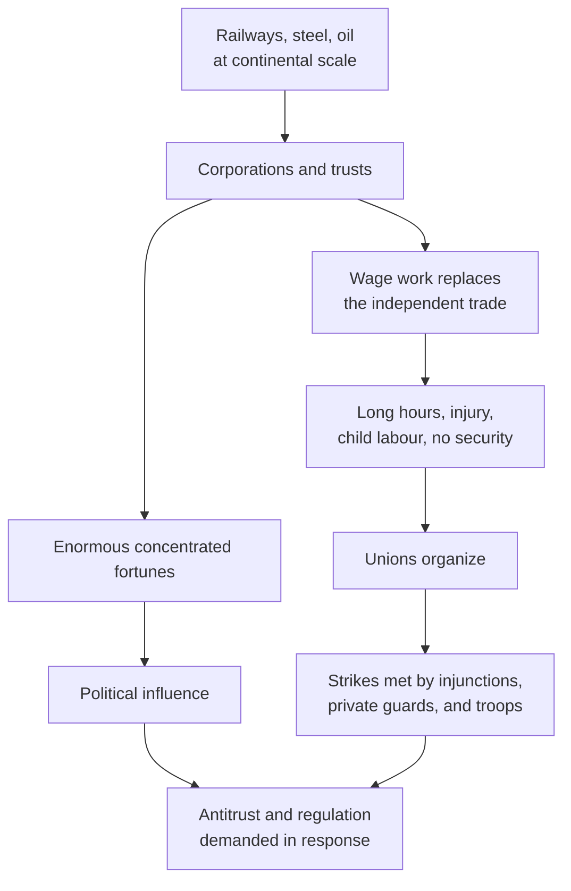

Between the end of Reconstruction and the Second World War the United States
became the largest industrial economy in the world, and the country argued
continuously about the terms. Who owned the new wealth, who worked for it,
what a city owed the people living in it, and whether government had any
business in the arrangement — these are the questions, and they are still
recognisable.

## Scale, and its consequences

Both ends of that diagram are real. The same decades that produced fortunes
of a size the country had never seen produced tenement districts where
families sublet floor space. That is the pattern worth naming: it did one
thing for capital and another for labour, at once, in the same city.

## What organizing achieved, and what it did not

Unions differed sharply on strategy. Craft federations organized skilled
workers by trade and bargained; industrial unions tried to organize an entire
workplace regardless of skill, which meant including the immigrants, women
and Black workers the craft unions frequently excluded.

Disaster moved the law more reliably than argument did. The Triangle
Shirtwaist Factory fire in New York in 1911 killed 146 workers, most of them
young immigrant women, many of whom could not escape because exits were
locked. It produced factory inspection, fire codes and a generation of
labour legislators, and it is the standard case for asking why reform so
often needs a body count.

The New Deal delivered the largest change. The National Labor Relations Act
of 1935 guaranteed that "employees shall have the right to self-organization,
to form, join, or assist labor organizations, to bargain collectively through
representatives of their own choosing." Read its exclusions with equal care:
the Act did not cover agricultural labourers or workers "in the domestic
service of any family or person at his home." Those two categories held a
very large share of Black workers in the South at the time. A landmark law
and a deliberate boundary, in the same statute.

## The city and the collapse

Cities grew on immigration and, from about the First World War, on the
movement of Black Americans out of the South. Neighbourhoods formed by
language and origin, and by exclusion. Then in 1929 the market broke, banks
failed, and unemployment reached levels the country had no machinery to
handle. Shanty settlements took the president's name, and drought and ruined
soil across the southern plains drove farm families west.

Test whether the New Deal reached everyone in [[Who Was the New Deal For|Who Was the New Deal For?]],
and set the labour question beside the racial one in
[[Jim Crow and Resistance]].

%%curriculum-start%%
## Curriculum connection

![[D1.1]]

![[D1.2]]

![[D1.3]]

![[D2.1]]

![[D2.2]]

![[D2.3]]

![[D3.2]]

![[D3.3]]
%%curriculum-end%%
