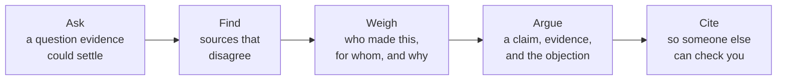

An honest inventory, written in class late in Unit 3 while there is still
term left to act on it: what studying history is actually building in you,
with a specific piece of your own work behind every claim. It is marked with
the rest of [[The Historian's Portfolio]], and the criteria are on that
page.

Historical investigation is not one skill. It is a chain, and it breaks at
whichever link you have not practised:

## Write one paragraph per link

For each of the five, name **one** thing you did this term, when, and what
it produced. "I can evaluate sources" is worth nothing. "I stopped using the
newspaper report for [[The Source Study]] once I saw which party owned the
paper, and used the statute instead" is evidence. If a link has no example
yet, say so and name the task where you will fix it.

The curriculum frames these as transferable, including the essential skills
in the Ontario Skills Passport — reading text, writing, document use,
computer use, oral communication and numeracy. Every one of those has a
history version you have already practised: numeracy is what
[[Statistics and the Census]] asks of you, and document use is most of this
course.

## Reading against the grain

The skill this course builds that no other subject quite does: reading a
document for what its author was not trying to tell you. An advertisement is
weak evidence about how people lived and excellent evidence about what
sellers believed would persuade them — see
[[Arts, Culture, and Consumer Society]]. Give one example of your own where
a source's purpose told you more than its content did.

## Work habits count as skills

The curriculum names self-regulation and initiative explicitly, and it asks
for them applied "in everyday contexts" — which is the part that decides
whether this counts. So describe one occasion OUTSIDE this class: another
subject, a job, a team, something at home, where you noticed a task going
wrong and changed your approach in a way you first practised here. Say what
you changed it to. A habit that only ever appears in history homework has
not transferred, and naming a real transfer is harder and more useful than
listing what you can do.

## Revisit after the culminating task

Come back after [[The Long Argument]] and add one paragraph: which link in
the chain failed under pressure? That paragraph is worth more than the five
above it, and it is what [[Where History Leads]] is built on.

%%curriculum-start%%
## Curriculum connection

![[A2.1]]

![[A2.2]]
%%curriculum-end%%
