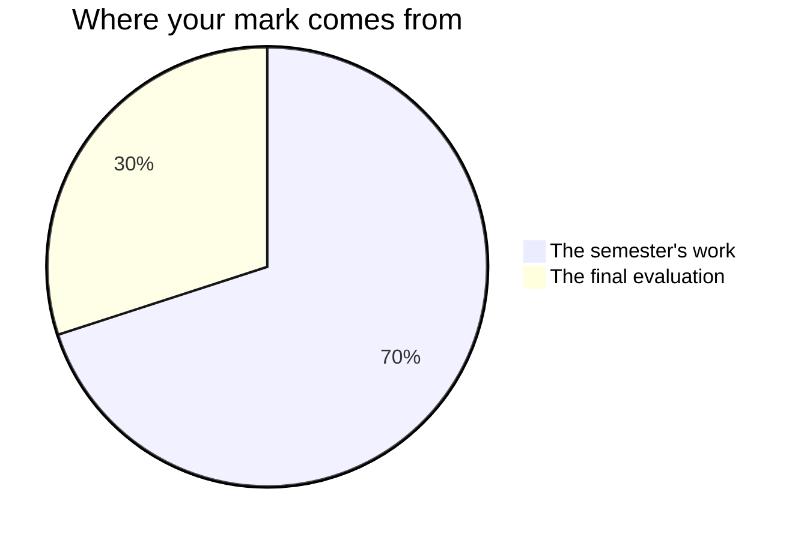

Your mark reflects what you can do with historical evidence, not how much of
the American past you can recall on demand.

## The seventy and the thirty

Every Grade 11 credit in Ontario is built the same way. **Seventy per cent**
comes from work done across the semester, and it leans towards your **most
recent and most consistent** work rather than averaging the start of the
course against the end of the course — a habit you did not have early on is
not held against you at the end of the course if it is plainly there by
then. **Thirty per cent** comes from a final evaluation at the end, which
has to reach across the whole course rather than test the last unit.

**The seventy** is the work of the four units. In the order you meet it:
[[The Source Study]], [[The Colonies Compared]], [[The Revolution Question]],
[[Slavery and the Nation]], [[The Union Divided]],
[[The Industrial Republic]] and [[Rights and Movements]] — plus
[[The Four Seminars]], one per unit, and [[The Historian's Portfolio]],
marked once as a set. They are not equally weighted: the written arguments
carry the most, because arguing from evidence is what this course is for,
and the two early pieces are the rehearsals that make the later ones
possible. Ask me for the exact split whenever you want it. It is not a
secret, it is just not the useful thing to memorise.

**The thirty** is two things, in two very different rooms.
[[The Long Argument]] is delivered to an audience at the end of Unit 4, on a
question you have followed the whole length of the course.
[[The Document Examination]] is three hours in the examination period, on
documents you have never seen. Neither one alone would show what you can
do; together they are meant to.

## Four kinds of thinking, not one

Every piece of work asks for more than one of these, and the balance shifts
with the piece. A correct account of what happened is never the whole of it.

| What is being judged | What it means here |
| --- | --- |
| What you know | The periods, the events, the people, and the terms that name them |
| How you think | Weighing sources against each other, ranking causes, judging significance |
| How you communicate | An argument a reader can follow, a citation they can check, a seminar turn |
| Where you apply it | Reading a document nobody prepared you for, about a question nobody set up |

The fourth is why the course ends the way it does. Anyone can analyse the
document the class analysed together; the examination asks whether you can
do it to a dossier you have never seen, and [[Where History Leads]] asks
whether you can do it to something happening this week.

## Three kinds of evidence, and two of them are not paper

**What you make** is the obvious one: essays, source studies, document sets,
the public-facing piece, the notebook. **What I watch you do** is the
second, and in this subject it is the most revealing thing there is — what
you do with a source in the twenty minutes before you decide what it means.
Almost none of that reaches the finished essay, which is why the work
periods exist and why I spend them walking round the room rather than
sitting at the desk. **What you tell me** is the third: the conferences
before every hand-in, and [[The Four Seminars]], where the whole of the
evidence is what you say.

If your essay is unfinished and you are quiet in a seminar, the conference
is often where the strongest evidence of that fortnight comes from. That is
not a consolation. It is how the mark is meant to work.

## What earns a high mark here

- **Evidence, attached to a source.** A dated claim with a citation beats a
  confident sentence every time.
- **Criteria stated before the judgement.** Almost every question in this
  course asks which was most significant, most justified, or most decisive.
  Say what standard you are applying before you apply it.
- **Precision about uncertainty.** "Two federal agencies publish different
  figures, and here is which I am using and why" earns marks rather than
  losing them. Rounding a contested figure to something memorable costs
  them.
- **Fair treatment of positions you disagree with.** Stating the strongest
  version of the other case, then answering it, is the single clearest
  signal of a strong argument.
- **Citation a reader could follow.** Marks are lost for references nobody
  could trace, not for choosing the wrong style guide — see
  [[Citing Historical Sources]].
- **Your own judgement.** Every assessed task ends in a position. A summary
  of what happened, however accurate, is not an argument.

## What is not in your mark

**How you work** is reported separately on the same report card, as **E, G,
S or N**, across six habits: responsibility, organization, independent work,
collaboration, initiative, and self-regulation. They matter, we will talk
about them, and they do not move your percentage. There is no mark in this
course for attendance, for talking often, or for effort — your mark is about
the work, and that column is about the worker.

The one narrow exception is where a habit is itself part of what the
curriculum asks this course to teach. Expectation A2.2 asks you to apply
"skills and work habits developed through historical investigation" in
everyday contexts, and names self-regulation and initiative in doing so — so
the paragraph [[Skills You Are Building]] asks for, about an occasion
OUTSIDE this class where you noticed a task going wrong and changed your
approach, is marked like anything else in the curriculum. Note where the
weight falls: it is the transfer out of here that the expectation is about,
not how organised you were at the start of the course. That is the whole of the
exception, and it lives on one page.

**Your own judgement of your work, and your classmates', are not part of
your mark.** You will judge your own work against the criteria often — see
[[Judging Your Own Work]] — and you will read a partner's brief before
[[The Long Argument]] goes to its audience. Both are worth doing well and
neither becomes a number. The mark is mine to determine, from evidence.

**Work done in pairs or threes is still marked individually.** Every group
task on this course names the piece that belongs to you alone, on its own
page, and that is the piece your mark comes from.

**Practice between classes is practice.** The reading before a lesson, the
draft paragraph, the notebook page you add on a Tuesday evening — none of
that is marked. Most of what I mark is made in the room, in the work
periods, which is why there are so many of them; when a class page says to
finish something for next class, that is a reminder to hand in the piece
those periods were for, not homework being marked.

## Late work, and revision

Talk to me before the deadline and we set a new one. Work that arrives
without that conversation is still marked, but the feedback reaches you late
enough to be useless, which is the real cost.

What the schedule gives you instead of resubmission is this: on every essay,
document set and inquiry report in this course except [[The Source Study]] —
deliberately short, and first — there is a conference period before the
hand-in, and at least one working period after that conference whose stated
job is acting on what it turned up. Those periods are on the class page, by
name. Use them; they are the only revision this course has time for, and
they are the reason
[[Building an Argument]] is written on the assumption that no first draft
survives contact with a good objection.

> [!tip] The criteria live on the task page
> Every task ends with what earns the marks for that specific piece of work.
> Read it before you start, not after you finish, and check it against
> [[Learning Goals]] if you are unsure what is being assessed.
