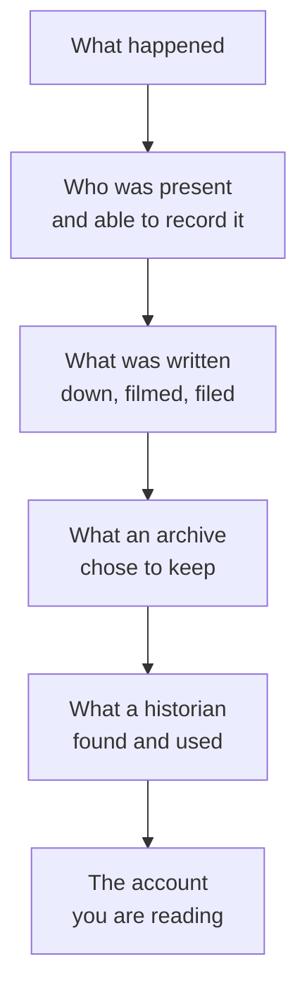

**The question:** the past leaves far more behind than any account of it
can hold. Whose version survives the filtering, and who was never asked
in the first place?

Nothing reaches you directly. It passes through a chain, and every link
in it removes something:

## Prepare

Take one event from 1945 to 1982 and find two accounts of it that
disagree — ideally a [[Government Records]] document and either a
newspaper report or an oral testimony. For each, answer the four
questions in [[Reading a Primary Source]]: who made this, for whom, for
what purpose, and what could they not have known?

## Positions that genuinely conflict

**The record is what was written down.** A department file was made at
the time by someone with access to the decision. It is dated, filed, and
checkable. Against it, memory recalled forty years later is a weaker
kind of evidence.

**The record is what power chose to keep.** [[Government Records]] tell
you what a government thought worth recording — which is not the same as
what happened. [[Oral History and Testimony]] reaches people the filing
system never described, and describes them as speakers rather than
cases.

**Some knowledge was never in written form to begin with.** Treating
writing as the standard of evidence is not neutral; it decides the
outcome before the evidence is weighed.

**Being recorded and being credited are different.** Read
[[Rights, Movements, and Resistance]] for people who were reported on
constantly and named rarely — organizers, community associations, and
the members whose work made a leader's name possible.

Argue it, then say what your own account of this week would leave out,
and who would have to be asked to fill the gap.

%%curriculum-start%%
## Curriculum connection

![[D3.1]]

![[A1.3]]

![[D3.2]]
%%curriculum-end%%
