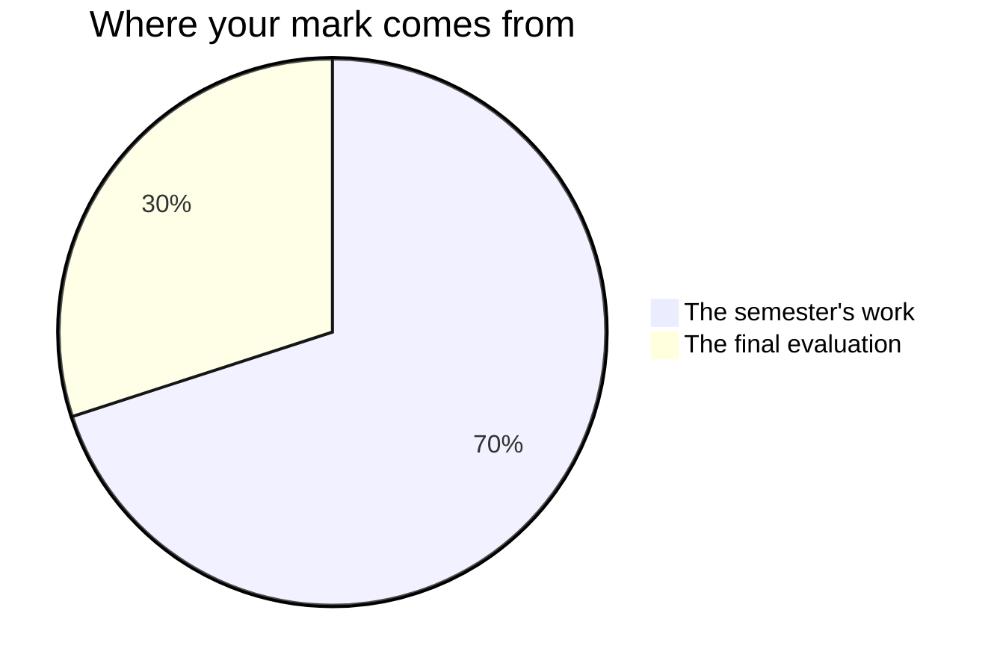

Your mark reflects what you can do with historical evidence, not how much
of the past you can recall on demand.

## The seventy and the thirty

Every Grade 10 credit in Ontario is built the same way. **Seventy per cent**
of your mark comes from the work you do across the semester — and it is not
the start of the course averaged against the end of the course. It leans
towards your **most recent and most consistent** work, because what you can
do with a document at the end of the course is a better account of what you
learned than what you could do with one in the second week.

**Thirty per cent** comes from a final evaluation at the end of the
course, which has to reach across the whole of it rather than test the
last unit.

**The seventy** is eight pieces of work. Seven are handed in through the
term, in the order you meet them: [[The Source Study]],
[[The War Question]], [[The Thirties Case]], [[The Wartime Decision]],
[[The Postwar Argument]], [[The Rights Inquiry]], and
[[The Recent Past]]. The eighth is [[The Portfolio Case]], which runs
from the first week to the last and is marked once, at the end, on what
you wrote at its four in-class milestones.

They are not equally weighted. The two inquiries ask for more, over more
periods, than a 600-word source study does, and the later work carries
more than the early work in any case. Ask me for the exact split whenever
you want it — it is not a secret, it is just not the useful thing to
memorise.

**The thirty** is two things at the end, deliberately in two different
rooms. [[The Commemoration Inquiry]] is delivered to an audience who
could act on it; [[The Document Examination]] is three hours on unseen
sources spanning the whole century. Between them they ask for everything
the four units were for, which is what a final evaluation is supposed to
do. The examination is the larger of the two.

## Four kinds of thinking, not one

Every task asks for more than one of these, and the balance shifts with
the task.

| What is being judged | What it means here |
| --- | --- |
| What you know | Events, sequence, terminology — who did what, when, and under what authority |
| How you think | Weighing sources against each other, and judging what the evidence will actually carry |
| How you communicate | The essay, the presentation, the citation, and what you say in a conference |
| Where you apply it | Doing all of it on a document, or a community, that nobody worked through with you first |

The middle two carry the most in this course, because the expectations
do: almost every one of them asks you to *analyse* or *assess* rather
than to list. The fourth is why [[The Document Examination]] uses
sources you have never seen and why [[The Commemoration Inquiry]] is
about your own community rather than a case study I chose.

## Three kinds of evidence, and two of them are not paper

**What you make** is the obvious one: essays, document sets, reports,
the leave-behind. **What I watch you do** is the second — which
document you open first, whether you find out who made a source before
you decide what it means, what you do with the piece of evidence that
does not suit the argument you had started to like. **What you tell me**
is the third: the conferences that appear on the class pages through
every unit are not progress checks, they are evidence in their own
right.

If your essay is unfinished and you are quiet in a seminar, the
conference is often where the strongest evidence of the week comes from.
That is not a consolation. It is how the mark is meant to work.

## Feedback, and where it lands

Every task has at least one checkpoint with me before it is due, and at
least one working period afterwards whose stated job is acting on what
the checkpoint found — look for it on the class pages, because it is
written there.

[[The Portfolio Case]] works the same way over a longer span: the Unit 3
check is its checkpoint, and the closing milestone three weeks later is
where you act on what it found.

Two things are exceptions. [[The Source Study]] is short, so its
conference and the time to act on it are both in the second half of one
period. [[The Document Examination]] is an examination: there is no
checkpoint on it and no revision after it, which is exactly why the course
ends with two classes working unseen dossiers against the clock, after a
third worked together at the end of Unit 3. What you find out there is the
last feedback of the course, and it is still early enough to change how
you prepare.

## What earns a high mark here

- **Evidence, attached to a source.** A dated claim with a citation beats
  a confident sentence every time.
- **Precision about uncertainty.** "The record does not say, and here is
  what the responsible body states about that gap" is worth marks, not
  lost ones. Rounding a contested figure to something memorable costs
  them.
- **Fair treatment of positions you disagree with.** Stating the
  strongest version of the other case, then answering it, is the single
  clearest signal of a strong argument.
- **Citation that lets a reader check you.** Marks are lost for
  citations nobody could follow, not for the wrong style guide — see
  [[Citing Historical Sources]].
- **Your own judgement.** Every assessed task ends in a position. A
  summary of what happened, however accurate, is not an argument.

## What is not in your mark

**How you work** is reported separately, on the same report card, as
**E, G, S or N** — six habits: responsibility, organization, independent
work, collaboration, initiative, and self-regulation. They matter, we
will talk about them, and they do not move your percentage. The mark is
about the work; that column is about the worker, and mixing the two
tells you less about both.

Some subjects have an exception, because they carry an expectation that
is genuinely about a habit. This course has one candidate and I have
decided against using it, so you should know what it says. Expectation
A2.2 asks you to "apply in everyday contexts skills **and work habits**
developed through historical investigation", and its examples name
"collaborating with peers or taking initiative" — real work habits, in
the curriculum, in so many words.

I mark the skills half of that and not the habits half. Collaboration and
initiative are reported in the E/G/S/N column, where I will have plenty
to say about them, and **no criteria table in this course gives you marks
for collaborating well.** Where a table mentions your partner at all, it
is only to establish which words are yours. You are entitled to hold me
to that: if a mark ever looks like it is about your conduct rather than
your evidence, say so.

**Your own judgement of your work, and your classmates', are not part of
your mark.** You will judge your own work against the criteria often —
see [[Judging Your Own Work]] — and you will read each other's drafts,
because both are the fastest ways to get better. Neither becomes a
number. The mark is mine to determine, from evidence.

**The seminars are not a mark of their own.**
[[Was It Worth It|Was It Worth It?]],
[[Who Gets to Tell the Story|Who Gets to Tell the Story?]],
[[Does an Apology Matter|Does an Apology Matter?]] and
[[What Should a Country Remember|What Should a Country Remember?]] exist
so that your position meets an objection before you commit it to paper.
None of them has a weighting and none appears in the list above. Come
prepared anyway, for two reasons. Each lands within a few days of a task
it makes much easier — the first, in Unit 1, the day before
[[The War Question]] is launched. And what you say in one is evidence
about THAT task, in exactly the way what you say in a conference is: it
can inform the mark the task carries, and it can never become a mark by
itself.

**Practice between classes is practice.** Reading a page before we
discuss it, drafting a paragraph, finding a source — none of that is
marked as work in its own right. The class pages' checklists may remind
you to hand in something the periods were for, and that is a reminder,
not a mark.

## Late work, and revision

Talk to me before the deadline and we set a new one. Work that arrives
without that conversation is still marked, but the feedback reaches you
late enough to be useless, which is the real cost.

Nothing here is revised after it is marked, which is why the feedback all
arrives before the deadline rather than after it. The checkpoint and the
period that follows it are the revision — that is the whole reason they
are on the schedule, and [[Building an Argument]] is written on the
assumption that no first draft survives contact with a good objection.

> [!tip] The criteria live on the task page
> Every task ends with what earns the marks for that specific piece of
> work. Read it before you start, not after you finish.
