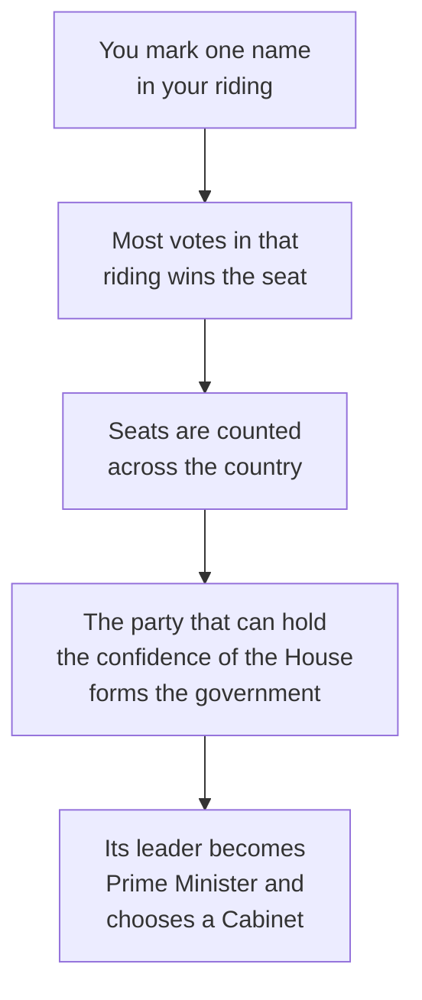

Canada is a constitutional monarchy with a parliamentary democracy and a
federal structure. Three claims in one sentence, and each one changes what
your vote does.

**Constitutional monarchy**: the head of state is the monarch,
represented federally by the Governor General and provincially by a
Lieutenant Governor. They act on the advice of ministers, which is a
constitutional way of saying they sign what an elected government asks
them to sign.

**Parliamentary democracy**: you do not elect a prime minister or a
premier. You elect one member for your riding, and the government is
formed by whoever can hold the confidence of the elected chamber.

**Federal**: powers are divided between orders of government, and neither
can simply overrule the other in the other's field. That is
[[Who Decides What, and Where]].

## What your ballot actually does

Two consequences follow, and both come up every election. A candidate can
win a riding with far less than half the votes cast, because the rule is
most votes, not a majority. And a party can form government without a
majority of seats, provided the House does not vote it down — a minority
government, which in Canada is common rather than exotic.

## Three branches of government, and why the split creates stability

Canada's system of government divides power across three distinct branches
at both federal and provincial levels:

- **The Executive branch** (the Crown, represented by the Governor General
  or Lieutenant Governor; the Prime Minister or Premier; the Cabinet; and the
  professional public service). It proposes legislation, administers government
  departments, and executes laws.
- **The Legislative branch** (Parliament federally, comprising the elected
  House of Commons, the appointed Senate, and the Crown; the unicameral
  Legislative Assembly of Ontario provincially). It debates bills, votes on
  taxation and spending, and holds the executive accountable during daily
  question period and in standing committees.
- **The Judicial branch** (independent courts, including provincial superior
  courts, appeal courts, the Federal Court, and the Supreme Court of Canada).
  It interprets laws, settles disputes, and determines whether laws or government
  actions conform to the Constitution and the Charter.

This separation of powers — combined with the principle of responsible
government, where Cabinet ministers must maintain the confidence of the elected
legislature — is fundamental to political, economic, and social stability in
Canada. It ensures no single leader or faction can exercise unchecked authority,
protects the independence of judges from political retaliation, and guarantees
that the professional public service continues delivering essential services,
collecting revenue, and issuing pensions uninterrupted through elections and
transitions of power.

## Passing a law, and amending an existing one

Passing a new statute or amending an existing Act follows a rigorous, multi-stage
legislative pathway designed to ensure public debate and committee scrutiny:

1. **Notice and First Reading**: The bill is introduced, printed, and made public
   without debate.
2. **Second Reading**: Members debate the core principle and purpose of the bill,
   culminating in a vote on whether the policy should proceed.
3. **Committee Stage**: A parliamentary committee examines the bill clause by
   clause, hears testimony from expert witnesses, affected citizens, and interest
   groups, and votes on specific amendments.
4. **Report Stage and Third Reading**: The amended bill is reported back to the
   full House for final debate and a vote on its complete text.
5. **Senate Review (Federal only)**: The bill repeats this process in the Senate,
   which provides "sober second thought" and can propose further amendments.
6. **Royal Assent**: The Governor General or Lieutenant Governor grants Royal
   Assent, transforming the bill into an Act. The statute comes into force on
   assent, on a date specified in the Act, or by Cabinet proclamation.

To amend or repeal an existing law, an amending bill must travel this exact
same legislative path from start to finish.

## The parties, described the way this course describes them

Elections Canada maintains the register of federal parties; there are
more than a dozen registered at any time, and the list is public. The
ones that have elected members in recent Parliaments include the Liberal
Party of Canada, the Conservative Party of Canada, the New Democratic
Party, the Bloc Québécois, and the Green Party of Canada.

A political compass is a way of placing parties on two axes at once —
economic, from more state direction to more market, and social, from more
regulation of personal conduct to less. It is a teaching tool, not a
measurement. Where you put a party is a claim you have to support, using
what the party has actually proposed and done, and reasonable people
place the same party in different spots.

That is the standard this course holds you to. You describe what a party
says it believes, and you show how that belief leads to its position on a
specific issue — a carbon price, a housing program, a criminal sentence.
You do not rate parties as good or bad, here or in your assessed work.
The point is to make the reasoning visible so a reader can judge it.

> [!note] Nothing on this page names who currently holds office
> Leaders, seat counts and governments change, sometimes within a term.
> Look up the current ones at elections.ca and parl.ca when you need
> them, and date what you write down.

[[The Issue Brief]] asks you to do exactly that for one issue, and
[[How Government Works]] is where it is marked.

%%curriculum-start%%
## Curriculum connection

![[B2.8]]

![[B2.1]]

![[B2.4]]

![[B2.6]]
%%curriculum-end%%
