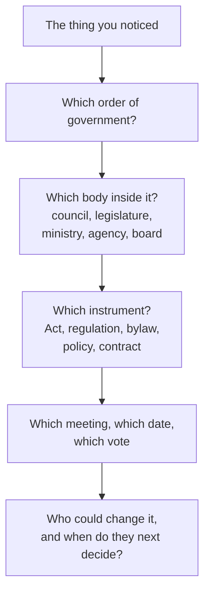

Something in your daily life was decided by a person, in a room, on a
date. The bus schedule, the age you can drive, the fee at the pool, the
rule about phones, the price of a transfer, what your school is allowed to
teach. This investigation traces one of them back to the decision.

## The question

**Who made this decision, under what authority, and what would it take to
reverse it?**

The trap is stopping at the first plausible answer. "The government did"
is not an answer; neither is "the school board", unless you can name the
motion and the meeting.

## The trail

Each arrow is a research step with a public record behind it. Ontario's
laws are at ontario.ca/laws, federal ones at the Justice Laws Website,
bylaws and council minutes on your municipality's site, and school board
policies and agendas on the board's. Nearly all of it is free and
searchable, and the minutes are usually the fastest route because they
name the date.

## Choosing well

Choose something small enough to finish and real enough to matter. Good
choices in past classes: a speed limit changed on one street; a library's
opening hours; a fee added to a permit; a bus route removed; the rule
governing an activity at your own school. Poor choices: a national policy
with no traceable single decision, and anything where the answer is "it
has always been that way", which is usually not true and always hard to
prove.

If your issue turns out to involve treaty land, jurisdiction on reserve,
or an agreement with an Indigenous government, that is a strong choice —
and it means the trail has more than one government on it. Read
[[Indigenous Governance]] before you start rather than after.

## What you produce

A single page with six things on it, in this order:

1. **The decision**: what was decided, when, and who is affected.
2. **The body and order**: the specific level of government, department, or
   council that held the power.
3. **The legal instrument**: the statute, regulation, bylaw, motion, or policy
   amendment that gave it legal force (see [[Bills and What Happens to Them]]).
4. **The funding mechanism**: how it is paid for (operating budget, capital plan,
   tax revenue, user fee, or government grant; see [[Budgets as Statements of Priority]]).
5. **The date and public record**: the meeting minutes, Hansard debate, or
   official notice.
6. **The route to change**: what it would take to amend or repeal it.

Then one paragraph of judgement, applying the concepts of political thinking:
was this decision made at the right level, and does the policy achieve its
intended objective without destabilising other community priorities? Argue it
with evidence.

Use [[Who Decides What, and Where]] for the map and
[[Bills and What Happens to Them]] if the trail leads to a statute. The
result becomes evidence in [[The Issue Brief]].

%%curriculum-start%%
## Curriculum connection

![[A1.1]]

![[B2.2]]

![[B2.7]]

![[B2.5]]

![[B2.6]]

![[A2.3]]
%%curriculum-end%%
