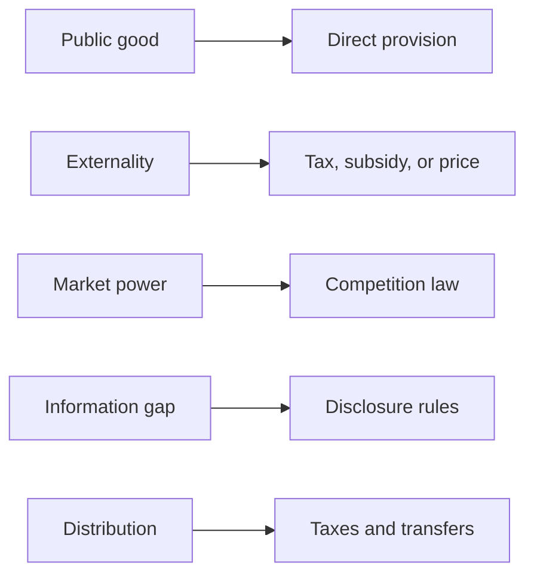

A short and honest list covers why a government overrides a market
outcome. Four items on it are market failures. The fifth is not.

## The list

**Public goods.** Nobody can be kept out, so nobody pays, so nothing is
built. **Externalities.** A cost lands outside the transaction, so the
price is wrong. **Market power.** One firm, or a few, set the price
rather than take it. **Information asymmetry.** One side knows what the
other cannot check. **Redistribution** is the fifth, and a values choice,
not a failure: a market can work perfectly and still produce a
distribution a society rejects. Each reason implies an instrument.

Regulation delivers most of it — minimum wages, insider-trading rules,
safety and accessibility standards, environmental limits, marketing
boards — and every rule puts a cost on the firm, the worker, the
consumer, or the entrant who never appears. Which one gets chosen is not
settled by economics: governments of different political perspectives
allocate scarce resources differently.

**Grey and black markets** appear when a rule or a tax raises the cost of
a transaction far enough that part of it moves out of sight — unreported
work, illegal downloading, tax evasion. Governments care because revenue
is lost, because legal protections do not travel with the worker, and
because compliant firms are undercut. Start from [[Public Goods]], then
argue an instrument in [[The Intervention Argument]].

%%curriculum-start%%
## Curriculum connection

![[B4.2]]

![[C1.4]]

![[C1.5]]

![[C1.6]]

![[C3.1]]

![[C3.3]]
%%curriculum-end%%
