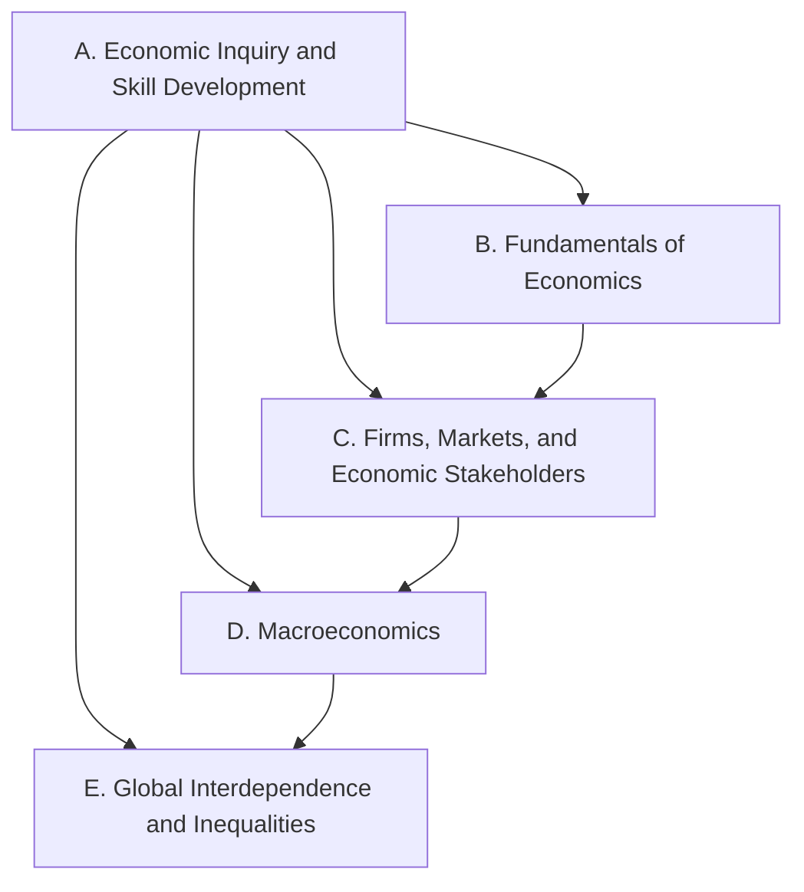

Everything this course does points at one or more of these expectations,
from **CIA4U — Analysing Current Economic Issues, Grade 12 University
Preparation**. Every concept, model, case, and task links back to the
codes it addresses.

> [!info] Where these come from
> The wording below is the Ontario curriculum's own, from the 2015
> Canadian and world studies document, which has not been revised for
> this course. See [[About These Expectations]]. Sixty-four specific
> expectations in eighty-six periods is why several pages here carry
> more than one code.

Strand A is not a unit. Its own stem says *throughout this course*, so
the inquiry process, the handling of data, and the concepts of economic
thinking appear in every unit rather than in a block at the start. The
four content strands build in order: the tools, then a market, then a
whole economy, then that economy opened to the world.

## Strand A. Economic Inquiry and Skill Development
*Throughout this course, students will:*

![[A1. Economic Inquiry]]
![[A1.1]]
![[A1.2]]
![[A1.3]]
![[A1.4]]
![[A1.5]]
![[A1.6]]
![[A1.7]]
![[A1.8]]
![[A1.9]]
![[A2. Developing Transferable Skills]]
![[A2.1]]
![[A2.2]]
![[A2.3]]
![[A2.4]]

## Strand B. Fundamentals of Economics
*By the end of this course, students will:*

![[B1. Scarcity and Choice]]
![[B1.1]]
![[B1.2]]
![[B1.3]]
![[B1.4]]
![[B1.5]]
![[B2. Supply and Demand Models]]
![[B2.1]]
![[B2.2]]
![[B2.3]]
![[B3. Growth and Sustainability]]
![[B3.1]]
![[B3.2]]
![[B3.3]]
![[B3.4]]
![[B4. Economic Thought and Decision Making]]
![[B4.1]]
![[B4.2]]
![[B4.3]]

## Strand C. Firms, Markets, and Economic Stakeholders
*By the end of this course, students will:*

![[C1. The Firm and Market Structures]]
![[C1.1]]
![[C1.2]]
![[C1.3]]
![[C1.4]]
![[C1.5]]
![[C1.6]]
![[C2. Economic Trade-offs and Decisions]]
![[C2.1]]
![[C2.2]]
![[C2.3]]
![[C2.4]]
![[C3. The Role of Government in Redressing Imbalance]]
![[C3.1]]
![[C3.2]]
![[C3.3]]

## Strand D. Macroeconomics
*By the end of this course, students will:*

![[D1. Macroeconomic Models and Measures]]
![[D1.1]]
![[D1.2]]
![[D1.3]]
![[D1.4]]
![[D1.5]]
![[D2. Fiscal Policy]]
![[D2.1]]
![[D2.2]]
![[D2.3]]
![[D2.4]]
![[D3. Monetary Policy]]
![[D3.1]]
![[D3.2]]
![[D3.3]]

## Strand E. Global Interdependence and Inequalities
*By the end of this course, students will:*

![[E1. Theories and Models of International Trade]]
![[E1.1]]
![[E1.2]]
![[E1.3]]
![[E1.4]]
![[E2. International Economic Developments]]
![[E2.1]]
![[E2.2]]
![[E2.3]]
![[E2.4]]
![[E3. International Economic Power and Inequality]]
![[E3.1]]
![[E3.2]]
![[E3.3]]
