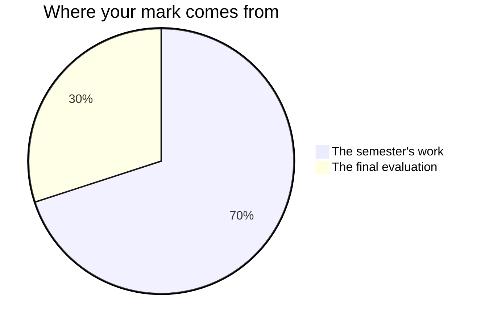

Nothing here is marked on how much you like the book, how quickly you get
through it, or how certain you sound while arguing about it. It is marked
on what the work does: the claim it makes, the evidence holding the claim
up, and whether a reader gets to the end without going back.

## The seventy and the thirty

Every Grade 10 academic credit in Ontario is built the same way.

**Seventy per cent** comes from the marked work of the semester. It is not
an average of everything from the first week onwards — it leans towards
your **most recent and most consistent** work, because a mark is supposed
to describe what you can do now. A paragraph you could not write in the
first unit and can write in the last one is evidence about now.

The seventy is five pieces, and nothing else:
[[The Story Behind the Story]], [[The Scene, Staged]],
[[The Literary Essay]], [[The Seminar]], and
[[The Media Deconstruction]]. They are not equally weighted — the essay
and the seminar ask for more than the first story did, and they arrive
later, which counts twice over. Ask me for the numbers whenever you want
them. They are not a secret; they have simply never improved anybody's
essay.

**Thirty per cent** is the [[Final Examination]], written in the
examination period. It is the one piece that reaches across all four
units at once: a text you have never seen, the studied texts from memory,
an unseen media text, and an essay planned and written in the room. That
is why it is the final evaluation, and why it is worth what it is worth.

## The four categories

| Category | In this course, that means |
| --- | --- |
| **Knowledge and Understanding** | You know the text and the terms |
| **Thinking** | You can interpret and evaluate, with evidence, including evidence that complicates your case |
| **Communication** | A reader follows you; the writing is organised and the voice is yours |
| **Application** | You transfer what we learned to a text or a task you have not seen |

No piece uses only one of them, and which matters most shifts with the
piece. The fourth is why the sight passages and the unseen media question
exist: anyone can write about the story we read together, and the
question this course asks is whether you can do it with something you
meet for the first time.

## Three kinds of evidence, and two of them are not paper

**What you make** is the obvious one: the story and the craft note, the
director's note, the essay, the seminar follow-up, the analysis and the
text you build.

**What I watch you do** is the second, and it exists only in the period
it happens in: what your pen does when you read your own sentence aloud,
what your group does with a line of the play nobody in it can paraphrase,
whether a poster changes after it is tested or only the argument about
the poster does.

**What you tell me** is the third: the conferences in the drafting
periods, the minute after your seminar question is approved, the two
minutes at your desk while the room works.

Some of what you understand about a text will only ever exist out loud.
A reading you can defend at your desk and have not yet got onto paper is
real evidence, and it is recorded as evidence. That is not a kindness
extended to people who find talking easier than writing — it is the only
way two thirds of the evidence ever gets collected at all.

Your [[Reading Journal]] is where all of this is rehearsed, and it is not
marked. What you write between classes is practice; practice is not
evaluated. Bring it to every seminar and every drafting period anyway —
the essays that arrive fastest belong to the people whose notes were
already arguing.

## What is not in your mark

How you work is reported separately, on the same report card, as **E, G,
S or N**: responsibility, organization, independent work, collaboration,
initiative, and self-regulation. They will be reported honestly and they
move your percentage by nothing. So there is no mark here for looking
busy, for handing work in early, or for the number of times you speak.
What you say in a seminar is marked — on what the contribution does to
the discussion, never on how much of it there is.

The one exception is where the curriculum itself asks for the habit. Two
marked pieces ask you to say what you did and what you would change: the
three sentences you hand in with [[The Literary Essay]], and the last
paragraph of your seminar follow-up. Describing the strategies you used
and naming the next thing to fix is an expectation of this course in its
own right — [[C4.1|as a writer]] and
[[A3.1|as a listener and speaker]] — so where a task asks for it, it is
marked like anything else in the curriculum.

Your own judgement of your work is not part of your mark, and neither is
a classmate's. You will judge your own work against the criteria before
you hand it in — [[Judging Your Own Work]] — and a partner reads your
draft in every workshop. Both make the work better. Neither becomes a
number; determining the mark is mine to do, from evidence.

That covers the checkpoints you mark yourself at the end of each of the
first three units, and the timed practice before the examination. They
exist so that you and I both find out what is missing while there is
still time to do something about it. Nothing written on them reaches your
percentage.

## Working with other people

Three of the five pieces are made with other people, and none of them
carries a shared mark.

- On [[The Scene, Staged]] the staging belongs to the group. What is
  marked as yours is your own director's note and the choices you
  executed on stage.
- On [[The Seminar]] your group leads one discussion, and there is no
  group mark on it: your follow-up is yours, and so is what you do in the
  five seminars you do not lead.
- On [[The Media Deconstruction]] the analysis and the made texts are the
  pair's. The note you write in class on the revision day is yours alone,
  and it is the part that carries your individual mark.

## Drafts

Every major piece is drafted, read, and rewritten. The draft is not
marked; it is where the teaching happens. Handing in a first attempt is
allowed and reliably costs more than the time it saved.

Each of the five is looked at by me before it is handed in or performed —
a conference, a note left on your desk, a round of the room — and there is
a working period after that reading whose job is acting on it. Sometimes
it is the next class; on [[The Scene, Staged]] it is the rehearsal. Either
way it is on the schedule, and not something left for you to find time for
at home.

## Late work

Talk to me before the deadline and we will set a new one. Silence is the
problem, not lateness: work that never arrives cannot be assessed, and
something unassessed cannot earn a mark.

> [!tip] The most useful ten minutes in this course
> Read the criteria table on a task page before you start, and again when
> you think you are finished. Most of the gap between a level 3 and a
> level 4 in this room is a criterion somebody did not read twice.

%%curriculum-start%%
## Curriculum connection

![[C4.1]]

![[B4.1]]
%%curriculum-end%%
