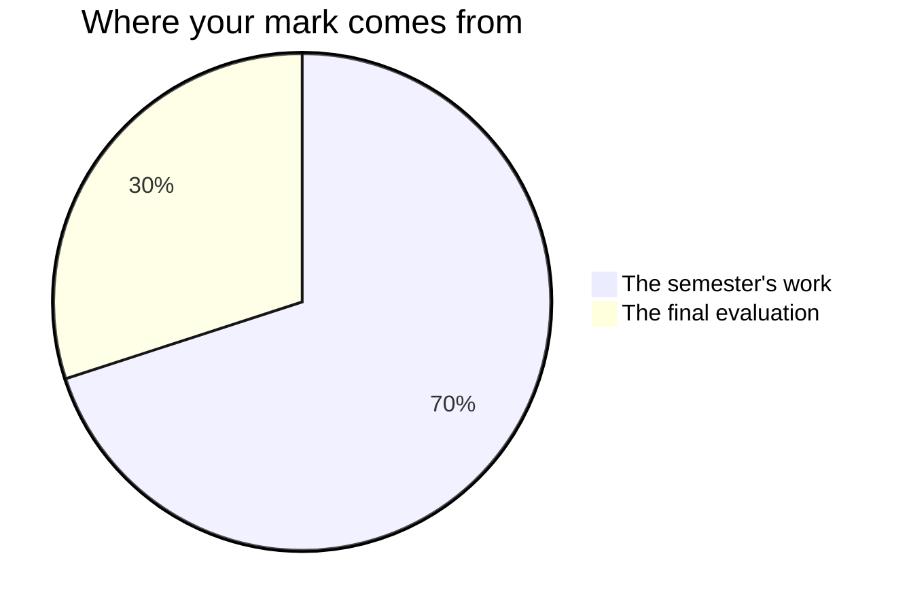

Nothing here is marked on how much you like reading, or on how confident
you sound while you do it. It is marked on what your work does: the
argument it makes, the evidence it stands on, and whether a reader can
follow it without going back.

## The seventy and the thirty

Every Grade 11 university credit in Ontario is built the same way.
**Seventy per cent** of your mark comes from work spread across the whole
course, and it leans towards your **most recent and most consistent**
work rather than averaging your first weeks against your last. A
paragraph you could not write at the start and can write now is evidence
of what you can do now, which is the thing a mark is supposed to
describe.

The remaining **thirty per cent** is the final evaluation, and it is three
things in two very different rooms: the [[Final Examination]], written
under examination conditions on texts you have not seen, and the finished
essay of [[The Independent Study]], two months with a text you chose, and
the two minutes in which you defend that essay out loud. Deliberately
different, so that neither one afternoon nor one essay decides this
alone — and so that the last thing this course asks for is not only
something written.

**The seventy** is everything else that is handed in and marked:
[[The Close Reading Essay]], [[The Macbeth Seminar]],
[[The Critical Essay]], [[The Media Argument]],
[[The Comparative Response]], the four checkpoints of the independent
study, and the milestone entries in your [[Reading Journal]]. They are
not equally weighted — the critical essay and the comparative response
ask for more than the first essay did, and the seminar is the one marked
piece that happens out loud. Ask me for the exact split whenever you want
it. It is not a secret; it is just not the useful thing to memorise.

## The independent study, and why it is weighted where it is

It runs across two months with four checkpoints, and each checkpoint is
assessed — those four belong to the seventy; the finished essay and the
defence of it are the parts that count in the thirty. A student who does
the whole thing in the last fortnight produces something that reads exactly like a thing done in a
fortnight, and the checkpoints exist to make that visible early enough to
fix.

## The categories

Four kinds of thinking, not one. Every task asks for more than one of
them, and which ones matter most shifts with the task.

| Category | Here, that means |
| --- | --- |
| **Knowledge and Understanding** | You know the texts and the critical vocabulary |
| **Thinking** | You interpret, evaluate, and handle evidence that complicates your case |
| **Communication** | The writing is organised, cohesive, and yours |
| **Application** | You transfer the method to a text nobody taught you |

The fourth is why the last unit and the sight passages exist. Anyone can
write about the story we read together; the course is asking whether you
can do it with a text you meet for the first time under time.

## Three kinds of evidence, and two of them are not paper

**What you make** is the obvious one: essays, responses, the media text,
the journal. **What I watch you do** is the second: whether you go back
to the book when a claim wobbles, whether you test a passage before you
build on it, what you actually do with a paragraph a partner has just
marked. **What you say** is the third — the conferences in the drafting
periods, the seminars, the check-ins while the room writes.

Some of what you understand about a text will only ever exist out loud. A
reading you can defend in a seminar and have not yet got onto paper is
real evidence, and it counts. If writing is slower for you than talking,
the conference is often where the strongest evidence of that day comes
from. That is not a consolation prize; it is how the mark is meant to
work.

The [[Reading Journal]] entries that count towards a mark are the ones
written **in class, at a milestone** — the five minutes of silence when
the play ends, the writing after the last pages of the novel, the growth
pair you build in the last week. What you write at home between classes
is yours, it is worth doing, and it is practice. Practice is not
marked.

## What is not in your mark

How you work is reported separately, on the same report card, as **E, G,
S or N**: responsibility, organization, independent work, collaboration,
initiative, and self-regulation. We will talk about them and they will be
reported honestly, and none of them moves your percentage by a point. A
mark describes an essay; that column describes a habit, and an average of
the two would describe neither.
So there is no mark here for looking busy, for handing things in on time,
or for how much you talk. What you say in a seminar is marked — on what
the contribution does, never on how often you make one.

The one exception is where a habit is itself part of what this course is
required to teach. Explaining which strategies worked for you, and where
they did not, is a curriculum expectation three times over — as a
[[B4.1|reader]], as a [[C4.1|writer]], and as a
[[A3.1|listener and speaker]] — so when a piece of work asks for that
reflection, it is marked like anything else in the curriculum.

Nor is what you decide about your own work, or what a classmate decides
about it. You will judge your own against the criteria at every essay —
see [[Judging Your Own Work]] — and a partner will go through your draft
in every workshop, because both make the writing better. Neither one
becomes a number. Determining the mark is mine to do, from evidence.

Each task page publishes its criteria before you start, written as things
a reader could see in the work. If a mark ever surprises you, start
there.

## Late work

Talk to me before the deadline and we set a new one. Silence is the
problem: work that never arrives cannot be assessed.

%%curriculum-start%%
## Curriculum connection

![[C4.1]]

![[B4.1]]
%%curriculum-end%%
