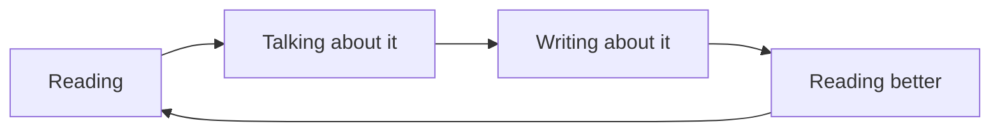
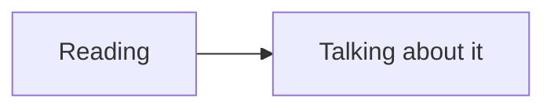
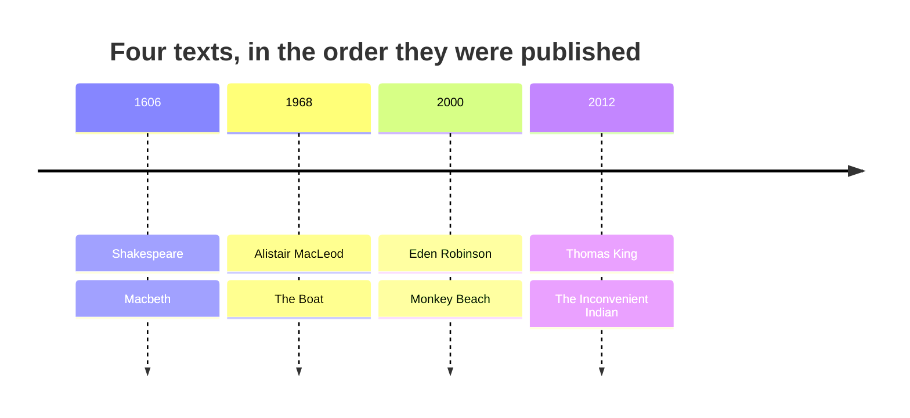

This page has two audiences. Students: it shows why the notes look the
way they do. Teachers: it is a working reference for everything a page
here can hold, with the source of every example shown beside it.

Everything below is written in **Markdown** — plain text with a few marks
of punctuation that mean something. If you can write a text message, you
can write this.

---

## Text that carries meaning

You get **bold**, *italic*, ~~struck through~~, and ==highlighted== text.
Highlighting is the one worth knowing: it draws the eye better than bold
when you want a single ==key term== to stand out in a paragraph.

**How that was made:**

```markdown
**bold**, *italic*, ~~struck through~~, ==highlighted==
```

Keyboard keys look like keys: press <kbd>⌘</kbd> + <kbd>K</kbd> to
search this site.

---

## Headings, and the table of contents

Every `##` heading becomes a link in **Navigate this page**, on the
right. Nothing builds that list by hand — it is made from the headings as
the page is built, so it cannot fall out of step with the page.

### Turning it off

A short page reads better without a contents panel. One line of
frontmatter does it:

```yaml
---
enableToc: false
---
```

Every class page in [[All Classes/index|All Classes]] uses this.

---

## Callouts

Callouts lift something out of the flow of the page. There are a dozen
kinds, each with its own colour and icon, so students learn to recognise
them at a glance.

> [!note] Note
> Neutral information worth setting apart.

> [!tip] Tip
> A habit or a shortcut that makes the work easier.

> [!important] Important
> The one thing to take away if you take away nothing else.

> [!warning] Warning
> Where people usually go wrong.

> [!question] Question
> Something to think about rather than something to know.

> [!quote] Quote
> Used in this course for epigraphs and for lines worth sitting with.

> [!abstract] At a glance
> Used at the top of task pages for the format, the deadline, and what is
> assessed.

**How that was made:** a blockquote with the kind named in brackets.

```markdown
> [!warning] Where people usually go wrong
> The text of the callout goes here.
```

### Foldable callouts

Add a `-` after the kind to start it collapsed — useful for answers,
hints, and anything a reader should attempt before seeing.

> [!success]- A worked answer (click to expand)
> The witches never tell Macbeth to kill anyone. They give him plenty of
> orders — "seek to know no more" — but every instruction to do the thing
> itself comes from somebody he is married to or from himself, which is
> what makes the prophecy a test rather than a cause.

---

## Tables

**How that was made:** rows of text separated by `|`, with a line of
dashes under the headings.

| Device | What it does | Where we meet it |
| --- | --- | --- |
| Simile | Compares using *like* or *as* | "The Boat" |
| Allusion | Points at another text or event | *Macbeth* |
| Juxtaposition | Sets two things side by side to make a point | *Monkey Beach* |

---

## Quoting at length

> Life's but a walking shadow, a poor player
> That struts and frets his hour upon the stage.

Two lines of *Macbeth*, set as a block quotation because verse
is quoted line by line. Block quotations take no quotation marks — the
indent does that job, and the line break is preserved because in verse
the line break is meaning. The conventions are on
[[Writing About Literature]].

**How that was made:** a `>` at the start of each line.

---

## Checklists

**How that was made:** a list where each line starts with `- [ ]`, or
`- [x]` for one already done.

- [ ] Draft finished
- [x] Read aloud once
- [ ] Checked against the criteria on the task page

On this site they are read-only — the boxes show what the page says, and
clicking one does nothing. Copied into your notebook, they are useful for
keeping your place.

---

## Diagrams

Diagrams here are **written, not drawn**, which means they can be edited
in seconds and never need a graphics program.



**How that was made:** not a picture — these lines of text, between two
fence lines that say `mermaid`.

````markdown

````

A timeline, which is useful when a course reads across a century:



---

## Transclusion — one page inside another

`![[Page name]]` pulls a whole page in live rather than copying it. Here
is this course's help-session page, embedded:

![[Help Sessions]]

Change the source page and every page that embeds it updates. That is how
each section's landing page always shows the current class, and how every
task page shows the curriculum expectations it addresses without anybody
maintaining two copies.

---

## Backlinks

At the foot of most pages is **When did we do this?** — every page that
links here, gathered automatically. Open [[Voice and Narration]] and you can
see every class that used the idea, in order, without anybody keeping a
list.

---

## Things this course does not need, which the site can still do

An English course has no equations and no code. The software supports
both, and a teacher moving a different subject onto this site should know
that:

Mathematics, set with the same typesetting system journals use:

$$\text{marks} = \frac{\text{what you can do}}{\text{what was asked}} \times 100\%$$

Code, with the language named so it is coloured properly:

```python
words = open("essay.txt").read().split()
print(len(words), "words")
```

Neither appears anywhere else in this course. They are here because the
question "can it do…?" deserves an answer you can see.

---

## Holding a page back

A page with `publish: false` in its frontmatter is skipped entirely when
the site is built. That is how tomorrow's class page can be written today
and published when the class actually happens.

```yaml
---
publish: false
---
```

---

## What all of this is for

| Feature | The problem it removes |
| --- | --- |
| Transclusion | The same text copied into six places, five of them stale |
| Backlinks | "Where did we do this again?" |
| Callouts | Important things lost in a wall of paragraphs |
| Diagrams as text | Rebuilding a whole diagram to change one arrow |
| Holding a page back | Keeping unpublished plans in some other file somewhere |

Write it once, link to it everywhere.
