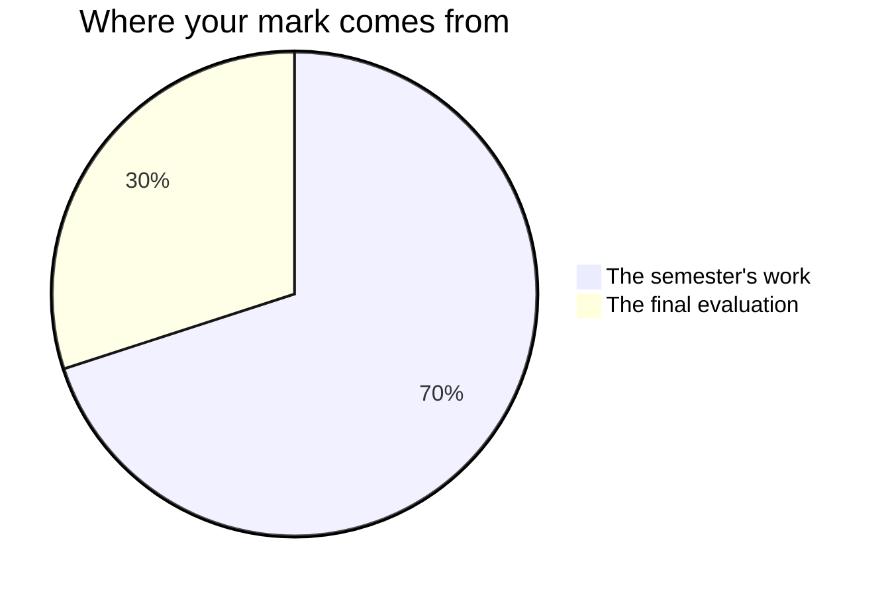

Nothing here is marked on how much you read, how quickly you speak, or
how confident you sound while doing either. It is marked on what the
work does: the argument it makes, the evidence holding it up, and whether
a reader can follow it without going back.

## The seventy and the thirty

Grade 12 university English is built the way every Ontario credit is built.
**Seventy per cent** of your mark comes from work done across the course,
weighted towards the **most recent and most consistent** evidence rather
than averaged from the first week onwards. An argument you could not make at
the start of the course and can make now is evidence of what you can do now,
and now is the thing a mark is supposed to describe.

The remaining **thirty per cent** is the final evaluation, in two very
different rooms: the [[Final Examination]], three hours of which nearly
half is on texts you have never seen, and the finished essay and oral
defence that end [[The Independent Study]], a text you chose and have
lived with since the autumn. One is cold and timed; the other you have
had longer with than anything else in the course. Between them they ask
for different things, which is the whole reason there are two.

**The seventy** is the marked work of the term: [[The Lens Essay]],
[[The Hamlet Seminar]], [[The Critical Essay]], [[The Comparative Essay]],
[[The Adaptation Study]], and the four checkpoints of
[[The Independent Study]]. They are not equally weighted — the critical
essay and the comparative essay ask for more than the lens essay did, and
they arrive later, which counts twice over. Ask if you want the numbers.
Knowing them has never improved anybody's essay, but they are yours.

The independent study sits on both sides of that line, which catches
somebody out every year. Its **four checkpoints** are marked when they
happen, and they belong to the seventy. What belongs to the thirty is
what you hand in at the end and what you say when you are asked about it.

## The categories

| Category | Here, that means |
| --- | --- |
| **Knowledge and Understanding** | You know the texts and the critical vocabulary |
| **Thinking** | You interpret, evaluate, and handle evidence that complicates your case |
| **Communication** | The writing is organised, cohesive, and yours |
| **Application** | You transfer the method to a text nobody taught you |

Every piece asks for more than one of them, and which matters most shifts
with the piece. The fourth is why the sight passages and the independent
study exist: anybody can write about the play we read together, and the
question this course asks is whether you can do it with something you
meet on your own.

## Three kinds of evidence, and only one of them is paper

**What you make** — the essays, the analysis and the media text you
produce, the seminar you lead. **What I watch you do** — which passage
you go back to when a claim wobbles, what you do in the ten seconds after
somebody breaks your thesis, whether the deletion test gets run or merely
asserted. **What you say** — the conferences built into the lens essay,
the critical essay and the independent study, the seminars, and the two
minutes at your desk while the room works.

A reading can be real before it is written down. If you can hold one
under questioning and it is not yet on paper, it is still evidence, and
it is recorded as evidence. That is not a kindness extended to people who
find talking easier than writing; it is the only way two thirds of the
evidence ever gets gathered at all.

The [[Reading Journal]] is where all of this is rehearsed, and it is not
marked. What you write between classes is practice, and practice is not
evaluated here. Bring it to every seminar and every drafting period
anyway — the essays that arrive fastest belong to the people whose notes
were already arguing.

## What is not in your mark

How you work is reported separately, on the same report card, as **E, G,
S or N**: responsibility, organization, independent work, collaboration,
initiative, self-regulation. They will be reported honestly and they move
your percentage by nothing. So there is no mark here for looking busy,
for handing work in early, or for the number of times you speak. What you
say in a seminar is marked — on what the contribution does to the
discussion, never on how much of it there is.

The one exception is where the curriculum itself asks for the habit.
After the seminars you write a short follow-up naming what you did as a
speaker and as a listener, what worked, and what you will do differently
in the discussions and the defences still ahead of you. Reflecting on
how you listen and speak is [[A3.1|an expectation of this course]] in
its own right, the follow-up is written in class, and it is marked like
anything else in the curriculum.

Your own judgement of your work is not part of your mark, and neither is
a classmate's. You will judge your own essays against the criteria before
you hand them in — [[Judging Your Own Work]] — and a partner will go
through your draft in every workshop. Both make the writing better.
Neither becomes a number. Determining the mark is mine to do, from
evidence.

That covers the checkpoints you mark yourself: the unseen passage at the
end of each of the first three units, and the timed sight passages
before the examination. They exist so that you and I both find out what
is missing while there is still time to do something about it. Nothing
written on them reaches your percentage.

## Working with other people

Two pieces are made with somebody else, and neither carries a shared
mark. On [[The Hamlet Seminar]] you are marked on the stretch you lead,
the passage you bring, your follow-up, and what you do in the five
seminars you do not lead. On [[The Adaptation Study]] the analysis and
the note are yours alone; the made text is the pair's, and your mark for
it comes from the part you made, which your note names.

## If a mark surprises you

Every task page carries its criteria, published on the day the task
launches rather than the day it is due, and written as things somebody
reading your work could point at. Every essay here is drafted, read by
somebody, and rewritten in class before it is handed in — so by the time
a piece reaches me you have already seen it judged twice. A mark that
surprises you is a mark to take back to that criteria table, and
[[Getting Help]] says how to find me.

## Late work

Talk to me before the deadline and we set a new one. Silence is the
problem: work that never arrives cannot be assessed.

%%curriculum-start%%
## Curriculum connection

![[C4.1]]

![[B4.1]]
%%curriculum-end%%
