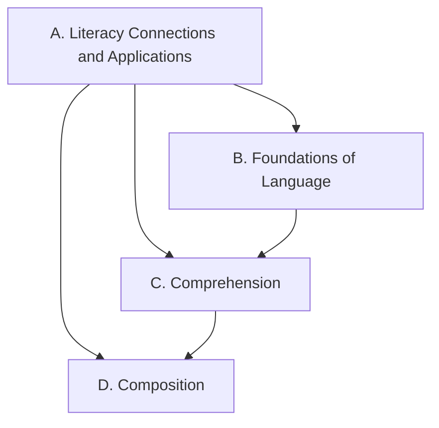

Everything we do in this course points at one or more of these expectations,
from **ENL1W — English, Grade 9, De-streamed**. Lesson pages link here so you can always
see *why* we are doing something.

> [!info] Where these come from
> The wording below is the Ontario curriculum's own. See
> [[About These Expectations]].

Strand A runs through all of the others: you practise those skills
while reading, listening, speaking, and writing.

## Overall and specific expectations

### Strand A. Literacy Connections and Applications
*Throughout this course, in connection with the learning in strands B to D, students will:*

![[A1. Transferable Skills]]
![[A1.1]]
![[A1.2]]
![[A2. Digital Media Literacy]]
![[A2.1]]
![[A2.2]]
![[A2.3]]
![[A2.4]]
![[A2.5]]
![[A2.6]]
![[A2.7]]
![[A3. Applications, Connections, and Contributions]]
![[A3.1]]
![[A3.2]]
![[A3.3]]

### Strand B. Foundations of Language
*By the end of this course, students will:*

![[B1. Oral and Non-Verbal Communication]]
![[B1.1]]
![[B1.2]]
![[B1.3]]
![[B1.4]]
![[B1.5]]
![[B2. Language Foundations for Reading and Writing]]
![[B2.1]]
![[B2.2]]
![[B2.3]]
![[B3. Language Conventions for Reading and Writing]]
![[B3.1]]
![[B3.2]]
![[B3.3]]

### Strand C. Comprehension: Understanding and Responding to Texts
*By the end of this course, students will:*

![[C1. Knowledge about Texts]]
![[C1.1]]
![[C1.2]]
![[C1.3]]
![[C1.4]]
![[C1.5]]
![[C1.6]]
![[C1.7]]
![[C2. Comprehension Strategies]]
![[C2.1]]
![[C2.2]]
![[C2.3]]
![[C2.4]]
![[C2.5]]
![[C2.6]]
![[C2.7]]
![[C3. Critical Thinking in Literacy]]
![[C3.1]]
![[C3.2]]
![[C3.3]]
![[C3.4]]
![[C3.5]]
![[C3.6]]
![[C3.7]]
![[C3.8]]

### Strand D. Composition: Expressing Ideas and Creating Texts
*By the end of this course, students will:*

![[D1. Developing Ideas and Organizing Content]]
![[D1.1]]
![[D1.2]]
![[D1.3]]
![[D1.4]]
![[D1.5]]
![[D2. Creating Texts]]
![[D2.1]]
![[D2.2]]
![[D2.3]]
![[D2.4]]
![[D2.5]]
![[D2.6]]
![[D3. Publishing, Presenting, and Reflecting]]
![[D3.1]]
![[D3.2]]
![[D3.3]]
