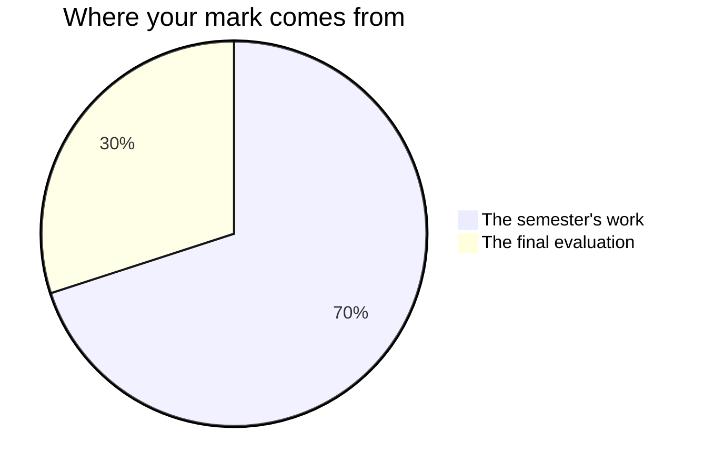

Marks in this course measure what you can do by the end, not the average
of everything you tried on the way. That sentence has consequences worth
reading.

## The four categories

Every piece of assessed work is judged in one or more of these, and the
task page tells you which:

| Category | In English, that means |
| --- | --- |
| **Knowledge and Understanding** | You know what the text says, and what the terms mean |
| **Thinking** | You can interpret, infer, and judge — with evidence |
| **Communication** | A reader can follow you, and your voice sounds like a person |
| **Application** | You use what we learned in a new situation, including your own writing |

No task uses only one, and the balance shifts. [[The Argument]] asks for
all four at once, which is part of why it comes last.

## The seventy and the thirty

Every Grade 9 credit in Ontario is built the same way.

**Seventy per cent** comes from the work of the semester: the five tasks
you hand in — [[Who You Are, in Three Hundred Words]], [[The Book Club]],
[[Say It Out Loud]], [[The Fact Check]], and [[The Argument]]. They are not
weighted equally and they are not averaged. What counts is what you can do
*consistently*, with the later work weighing more than the earlier: a
paragraph written at the start of the course and one written at the end of
the course are not equal evidence of what you can do now. Ask me for the
exact split whenever you want it — it is not a secret, it is just not the
useful thing to memorise.

**Thirty per cent** is the final evaluation: [[The Portfolio Conversation]]
in the last week, with your work from the whole course on the desk
between us. It is the one piece of assessment that reaches across all
four units at once, which is what a final evaluation is for.

Everything else — the practice sets, the discussions, the retrieval
warm-ups, the end-of-unit checkpoints, and your journal apart from the
reading log that belongs to [[The Book Club]] — is how you get good
enough for those six. None of it is marked. That is not a hint that it is
optional. It is where the learning happens, and skipping it shows up in
the six things that are.

## Three kinds of evidence, and two of them are not paper

**What you make** is the obvious one: the piece, the script with your
delivery marks on it, the published check, the response. It arrives, it
holds still, and I can read it on a Sunday.

**What I watch you do** is the second. Whether you cut the sentence that
was explaining what the story already showed. Whether you write down the
objection your partner actually made, or a softer one you can answer.
Whether the pen comes out after you hear your own script out loud for
the first time. None of that survives into the finished piece, and all
of it is evidence.

**What you say** is the third, and in an English class it is the big one.
A reading often exists out loud before it exists on paper — you will say
something in a circle early on that you could not have written that
week. The conferences, the circle meetings, and the fifteen minutes of
[[The Portfolio Conversation]] are not progress checks. They are evidence
in their own right, and for some of you they are where the strongest
evidence of the term comes from.

If your draft is thin and you talk about your book like somebody who has
read it, that counts. It is not a consolation prize. It is how the mark
is meant to work.

## Drafts, feedback, and rewriting

Most major writing in this course is drafted, given feedback, and
rewritten before it is marked. The draft is not marked; it is where the
teaching happens. Skipping it and handing in a first attempt is legal and
almost always costs more than the time it saved.

Every task has a point before the deadline where you get feedback — from
me, from a partner, or both — and class time afterwards to use it.
Sometimes that is a whole period, as with the drafting period that
follows a conference with me. Sometimes it is the last fifteen minutes of
the next class. It is never nothing, and it is never sent home as
homework.

## What is not in your mark

**How you work** is reported separately, on the same report card, as
**E, G, S or N** — six habits: responsibility, organization, independent
work, collaboration, initiative, and self-regulation. They matter, we
will talk about them honestly, and they do not move your percentage. The
mark describes the work; that column describes the worker, and mixing
the two tells you less about both.

There is one narrow exception, and it comes from the curriculum rather
than from me: [[A1.2|expectation A1.2]] asks you to explain how skills
such as self-directed learning help you learn, and to make a plan to
build them. That is part of what this course is required to teach, so it
is evaluated like anything else in the course — in
[[The Portfolio Conversation]]. It is not a licence to mark whether you
brought a pen.

**Your own judgement of your work, and your classmates'**, are not part
of your mark either. You will judge your own work against the criteria
often — see [[Judging Your Own Work]] — and a partner will tell you where
they stopped being persuaded. None of that becomes a number. The mark is
mine to determine, from evidence, and that is exactly what makes a
workshop safe to be honest in.

> [!important] What I mark, and what I do not
> I mark the piece, not the person, and not the effort. Effort is real
> and matters enormously — it is why the piece got better — but the mark
> describes the work in front of me. If you worked hard and the piece is
> not there yet, come and see me and we will make a plan; that is the
> conversation worth having.

## Late work

Tell me before the deadline and we will agree a new one. That is it —
that is the whole policy, and it exists because "I did not want to hand
in something bad" is a reason I respect and can work with.

Silence is different. Work that simply does not arrive, with no
conversation, eventually cannot be assessed, and something that cannot be
assessed cannot earn a mark.

Every task page publishes its criteria before you start, in the words I
will actually use. If a mark ever surprises you, start there — and
[[Getting Help]] lists the ways to reach me.

%%curriculum-start%%
## Curriculum connection

![[D3.3]]
%%curriculum-end%%
