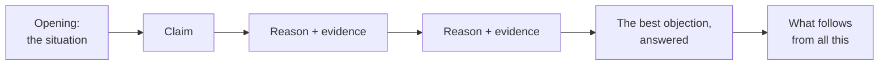

> [!abstract] At a glance
> Individual · five class periods, drafted and rewritten · 700–900 words
> · assessed on all four categories

## The task

Change somebody's mind about something small and real.

Not "climate change is bad" — you will convince nobody of anything they
do not already hold. Something local, arguable, and yours: a rule at this
school, a decision in your community, a claim in a text we read, a thing
everybody assumes about people your age.

## What an argument needs

1. **A claim somebody could disagree with.** Test it: if nobody could
   argue the other side, you have a fact, not a thesis.
2. **Reasons**, in an order you chose. The strongest one goes last if you
   want to be remembered, first if you might lose the reader.
3. **Evidence for each reason** — a source, a text, a number, an example.
   [[Citing What You Use]] tells you how to credit it.
4. **The strongest objection, answered.** Not the weakest one. Handling
   the best counter-argument is what separates a Grade 9 essay from a
   Grade 12 one, and you can do it now.
5. **An ending that does something.** Not a summary of what you just
   said.

## The shape

That is a shape, not a formula. If your argument is better served by
another order, take it — and say why in your journal.

## How it will be built

| Period | What happens |
| --- | --- |
| 1 | Position, and the objection you most fear. Both written down |
| 2 | Evidence hunt, with sources recorded properly |
| 3 | Draft |
| 4 | Workshop: a partner argues the other side out loud while you take notes |
| 5 | Rewrite, and read the whole thing aloud before handing it in |

## How it is marked

| Category | What I am looking for |
| --- | --- |
| Knowledge | You know the situation you are arguing about, including the boring parts |
| Thinking | The reasoning holds; the objection is the real one; the evidence supports the claim it is under |
| Communication | Paragraphs hold together, per [[Paragraphs That Hold Together]]; the voice is yours |
| Application | You use the conventions from [[Writing About Texts]] when you cite what you read |

> [!tip] The test that predicts the mark
> Give your draft to somebody who disagrees with you and ask them to mark
> the sentence where they stopped being persuaded. That sentence is your
> rewrite. Nothing else you do in period 5 will help as much.

%%curriculum-start%%
## Curriculum connection

![[D1.4]]

![[D2.1]]

![[D2.5]]

![[C3.3]]

![[B3.1]]

![[B3.2]]

![[B3.3]]

![[D1.2]]

![[D2.4]]

![[D3.1]]
%%curriculum-end%%

%%
Triangulation — the evidence you will not have unless you go and get it.

OBSERVE — Unit 4, Day 14, the workshop where a partner argues the other
  side
  Watch for: whether the objection is written down as the partner
  actually put it, or in a softened form the writer can already answer.
  Then: whether the writer argues back instead of writing — the ones who
  defend out loud usually have an empty page at the end of the period.
  Going well: a pen moving while the partner is still talking; a
  follow-up question rather than a rebuttal.
  Stuck: a debate. Two people enjoying themselves, nobody taking notes,
  both leaving with what they arrived with.
  The essay will show you which objection was answered. It cannot show
  you that a better one was offered in this period and quietly
  downgraded, which is the single most common way a Grade 9 argument
  stays safe.
  Record: class list, two ticks — wrote it as said, argued instead.
  That is D2.5 watched: revision that SEEKS and SELECTIVELY USES
  feedback. Selecting is the word, and selecting is what you are
  watching.

TALK — Unit 4, Day 12, the conference already on that agenda
  Ask: "Show me a piece of evidence you found and are not going to use.
  Why is it out?"
  Then: "Who actually holds the other side of this — a real person, not
  a position? What would they say that you cannot answer yet?"
  A strong first answer gives a reason about the source or the fit —
  it came from the group that benefits, it proves something slightly
  different from the claim — rather than "I ran out of room". That is
  D1.4's "identify and organize relevant content" heard, since what gets
  left out is half of organizing it, together with C3.3, credibility and
  significance assessed. Do not lean on D1.4's "evaluating the choices"
  for this: those choices are of text form, genre and medium, not of
  evidence. The essay shows what was kept and is silent about everything
  discarded.
  A strong second answer names somebody and admits a gap; a weak one
  describes an imaginary opponent who is conveniently wrong.
  Record: one line per student in the conference list, and a star
  against anyone who admitted a gap — they are the ones to send back to
  the evidence.

The product evidence is the essay handed in on Day 16.
%%
