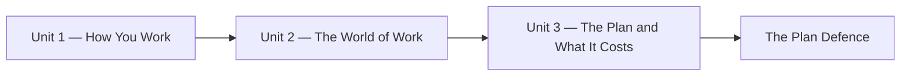

Career Studies is short and it is about you, which is an unusual
combination in a school timetable. Ten weeks from the first week, in this
period, and then Civics takes the same period for the rest of the
semester. That means nothing here is filler — there is not room for any.
[[Using This Site]] shows you where everything lives.

## The shape of the ten weeks

Unit 1 is about you: what you can already do, how you decide, how you
set goals, and how you keep yourself working well. Unit 2 is about work:
what is changing, what employers are actually asking for, and what the
pathways after Grade 12 are. Unit 3 puts the two together into a plan
with a budget attached, and then you defend it.

## A normal period

1. **Something to do**, usually before it has been explained — a list, a
   posting, a decision, a real number to find.
2. **Comparing.** What you came up with, next to what other people came
   up with. Most of the learning in this course happens here.
3. **The name for it.** The concept page becomes useful at this point
   and not before.
4. **Where it goes.** Into your portfolio, or into the task it feeds.

## What the course asks of you

- **Bring the real version.** This course only works on true
  information — your actual marks, your actual hours, your actual
  situation. Nothing you write is shared without your say-so.
- **Look things up at the source.** Costs, requirements, and deadlines
  all change. The skill being taught is finding today's number, not
  memorising last year's.
- **Take other people's plans seriously.** Apprenticeship, college,
  work, community living, university, and taking a year are all real
  plans. Nobody in this room ranks them out loud or quietly.
- **Say when something is hard.** Early, and to whoever is easiest to
  say it to. [[Getting Help]] lists the options.

## What you finish with

A portfolio, a plan for your first year after secondary school with a
budget you can defend, and a set of documents — profile, résumé,
covering message — that you will reuse for the next two years and
probably longer.
