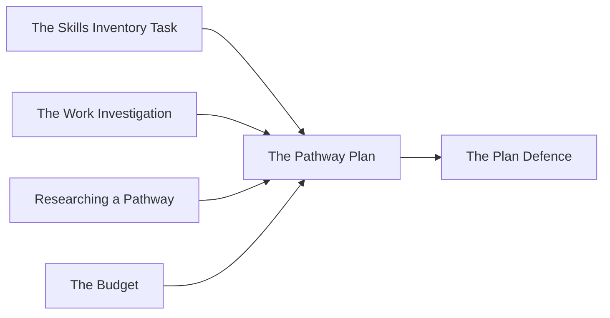

**Unit 3. The culminating task. Individual. Four working periods, Days 7
to 10, handed in at the end of the fourth.** Four to six pages, built
from work you have already done.

Your plan for your first year after secondary school, with the two years
of secondary school that lead to it, costed with a real budget. Almost
none of this is written from scratch — it is the course, assembled and
argued.

## Where the pieces come from

## What the plan contains

1. **The destination**, named precisely — the program, trade, employer,
   or arrangement, not the category. A second destination if you are
   keeping two open, with what would decide between them.
2. **Why this one**, argued from your profile: your skills, interests,
   values, and circumstances, and how they line up. This is where the
   self-knowledge from Unit 1 has to do actual work.
3. **The secondary school pathway** — the Grade 11 and 12 courses
   required, checked against the requirements you copied from the
   source, and against what you have earned so far. Any specialised
   program that applies: co-op, OYAP, a Specialist High Skills Major, a
   dual credit.
4. **The supports** you will use, at school and in the community, named
   with how you would reach them.
5. **The steps**, in order, with the term each belongs to, from now to
   the application.
6. **The money**, summarised from [[The Budget]] — what the first year
   costs, how it is funded, and where it is tight.
7. **The risks**, and what you would do instead. Marks, money, a program
   filling, a change of mind. One line each, with a next move.

## What earns the marks

- **Precision.** Real requirements, real deadlines, real costs, sourced.
- **Coherence.** The destination follows from the profile, and the
  courses follow from the destination.
- **Feasibility.** Someone reading it could see how the first three
  steps would happen.
- **Honesty about the unknowns.** A plan that admits what is uncertain
  and says how it would be resolved beats a plan that sounds certain.
- **Revision visible.** What changed since the first week, and what changed
  it.

%%curriculum-start%%
## Curriculum connection

![[B3.1]]

![[B3.2]]

![[C1.1]]

![[C1.2]]
%%curriculum-end%%

%%
Triangulation — the evidence you will not have unless you go and get it.

OBSERVE — Unit 3, Day 8, period 2 of 4, the secondary school pathway
  Watch for: which documents are open when the Grade 11 and 12 courses
  go onto the page. B3.2 wants the courses that lead to the destination
  AND satisfy the diploma, and four correct courses look the same on the
  page whether they were read off the requirements copied on Day 5 or
  remembered from a conversation in the corridor.
  Going well: both are open at once — the copied requirements and their
  own course record — and a course goes on the list because a comparison
  found a gap.
  Stuck: a list written straight out with the copied requirements never
  opened; or a student who has the requirements and has not brought the
  record of what they have actually earned.
  Record: a 2, a 1 or a 0 beside each name, for how many of the two
  documents were actually open.

TALK — Unit 3, Day 9, at the conferences that are already the checkpoint
  Ask: "What is the earliest point at which you would know this plan was
  not going to work?"
  Then: "What would have to change for you to go back to the
  destination you did not choose?"
  A strong first answer names a date or an event — a mark released, a
  deadline, a reply that does not come — rather than "if it does not
  work out". That is C1.2's potential challenges, made specific. The
  second is B3.1's comparison. Both write-ups are on file and the plan
  names the second destination, so you have WHAT was compared; what
  nothing on paper carries is what would reverse it, which is the part
  that tells you whether the comparison decided anything.
  Record: the signal, in their words. If it is not a date or an event,
  put a question mark on it and go back to them before Day 10.

The product evidence is the plan itself, handed in at the end of Day 10.
%%
