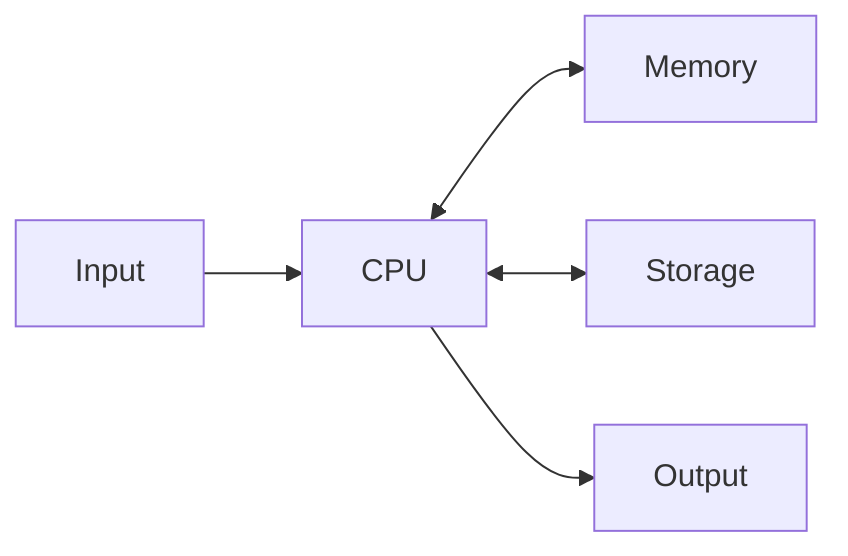

When the case came off in [[Inside the Box]], the mystery mostly
evaporated. A computer is a small number of parts, each with one job,
connected so they can hand work to each other. Every device you own —
laptop, phone, console, the watch on your wrist — is these same parts
at different sizes.

## The CPU

The central processing unit is the follower of instructions — the
part that actually computes. It does nothing but fetch the next tiny
step and carry it out, billions of times per second, with exactly the
no-judgement literalness you met in [[The Sandwich Robot]]. Fast is
its only talent.

## Memory and storage

These two get confused because both "hold things", but the jobs
differ. Memory — RAM — is the desk: whatever you are working on right
now sits there, reachable instantly, and it is swept clean the moment
the power goes off. Storage — the SSD or hard drive — is the
backpack: slower to dig through, but everything in it survives the
trip home. When your laptop "runs out of space", that is storage;
when it chokes on twenty open tabs, that is memory.

## Input and output

Input devices carry information in: keyboard, mouse, trackpad,
microphone, camera, and the touchscreen under your thumb all day.
Output devices carry results out: screen, speakers, printer, the
little motor that vibrates against your wrist. Some hardware works in
both directions — a touchscreen displays and listens at once.

## How the parts work together

Every program you write this term travels this loop: input comes in,
the CPU works on it using memory, results go out — and anything worth
keeping gets written to storage. [[Connected Devices]] shows what
happens when these parts shrink, multiply, and start talking to each
other.

## Matching hardware specifications to user requirements

When evaluating hardware or preparing a recommendation for a user (as in
[[The Device Recommendation]]), you assess component capacity against
real workloads:

- **General productivity and study** — a modest quad-core processor,
  8–16 GB of RAM, and a 256–512 GB solid-state drive provide snappy
  performance for web browsing, document writing, and video conferencing.
- **Media creation and editing** — video production, audio editing, and
  digital animation demand a multi-core processor, 32+ GB of RAM to hold
  high-resolution timelines, a dedicated graphics processor (GPU) for
  hardware-accelerated rendering, and fast multi-terabyte NVMe storage.
- **Software development and data science** — requires a fast multi-threaded
  CPU and 16–32 GB of RAM to run compilers, local databases, and test
  environments without memory bottlenecks.
- **Accessibility and ergonomic requirements** — selecting specialized
  input devices (adaptive controllers, ergonomic keyboards, eye-tracking)
  and high-contrast, low-latency monitors to meet specific physical needs.

Tracing hardware numbers directly to what a user actually does is what turns
a product specification sheet into sound advice.

%%curriculum-start%%
## Curriculum connection

![[B1.1]]

![[B2.3]]
%%curriculum-end%%
