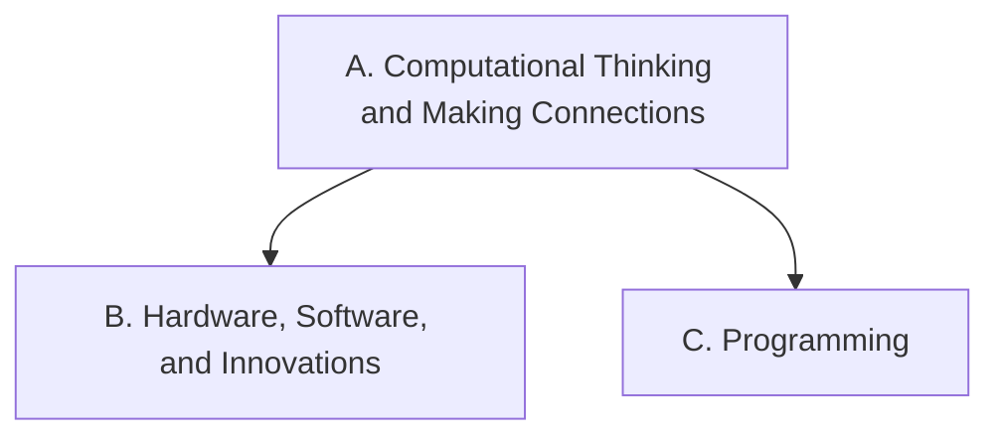

Everything we do in this course points at one or more of these
expectations, from **ICD2O — Digital Technologies and Innovations in
the Changing World, Grade 10, Open**. Lesson pages link here so you
can always see *why* we are doing something.

> [!info] Where these come from
> The wording below is the Ontario curriculum's own. See
> [[About These Expectations]].

Strand A runs through everything: computational thinking and the
connections between technology and the world are practised inside
the learning of strands B and C.

## Overall and specific expectations

### Strand A. Computational Thinking and Making Connections
*Throughout this course, in connection with the learning in the other strands, students will:*

![[A1. Computational Thinking, Planning, and Purpose]]
![[A1.1]]
![[A1.2]]
![[A1.3]]

![[A2. Digital Technology and Society]]
![[A2.1]]
![[A2.2]]
![[A2.3]]
![[A2.4]]
![[A2.5]]

![[A3. Applications, Careers, and Connections]]
![[A3.1]]
![[A3.2]]
![[A3.3]]

### Strand B. Hardware, Software, and Innovations
*By the end of this course, students will:*

![[B1. Understanding Hardware and Software]]
![[B1.1]]
![[B1.2]]
![[B1.3]]

![[B2. Using Hardware and Software]]
![[B2.1]]
![[B2.2]]
![[B2.3]]

![[B3. Cybersecurity and Data]]
![[B3.1]]
![[B3.2]]

![[B4. Innovations in Digital Technology]]
![[B4.1]]
![[B4.2]]
![[B4.3]]

### Strand C. Programming
*By the end of this course, students will:*

![[C1. Programming Concepts and Algorithms]]
![[C1.1]]
![[C1.2]]
![[C1.3]]
![[C1.4]]
![[C1.5]]

![[C2. Writing Programs]]
![[C2.1]]
![[C2.2]]
![[C2.3]]
![[C2.4]]
![[C2.5]]
![[C2.6]]
![[C2.7]]

![[C3. Modularity and Modification]]
![[C3.1]]
![[C3.2]]
![[C3.3]]
![[C3.4]]
![[C3.5]]
