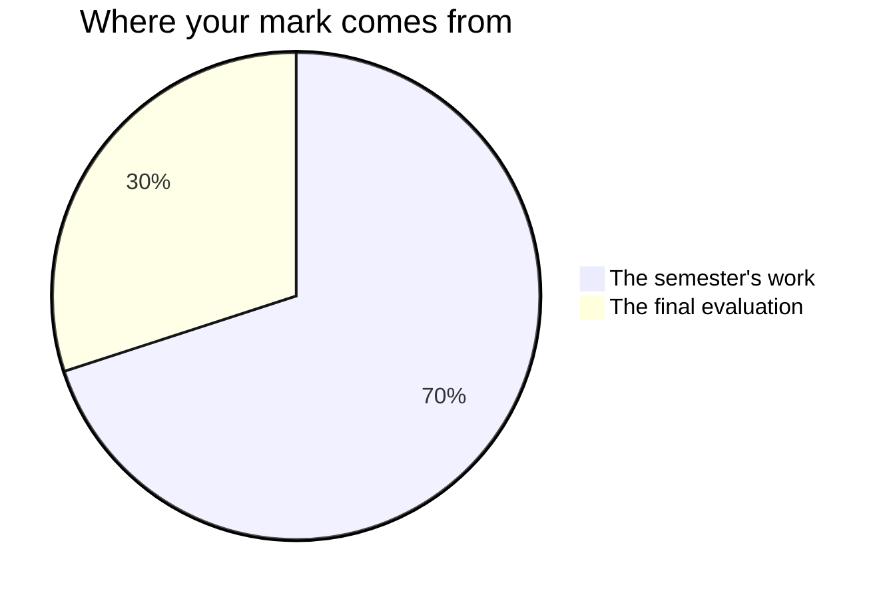

Marks in this course worry people for one wrong reason: the belief that
some people are "computer people" and the rest are doomed to watch. No
such split exists — reading code, writing code, and reasoning about
technology are learned skills. What gets judged is the work, and every
task tells you what it is looking for before you start.

## The seventy and the thirty

Every Grade 10 credit in Ontario is built the same way. Seventy per cent of
your mark comes from work spread across the whole semester, and it leans
towards your **most recent and most consistent** work rather than averaging
the start of the course against the end of it. A thing you understood badly
early on and understand well at the end of the course is marked on the most
recent evidence. The remaining thirty per cent comes from one final
evaluation at the end of the course, which in this course is [[Launch Day]].

**The seventy** is the five tasks you hand in during the semester, in
the order you meet them: [[The Algorithm Field Guide]] and
[[The Device Recommendation]] in the first unit, [[The Quiz Machine]]
in the second, [[The Remix Project]] in the third, and
[[The Innovation Brief]] running from the third unit into the fourth.
Added to those are the [[Dev Journal]] entries you write in class. The
five are not equally weighted — the two programming tasks ask for more
at once and run over more periods than the one-page pieces do, and the
early tasks are the rehearsals that make the later ones possible. Ask
me for the exact split whenever you want it; it is not a secret, it is
just not the useful thing to memorise.

**The thirty** is [[Launch Day]]: one artifact built for a real person,
handed over to them, documented so a stranger could reuse it, and
defended in conversation. It is the only piece of work in the course
that asks for the whole of the building side at once — planning,
programming, documentation, and being able to say why it works this
way. Your growth statement is part of it, so the whole semester is
in the room on that day too.

The [[Dev Journal]] entries that carry a mark are the ones written in
the **last minutes of class, on the day** — the "log it" step at the end
of a period. What you add at home afterwards is yours: often the best
writing in the book, worth doing, and not marked. Practice you do
between classes is practice, and practice is never the thing I put a
mark on. The [[Final Reflection]] is not marked at all — it is the last
piece of writing in the course, and it is better when nothing is riding
on it.

## Four kinds of thinking, not one

Every task asks for more than one of these, and the balance shifts with
the task. A program that runs is never the whole of it.

| What is being judged | What it means here |
| --- | --- |
| What you know | Terminology, what a component does, what a loop is for |
| How you think | Choosing an approach, tracing, finding the fault nobody sees |
| How you communicate | Comments, documentation, a brief a stranger can read, your explanation out loud |
| Where you apply it | Making it work for a person and a purpose nobody walked you through |

The fourth is why [[The Device Recommendation]] and [[Launch Day]] both
put you in front of a real person. Anyone can rebuild the program we
read together; the course is asking whether you can build for somebody
whose problem nobody has solved in front of you.

## Three kinds of evidence, and two of them are not paper

**What you make** is the obvious one: programs, guides, briefs, journal
entries. **What I watch you do** is the second: how you attack a bug you
have not seen, whether you read the error message before you start changing
lines, whether the fix you try is the one the message actually points at.
**What you tell me** is the third — the conferences and check-ins during
working periods are not a progress report, they are evidence in their own
right.

All three count. If you are quiet and your program is unfinished, the
conversation is often where the strongest evidence of that day comes
from. That is not a consolation prize; it is how the mark is meant to
work.

## What is not in your mark

How you work is reported separately, on the same report card, as **E,
G, S or N** — six habits: responsibility, organisation, independent
work, collaboration, initiative, and self-regulation. They matter, we
will talk about them, and they do not move your percentage. The policy
allows one exception, for a habit that is itself written into a
curriculum expectation, and this course does not have one: no criteria
table here judges how you spend a period, so there is no asterisk. Your mark is
about the work; that column is about the worker, and mixing the two
tells you less about both.

Your own judgement of your work is not part of your mark either, and
neither is a classmate's. You will judge your own work often — that is
what [[Judging Your Own Work]] is for, and it is the cheapest way to
raise a mark that exists in this course — and a classmate will
play-test your quiz, play your client, and read your brief. None of
those becomes a number. What a classmate finds can become work you have
to do — a bug to fix or a sentence to rewrite — and that is not the
same thing as a classmate marking you. The checkpoints and retrieval
clinics you mark yourself against a posted solution are the same: they
exist to show you what to revise while there is still time.

> [!important] Broken programs are never penalised as broken
> Version one of everything crashes. The mark follows where your work
> ends up and how visibly you got there — the journal and your comments
> are how "visibly" happens.

If a mark ever surprises you, ask — the criteria on each task page are
the whole story, and [[Getting Help]] lists the ways to reach me.
