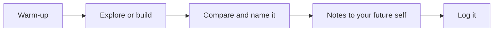

This course is a workshop, not a lecture. Most days you will build,
break, and fix things — sometimes with a computer, sometimes deliberately
without one — and the ideas get their names *after* you have met them
with your hands.

## Warm-up

Five minutes at the door: [[Predict the Output]] on the board, a
[[Spot the Bug]] hunt, or a [[Tech Headlines]] minute. Small daily reps —
reading code and reasoning about it — compound faster than anything else
in this course.

## Explore or build

The heart of class. Some days are unplugged — you will programme a
classmate to make a sandwich before you ever programme a computer — and
some days are at the keyboard, usually in **pairs**: one person drives
(hands on keys), one navigates (eyes on the plan), and you swap on a
timer. The problem usually arrives BEFORE the technique; being stuck is
part of the design, and [[Getting Unstuck]] is a skill we practise on
purpose.

## Compare and name it

We end the build by touring what groups did — different programs that
solve the same problem, different diagnoses of the same bug — and only
then does the idea get its proper name and its clean statement on a
[[Concepts/index|concept page]].

## Notes to your future self

A few sentences and one small example in your own words, written for the
version of you who opens this at the end of the course having forgotten
everything. The concept pages hold the full statements; your notes hold what
YOU need.

## Log it

When a period ends with "log it" on the agenda, the last minutes belong
to your [[Dev Journal]] — what you built, what broke, what you would try
next. Every professional developer keeps one
in some form; yours starts now.

> [!tip] If you were away
> Check the class page in All Classes, run the warm-up yourself, and try
> the build before reading anything about it. A genuine attempt teaches
> more than a perfect summary.

%%curriculum-start%%
## Curriculum connection

![[A3.3]]
%%curriculum-end%%
