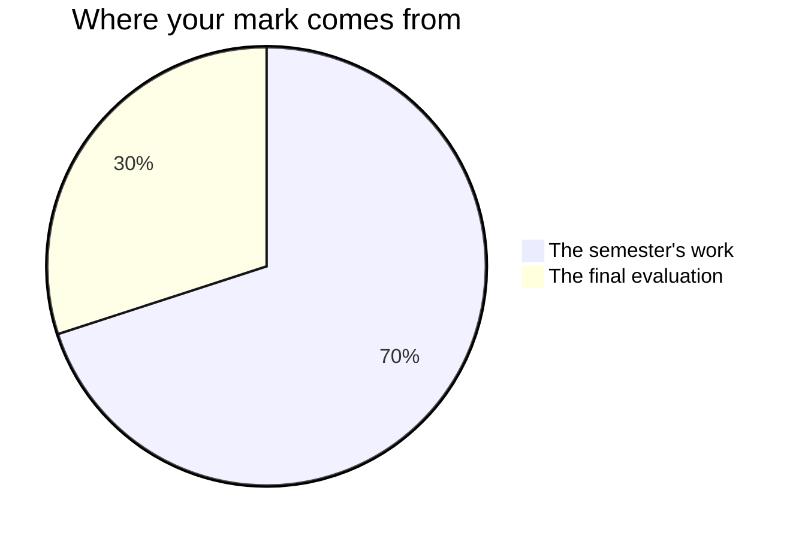

Marks in this course worry people for one wrong reason: the belief
that some people are "programmers" and the rest are here to watch. No
such split exists. Reading code, writing code, and building something
a person can use are learned skills, and you are marked on what your
work does — for you, and for somebody else.

## The seventy and the thirty

Every Grade 11 credit in Ontario is built the same way. Seventy per cent of
your mark comes from work spread across the whole semester, and it leans
towards your **most recent and most consistent** work rather than averaging
the start of the course against the end of it. The remaining thirty per cent
comes from a final evaluation at the end: the [[Final Examination]], plus
handing your project over to the person you built it for on [[Launch Day]].
Two very different rooms, deliberately, so that neither one afternoon nor
one project decides this alone.

**The seventy** is every task you hand in during the semester, plus the
milestone entries in your [[Code Journal]]. In roughly the order you
meet them: [[The Spec Sheet]], [[The Helper Script]],
[[The Data Digest]], [[The Green Audit]], [[The Toolbox]],
[[The Research Brief]], and the five weeks of building
[[The Community App]]. They are not equally weighted: the
Community App is worth several of the smaller ones on its own, because
it runs longest and asks for everything at once, and the earlier tasks
are the rehearsals that make it possible. Ask me for the exact split
whenever you want it — it is not a secret, it is just not the useful
thing to memorise.

**The thirty** is two things, on two different days: the
[[Final Examination]], written on paper under the same conditions as
everyone else, and handing your project over to the person you built it
for on [[Launch Day]]. The examination is the larger of the two.

The [[Code Journal]] entries that count are the ones written **in
class, at a milestone**. What you add at home is yours, and is worth
doing, but practice you do between classes is practice — it is not
something I mark.

## Four kinds of thinking, not one

Every task asks for more than one of these, and the balance shifts with
the task. A program that runs is never the whole of it.

| What is being judged | What it means here |
| --- | --- |
| What you know | Terminology, how a machine works, what a construct does |
| How you think | Choosing an approach, tracing, finding the fault nobody sees |
| How you communicate | Prompts, error messages, comments, usage notes, your talk |
| Where you apply it | Making it work in a situation nobody walked you through |

The fourth is why the last unit exists. Anyone can build the program
they were shown; the course is asking whether you can build one for a
stranger's problem that nobody has solved in front of you.

## Three kinds of evidence, and two of them are not paper

**What you make** is the obvious one: programs, test plans, briefs,
journal entries. **What I watch you do** is the second: how you attack
a bug you have not seen, whether you test one change at a time,
whether you read the error before you edit. **What you tell me** is the
third — the two-minute conferences at every milestone are not a
progress check, they are evidence in their own right, and some things
you understand will only ever show up there.

If you are quiet and your program is unfinished, the conference is
often where the strongest evidence of the day comes from. That is not a
consolation. It is how the mark is meant to work.

## What is not in your mark

How you work is reported separately, on the same report card, as **E,
G, S or N** — six habits: responsibility, organization, independent
work, collaboration, initiative, and self-regulation. They matter, we
will talk about them, and they do not move your percentage. Your mark
is about the work; that column is about the worker, and mixing the two
tells you less about both.

The one exception is where a habit is itself part of what this course
is required to teach — backing your work up is expectation C2.3, and
describing the work habits this field runs on is part of what
[[Launch Day]] asks you to reflect on. When a habit is named in the
curriculum, it is marked like anything else in the curriculum.

Your own judgement of your work, and your classmates', are not part of
your mark either. You will assess your own work against the criteria
often — see [[Judging Your Own Work]] — because it is the fastest way
to get better. But the mark is mine to determine, from evidence.

> [!important] Small and used beats ambitious and broken
> On every task, and most of all on the culminating project, a modest
> program that works and that somebody actually uses scores higher
> than a grand design that does not run. This is not a consolation
> prize for low ambition — judging scope accurately is one of the
> hardest skills in software, and [[Interviewing Your Client]] treats
> it as a professional skill because it is one.

> [!important] Broken programs are never penalised as broken
> Version one of everything crashes. The mark follows where your work
> ends up and how visibly you got there — your journal and your
> comments are how "visibly" happens.

Each task page lists its success criteria before you start, phrased as
things an observer could see in your work. If a mark ever surprises
you, ask: those criteria are the whole story, and [[Getting Help]]
lists the ways to reach me.
