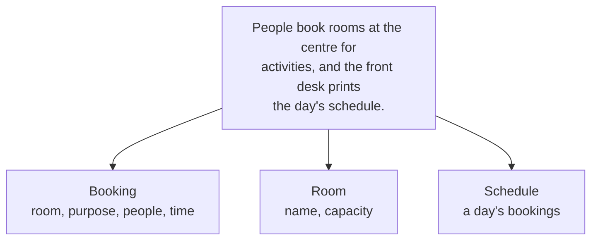

The community centre's booking sheet came to us as three parallel
lists: rooms in one, purposes in another, group sizes in a third. It
worked until somebody cancelled a booking in the middle, removed it
from two of the three lists, and left a room permanently reserved for
a group that no longer existed.

Nothing in that program was wrong, line by line. What was wrong was
that a single real thing — one booking — had been smeared across three
containers, and only the person holding the clipboard knew they
belonged together. A class is how you tell the computer they belong
together.

## A class is a description; an object is a thing

```python
class Booking:
    """One room booking at the community centre."""

    def __init__(self, room, purpose, people):
        self.room = room
        self.purpose = purpose
        self.people = people
```

`Booking` is not a booking. It is the description of what every
booking will be — a blueprint, a form, a cookie cutter. Bookings
themselves appear when you use it:

```python
tutoring = Booking("Room 2", "math tutoring", 12)
choir = Booking("Hall", "community choir", 24)
```

Now there are two objects. Each has its own `room`, its own `purpose`,
its own `people`, and they cannot drift apart, because cancelling
`tutoring` removes all three facts at once. The bug from the opening
paragraph is not fixed; it is *impossible*.

| Word | What it means here |
| --- | --- |
| Class | `Booking` — the description |
| Object, or instance | `tutoring`, `choir` — actual bookings |
| Attribute | `room`, `purpose`, `people` — what one booking knows |
| Constructor | `__init__` — runs once, as the object is built |
| `self` | "this particular booking", inside the class |

## Finding the classes in a problem

This is the part that takes judgement, and it is what
[[C1.1|the decomposition expectation]] is really asking for. A
reliable first pass: write down what the client said, underline the
nouns, and ask of each one — *does this thing have facts that travel
together, and does it do anything?*



Not every noun becomes a class. "Time" is a value, not a thing with
behaviour. "The front desk" is where the program runs, not something
it models. Two useful sanity checks: a class you would never create
more than one of is usually a function in disguise, and a class with
attributes but no methods is usually just a record — which is fine,
but say so on purpose.

Professionals sketch this before coding, on **CRC cards** — one index
card per class, with its name, what it is Responsible for, and which
other classes it Collaborates with — or in a UML diagram. The tool
matters less than the habit: decide what your program's nouns are
while changing your mind is still free.

## The model is the point

A program built out of well-chosen classes reads like the problem it
solves. Somebody who understands the community centre can follow
`booking.people` and `room.capacity` without knowing Python, and
somebody who understands Python can find the booking rules without
knowing the community centre. That is not decoration — it is what
makes the program survivable when the next person opens it, as
[[Reading Somebody Else's Code]] argues from the other direction.

> [!tip] Name the class after the thing, not after the program
> `Booking`, `Tool`, `Volunteer`, `Hold`. Not `BookingManager`,
> `DataHandler`, or `Info`. If you cannot name a class after something
> the client would recognise, you probably have not found the right
> class yet.

Build one in [[Your First Class]], then a list of them in
[[Objects in a List]]. The behaviour half of the story is
[[Attributes and Methods]], the protection half is [[Encapsulation]],
and the drill is in [[Classes and Objects Practice]]. If you want to
see why this matters before you believe it, go back to
[[The Inherited Program]] and try to describe that program without
naming its classes.

%%curriculum-start%%
## Curriculum connection

![[C1.1]]

![[C1.4]]

![[A2.2]]
%%curriculum-end%%
