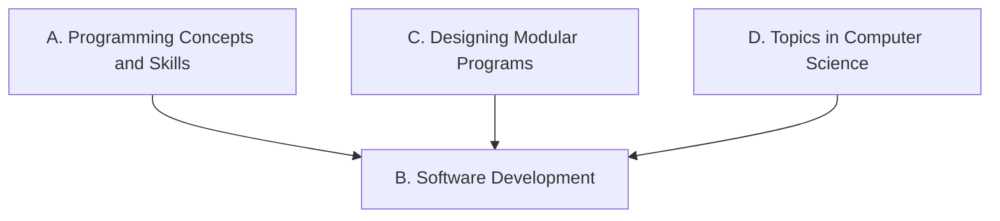

Everything we do in this course points at one or more of these
expectations, from **ICS4U — Computer Science, Grade 12,
University Preparation**. Lesson pages link here so you can
always see *why* we are doing something.

> [!info] Where these come from
> The wording below is the Ontario curriculum's own. See
> [[About These Expectations]] — including a note about the codes.

## Strand A. Programming Concepts and Skills
*By the end of this course, students will:*

![[A1. Data Types and Expressions]]
![[A1.1]]
![[A1.2]]
![[A1.3]]
![[A1.4]]
![[A1.5]]
![[A2. Modular Programming]]
![[A2.1]]
![[A2.2]]
![[A2.3]]
![[A3. Designing Algorithms]]
![[A3.1]]
![[A3.2]]
![[A3.3]]
![[A3.4]]
![[A3.5]]
![[A3.6]]
![[A4. Code Maintenance]]
![[A4.1]]
![[A4.2]]
![[A4.3]]
![[A4.4]]

## Strand B. Software Development
*By the end of this course, students will:*

![[B1. Project Management]]
![[B1.1]]
![[B1.2]]
![[B1.3]]
![[B1.4]]
![[B1.5]]
![[B1.6]]
![[B1.7]]
![[B2. Software Project Contribution]]
![[B2.1]]
![[B2.2]]
![[B2.3]]

## Strand C. Designing Modular Programs
*By the end of this course, students will:*

![[C1. Modular Design]]
![[C1.1]]
![[C1.2]]
![[C1.3]]
![[C1.4]]
![[C2. Algorithm Analysis]]
![[C2.1]]
![[C2.2]]
![[C2.3]]
![[C2.4]]

## Strand D. Topics in Computer Science
*By the end of this course, students will:*

![[D1. Environmental Stewardship and Sustainability]]
![[D1.1]]
![[D1.2]]
![[D2. Ethical Practices]]
![[D2.1]]
![[D2.2]]
![[D2.3]]
![[D3. Emerging Technologies and Society]]
![[D3.1]]
![[D3.2]]
![[D4. Exploring Computer Science]]
![[D4.1]]
![[D4.2]]
![[D4.3]]
![[D4.4]]
