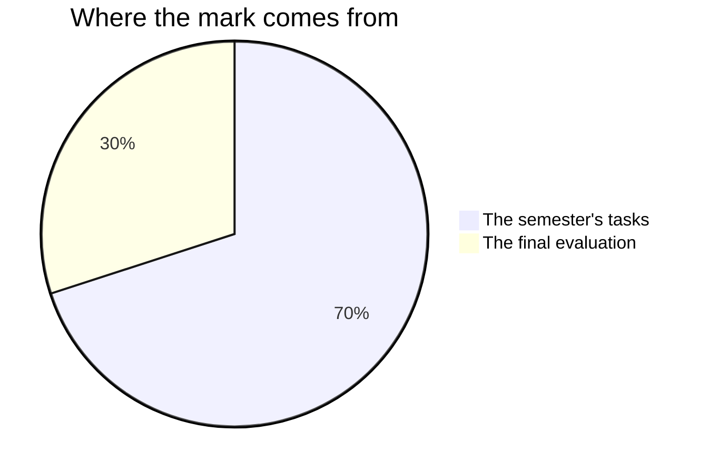

You are marked on what you can be seen to do: code you wrote,
decisions you defended, reviews you gave, problems you found in work
that was not yours. All of it is inside your control, and all of it
leaves a record.

## The seventy and the thirty

Ontario builds every Grade 12 credit out of two numbers. Seventy of the
hundred are earned across the semester itself, and they lean on your **most
consistent** work with extra weight given to the **most recent** — not on an
average of the start of the course against the end of it. Something you
could not do early on and can do reliably at the end of the course counts as
something you can do. The other thirty come from one final evaluation at the
end of the course.

**The seventy** covers six tasks and the milestone entries in your
[[Code Journal]]. You meet them in this order: [[The Model]],
[[The Structure Study]], [[The Efficiency Case]],
[[The Software Project]], [[The Maintenance Sprint]], and
[[The Frontier Report]]. They are nowhere near equally weighted.
[[The Software Project]] is the biggest single piece of this course by
a wide margin — it launches in Unit 3, runs underneath every class of
Unit 4, is built by a team for a real community partner, and is where
objects, containers, algorithms, tests and four people who have to
agree all have to work at the same time. The tasks before it are the
rehearsals that make it possible, and [[The Maintenance Sprint]] is
the one that teaches the hardest skill in the course: changing code
you did not write, safely. The exact weights exist and I will show them
to anybody who asks. They are a professional judgement rather than
arithmetic, they shift a little from one class to the next depending
on what a year turns out to need, and memorising them has never once
improved anybody's work.

**The thirty** is two things, on two different days. [[The Handover]]
is Unit 4, Day 20: your community partner sits at the machine, runs
what your team built, and carries the whole package away. The
[[Final Examination]] is three hours in the examination period, on
paper, under the same conditions for everyone. Most of the thirty is
the examination, because it is the one piece of evidence in the course
that is unambiguously and only yours; the handover is the smaller
share, and the one nobody can prepare for the night before.

The unit checkpoints in Units 1, 2 and 3 are in neither number. You
mark those yourself and write your own revision list from them. Their
whole job is to tell you — and me — what to do in the next class, and
that is a job they can only do while nothing is riding on them.

## The four things being judged

No task in this course asks for only one of them, and which one leads
changes from task to task. A program that runs is a good start and
never the whole answer.

| The category | What it means in this course |
| --- | --- |
| What you know | Objects, containers, complexity, version control, and what a code of ethics is for |
| How you think | Choosing a structure or an algorithm and defending the choice; finding the fault in a program you did not write |
| How you communicate | Commit messages, docstrings, review comments, documentation a stranger can act on, and what you say out loud |
| Where you can take it | Making it work for a real partner, on a problem nobody solved in front of you first |

The fourth row is why Units 3 and 4 are shaped the way they are.
Building the program you were shown is Grade 11. This year the
question is whether you can build one for somebody whose problem was
never on the board.

## Three sources of evidence, and only one of them is paper

**What you make** is the source everybody expects: programs, tests,
studies, reports, journal entries, a handover package. The second
source is **what I watch you do**: how you go at a program nobody in
the room wrote, whether you change one thing at a time, whether a note
gets edited when your reader is stuck or merely explained around. The
third is **what you tell me**. Conferences and milestone check-ins are
not progress reports; they are evidence in their own right, and some
of what you understand will surface nowhere else.

Working periods are class time, and they are where most of the second
kind comes from. That is not a mark for looking busy. It is that a
decision made in front of me is evidence in a way the finished file
cannot be, because the finished file has had all the deciding taken
out of it.

A quiet student with an unfinished program can still produce the best
evidence in the room during a two-minute check-in. That is not a
kindness extended to them. It is the mark working the way it is meant
to.

## The group work question

Every student asks it and it deserves a straight answer: *what stops
me being dragged down by a team, or carried by one?*

**You do not receive a group mark for the team project.** There is no
part of your percentage that four people hold between them. What the
team owes together is a *standard* rather than a share of the mark —
the software has to work, and it has to be handed over in a state your
partner can use — and each of you is judged against that standard
individually, on evidence that is specific to you.

| Evidence | What it shows | Where it comes from |
| --- | --- | --- |
| Your commits | What you wrote, when, and in what size pieces | The repository history, under your own name |
| Your reviews | What you read, what you caught, how you said it | Comments on your teammates' changes |
| Your journal | What you decided, what you rejected, what changed your mind | [[Code Journal]], collected each unit |
| Your milestone check-ins | Whether you knew where the project stood | Short conversations with me during build periods |
| The handover documents you wrote | Whether somebody else can use what you built | [[The Handover]] |

The same rule runs through every task that is not solo. Each one names
the piece that is yours alone: your own two-page case on
[[The Efficiency Case]], your own change log on
[[The Maintenance Sprint]], and on [[The Software Project]] your
commits, your reviews, your journal, and the role you answered for.
There is no task in this course where four names on a cover page
produce four identical marks.

Three things follow from that table, and they are worth taking
seriously in week one rather than week eight.

> [!important] Commit under your own name, in small pieces, often
> A commit is the most objective record you have. Forty small commits
> across the term say more about your contribution than one enormous
> one at the end, and a teammate committing your work for you erases
> you from the record. [[Using Version Control]] shows how; this is
> why it matters.

> [!important] Reviewing counts as contribution
> Finding the bug in somebody else's change is real work and it is
> assessed as real work. A student who writes less code but catches
> what would have shipped broken has contributed, and the review
> record proves it. This is deliberate — it is also true of
> professional teams, where it is routinely forgotten.

If your team is genuinely not working — somebody has stopped contributing,
or one person is carrying everything — that is a problem to raise with me
early, not to absorb quietly and mention in the end of the course.
[[Working in a Team]] has the protocols; [[Getting Help]] has the ways to
reach me. Nothing about that conversation counts against you.

## What stays out of your mark

The way you work gets its own column on the report card, graded
**E, G, S or N** against six habits: responsibility, organization,
independent work, collaboration, initiative, and self-regulation. We
will talk about that column all semester, and it will never move your
percentage by a single point. The percentage describes the work; the
column describes the worker. They are reported side by side and never
blended, because each one tells you something the other cannot.

The exception is narrow and it is unusually visible in this course:
where a habit is written into the curriculum itself, it is marked
like any other curriculum expectation. Four of them are. `B2.1` asks
you to contribute as a team member. `B2.2` asks you to meet goals and
deadlines by managing your own time inside a group project. `A4.1`
asks you to work independently with the documentation to resolve a
syntax problem. `D4.4` asks you to evaluate your own development of
the Essential Skills and work habits in the Ontario Skills Passport.
Notice what is marked in that last one: the quality of the evidence
and the reasoning in your evaluation, never the rating you award
yourself. A generous verdict with nothing behind it is a weak answer;
a harsh one with two dated journal entries behind it is a strong one.

Nothing you conclude about your own work, and nothing a classmate
concludes about it, becomes part of your percentage. You will judge
your own work against the criteria regularly, and the routine for it
is [[Judging Your Own Work]] — we run it together the first time —
because it is the cheapest way to improve a piece of work while there
is still time to change it. A teammate's
review changes the code; it never changes anybody's percentage. That
cuts both ways, and it is what makes an honest review safe to give.

Practice you do between classes is practice. The exercise sets, the
finishing-off, the reading you meant to do — all worth doing, often
the difference between a good week and a bad one, and none of it
something I mark. What is marked is work done here, where I can see
it, or the deliverable that a run of working periods was for. Your
journal follows the same rule: the daily habit is yours, and the
entry read against the criteria is the milestone entry you write in
class at the end of each unit — and in Unit 4 that entry is your
[[Final Reflection]], written across Days 19 and 21.

## Two things that are never penalised

> [!note] Small and used beats ambitious and broken
> On every task, and most of all on the team project, a modest
> program that works and that the partner actually uses scores higher
> than a grand design that does not run. Judging scope accurately is
> one of the hardest skills in software, and
> [[Software Project Management]] treats it as a professional skill
> because it is one.

> [!note] Broken programs are never penalised as broken
> Version one of everything crashes. The mark follows where your work
> ends up and how visibly you got there. Your commits, your journal,
> and your comments are how "visibly" happens.

Each task page lists its success criteria before you start, phrased
as things an observer could see in your work. If a mark ever
surprises you, ask — those criteria are the whole story, and
[[Judging Your Own Work]] is how you read them before I do.
