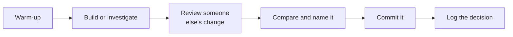

This course is a workshop, not a lecture. Most days you will build,
break, and repair something, and ideas get their proper names *after*
you have run into the need for them. That much is inherited from
Grade 11. What is new is that the code on the bench is rarely only
yours.

## Warm-up

Five minutes at the door: a [[Predict the Output]] on the board, a
[[Read the Diff]] you have to approve or refuse, a [[Trace It]] on a
recursive call. Small daily reps compound faster than anything else
in this course and cost almost nothing.

## Build or investigate

The heart of the period. Some days you build; some days you are given
a working program nobody in the room wrote and have to find out what
it does. The first class of the course is the second kind, on
purpose — see [[The Inherited Program]] — because reading code
somebody else wrote is not a punishment or a warm-up for real work.
It **is** the work, and it is the thing that makes Grade 12 different
from a bigger Grade 11.

The problem still arrives before the technique. You will search a
list badly enough to care about the alternative before anybody says
"binary search", and you will lose an afternoon to a shared list
before anybody says "aliasing".

## Review someone else's change

Most days end with somebody's change on the board or on a screen and
the question: what does this do, and would you approve it? Reviewing
is a taught skill in this course, with sentences you can borrow, and
the rule that never bends is in [[Our Classroom Norms]] — the review
is about the code, never about the person who wrote it.

## Compare and name it

We tour what different groups did: different designs for the same
problem, different diagnoses of the same bug, different algorithms
with different timings. Only then does the idea get its clean
statement on a [[Concepts/index|concept page]].

## Commit it

From Unit 4 onwards, and earlier if your team is ready, work ends
with a commit: a small, named, permanent snapshot with a message
saying why. [[Using Version Control]] teaches the mechanics. The
habit matters beyond the tool — it is what makes your individual
contribution visible inside a team project.

## Log the decision

The last minutes belong to your [[Code Journal]]. This semester it asks
for one thing Grade 11 did not: the decision you made and the options
you turned down. The code and the commit history will still be there
at the end of the course. The reasons will not, unless you write them.

## The thread through all of it

Grade 11 asked "who is this for?" and never let it go. That question
is still here, with a second one behind it: **who has to live with
this after we go?** [[The Software Project]] is a team build for a
real community partner, and the course ends with [[The Handover]] —
handing it over properly, to somebody who has to keep it working
without you. That is not a ceremony at the end. It is the reason for
the rest of it.

> [!tip] If you were away
> Check the class page, run the warm-up yourself, then update your
> copy of the project *before* you write a line. Starting from a
> three-day-old copy is the single most reliable way to create a
> merge conflict nobody enjoys.

%%curriculum-start%%
## Curriculum connection

![[D4.4]]
%%curriculum-end%%
