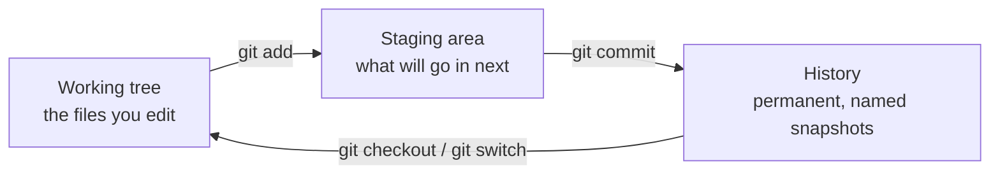

Three people are editing one program. Without version control the
best case is that somebody emails a zip file called `final_v3_REAL`
and everybody loses an afternoon. With it, the three of you edit the
same files all week and the tool works out what changed. This page
teaches **git**, which is the version control system most of the
world uses, from the handful of commands that do ninety percent of
the work.

## The three places your work can be

Everything in git makes sense once you can name where a change is.



The **working tree** is the files as they sit on disk right now. The
**staging area** is the pile you have said should go into the next
snapshot. The **history** is the sequence of commits — snapshots with
a message, an author, and a time, which do not change afterwards.

The staging area feels like an extra step until the first time you
have fixed two unrelated things and want them in separate commits.
Then it is the whole point.

## The loop you will run all term

Edit a file, and ask git what it sees:

```text
$ git status
On branch main
Changes not staged for commit:
  (use "git add <file>..." to update what will be committed)
  (use "git restore <file>..." to discard changes in working directory)
	modified:   signout.py

no changes added to commit (use "git add" and/or "git commit -a")
```

Git's messages tell you the next command. Read them; they are better
documentation than most of what is written about git.

Now look at exactly what you changed:

```text
$ git diff
diff --git a/signout.py b/signout.py
index 9e9b862..7a8d1d7 100644
--- a/signout.py
+++ b/signout.py
@@ -1,3 +1,6 @@
 def spaces_left(capacity, booked):
-    """Return how many spaces remain in a session."""
-    return capacity - booked
+    """Return how many spaces remain, never fewer than zero."""
+    remaining = capacity - booked
+    if remaining < 0:
+        remaining = 0
+    return remaining
```

Lines with `-` were removed, lines with `+` were added, and the rest
is context. Reading these is a routine of its own —
[[Read the Diff]].

Stage it, and check again:

```text
$ git add signout.py
$ git status
On branch main
Changes to be committed:
  (use "git restore --staged <file>..." to unstage)
	modified:   signout.py
```

Commit it, with a message that says *why*:

```text
$ git commit -m "Stop spaces_left going negative when a session is overbooked"
[main 878055a] Stop spaces_left going negative when a session is overbooked
 1 file changed, 5 insertions(+), 2 deletions(-)
```

And look at what the project remembers:

```text
$ git log --oneline
878055a Stop spaces_left going negative when a session is overbooked
62729ab Add spaces_left
```

That short string is the commit's identifier — git shows an
abbreviation of a much longer one. It is how you refer to a specific
snapshot forever after.

> [!important] Commit messages are documentation with a deadline
> "Fixed stuff" tells your teammates nothing and tells you less in
> March. Write what changed and why, in one line, in the present
> tense: *Stop spaces_left going negative when a session is
> overbooked.* When somebody a year from now runs `git log` on a
> confusing line — the move recommended in
> [[Reading Somebody Else's Code]] — your sentence is the entire
> explanation they get.

## Branches: working without standing on each other

A **branch** is a line of development with a name. Your team's shared
line has a name too — you will see `main` in some projects and
`master` in others, and which one a project uses depends on when and
how it was created, so check rather than assume.

```text
$ git switch -c waitlist
Switched to a new branch 'waitlist'
```

Now commits go onto `waitlist` and the shared branch is untouched.
Work, commit as often as you like, and when the feature is finished,
switch back and merge it in:

```text
$ git switch main
Switched to branch 'main'
$ git merge waitlist
```

Most of the time git works out how to combine the two sets of changes
and says so. Sometimes it cannot.

## What a conflict actually looks like

Suppose that while you were rewording a docstring on `waitlist`, a
teammate reworded the *same* docstring on the shared branch. Both
changes are reasonable. Neither is wrong. A conflict happens when two
branches changed the *same lines*, and git does not guess:

```text
$ git merge waitlist
Auto-merging signout.py
CONFLICT (content): Merge conflict in signout.py
Automatic merge failed; fix conflicts and then commit the result.
```

Open the file. Git has written both versions into it, with markers:

```text
def spaces_left(capacity, booked):
<<<<<<< HEAD
    """Return the number of free spaces left in a session (never below 0)."""
=======
    """Return how many spaces remain, or 0 when the session is full."""
>>>>>>> waitlist
    remaining = capacity - booked
    if remaining < 0:
        remaining = 0
    return remaining
```

Between `<<<<<<<` and `=======` is what is on the branch you are
standing on. Between `=======` and `>>>>>>>` is what is coming in.
Resolving means editing the file until it says what you want —
keeping one side, keeping the other, or writing something better than
both — and **deleting all three marker lines**. Then:

```text
$ git add signout.py
$ git commit -m "Merge branch 'waitlist'"
$ git status
On branch main
nothing to commit, working tree clean
```

`git log --oneline --graph` will now show the two lines of work
joining back up:

```text
*   7345dea Merge branch 'waitlist'
|\  
| * 3d7f92b Reword the docstring for the waitlist work
* | 6c3edb7 Clarify the docstring
|/  
* 878055a Stop spaces_left going negative when a session is overbooked
* 62729ab Add spaces_left
```

> [!warning] A conflict is not a fight, and not a failure
> It is git refusing to make a judgement that only a person can make.
> It means two people cared about the same lines, which is
> information, not a crime. If the two versions disagree about
> something real, the resolution is a conversation, not a coin toss —
> and [[Working in a Team]] has the protocol. Practise the mechanics
> deliberately in [[The Merge Conflict]] so the first real one is
> boring.

## Hosting: where the shared copy lives

Your commits so far are on one machine. A hosting service — GitHub
and GitLab are two well-known examples — keeps a shared copy your
whole team can reach, usually called a **remote**. You send commits
to it and fetch your teammates' commits from it. The vocabulary
travels: repository, branch, commit, merge, and a review of a
proposed change before it lands.

Every service arranges its buttons differently and rearranges them
without warning, so this page will not describe any of them. Your
teacher will set up the shared repository with you in class, and the
commands above are the same wherever it is hosted.

## The commands worth memorising

| Command | What it does |
| --- | --- |
| `git status` | What has changed, what is staged, what to do next |
| `git diff` | The exact lines you changed but have not staged |
| `git add <file>` | Put a file's changes in the staging area |
| `git commit -m "..."` | Record a permanent snapshot, with a reason |
| `git log --oneline` | The project's history, one line per commit |
| `git switch <branch>` | Move to an existing branch |
| `git switch -c <branch>` | Create a branch and move to it |
| `git merge <branch>` | Bring another branch's work into this one |

> [!tip] Commit small and commit often
> A commit that changes one thing can be read, reviewed, and undone.
> A commit that changes forty files at 11 p.m. can only be accepted
> on faith. Small commits also make your individual contribution
> visible, which matters when the team project is marked — see
> [[How Marks Work]].

The idea behind all of this, rather than the mechanics, is
[[Version Control]].

%%curriculum-start%%
## Curriculum connection

![[A2.3]]

![[B1.7]]

![[B2.1]]
%%curriculum-end%%
