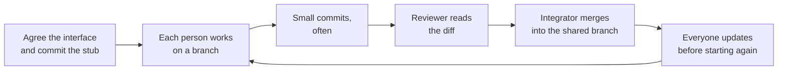

Group work has a bad reputation and it has earned it, because most
group work is one project handed to four people with no mechanism.
This page is the mechanism. None of it is about being nice. It is
about how four people change one program every day without losing
work, without duplicating work, and without anyone quietly carrying
the whole thing.

## Roles that rotate

Fixed roles turn into fixed reputations by week two, so these rotate
weekly. Everybody writes code; a role is what you do *in addition*.

| Role | Owns | Roughly what it costs |
| --- | --- | --- |
| Coordinator | The board of who is doing what; runs the standup | Ten minutes a day |
| Integrator | Merges branches, keeps the shared branch working | Twenty minutes a day |
| Reviewer | Reads every change before it lands | Thirty minutes a day |
| Partner contact | The one voice the community partner hears from | An email or two a week |

That last role exists because a partner who receives four different
questions from four students, asking the same thing in different
words, will stop replying. One voice, and the rest of you brief them.

## The standup: five minutes, standing up

At the start of every build period, in the same order, everybody says
three things:

1. What I finished since last time.
2. What I am doing next.
3. What is in my way.

That is the whole meeting. It runs five minutes because you are
standing, and it exists for the third item. A team where nobody ever
names a blocker is not a team without blockers; it is a team where
saying so feels expensive, and that always costs more later.

> [!important] A stuck teammate is a team problem
> If somebody has been blocked for two days, the team lost two days,
> not that person. Blockers are announced, not confessed. The
> coordinator's actual job is to notice the same item appearing in
> somebody's third slot twice, and to do something about it before it
> appears a third time.

## Splitting work so it can actually be merged

The naive split — "you take the interface, I'll take the data" —
sounds efficient and produces four people who each understand a
quarter of the project and cannot review each other's work. Three
rules make a split mergeable:

- **Split by file where you can.** Two people editing the same file
  is the main cause of conflicts, and it is usually avoidable by
  planning for a day rather than by heroics afterwards.
- **Agree the interfaces first, in writing.** Before anyone builds,
  decide what the function is called, what goes in, and what comes
  out. Write the empty function with its docstring, commit it, and
  now both sides can build against a promise instead of a guess.
- **Nobody owns a file permanently.** Rotate who works where across
  the project. It costs a little speed and it is the only real
  defence against the bus factor described in
  [[What Happens When You Leave]].

That last step is the one teams skip. Starting a day's work from a
copy that is three days old is how you generate a conflict big enough
to ruin an evening. Update first, every time.

## Code review, and how to say a hard thing

Review is about the code. Not the person, not their week, not how
they are getting on generally. The habit is easier if you have
sentences ready:

| Instead of | Say |
| --- | --- |
| "This is wrong." | "This returns -1 for Bea, and she is on the sheet. Am I reading it right?" |
| "You didn't test this." | "Could we add a test for the empty list? I think it divides by zero." |
| "Why would you do it that way?" | "What made you choose a list here? I would have reached for a dictionary and I might be missing something." |
| "Fine, whatever." | "I still prefer the other approach, but I do not think it is worth blocking on. Merging." |
| "Looks good" (on 400 lines) | "This is bigger than I can review well. Could we split it?" |

Two rules make all of these work. **Ask before you assert** — the
author usually had a reason, and half of what looks wrong in a review
turns out to be a constraint you did not know about. And **say what
you decided**, out loud: approve, approve with a change, or not yet.
A review that ends ambiguously leaves the author guessing, which is
worse than a clear no.

## When you disagree

Design disagreements are normal, and they are a sign the team is
thinking. What ruins a project is not disagreement; it is
disagreement with no way to end. So agree the protocol before you
need it:

1. **Both positions stated, by the other person.** You must be able
   to say the opposing case well enough that its holder agrees you
   understood it. Most disagreements die right here, because they
   turn out to be about different problems.
2. **Look for the deciding evidence.** Is this settleable? Very often
   it is: write the test, measure both with
   [[Profiling and Timing Code]], or ask the partner what they
   actually need. An argument with an experiment available is not an
   argument.
3. **If it is genuinely a matter of taste, the owner of that area
   decides**, and the team moves on within the period. Not every
   decision deserves an hour.
4. **Write down what was decided and why**, in a commit message or
   your [[Code Journal]]. In three weeks nobody will remember, and
   the same argument will start again from zero.
5. **If it is stuck, or it has stopped being about the code**, bring
   it to me the same day. See [[Getting Help]]. That is not
   escalating; that is the fifth step, and it exists so that nobody
   has to decide privately whether things are bad enough to mention.

> [!warning] The two failure modes
> One person doing everything, and four people doing nothing in
> parallel. Both feel fine from the inside for about ten days. The
> standup and the review are what catch them — which is why they
> happen every period, not when somebody notices a problem.

## What the record shows

Everything above leaves evidence, and that is deliberate. Your
commits show what you wrote and when. Reviews show what you read.
Your journal shows what you decided and what changed your mind. That
record is how individual contribution inside a team project is
assessed — [[How Marks Work]] sets out exactly how — and it is also
the only honest way to answer the question at the end of a group
project: what did I actually do?

The project this is all for is [[The Software Project]]; the planning
side of it, including milestones and scope, is
[[Software Project Management]].

%%curriculum-start%%
## Curriculum connection

![[B1.2]]

![[B1.4]]

![[B1.7]]

![[B2.1]]

![[B2.2]]

![[B2.3]]
%%curriculum-end%%
