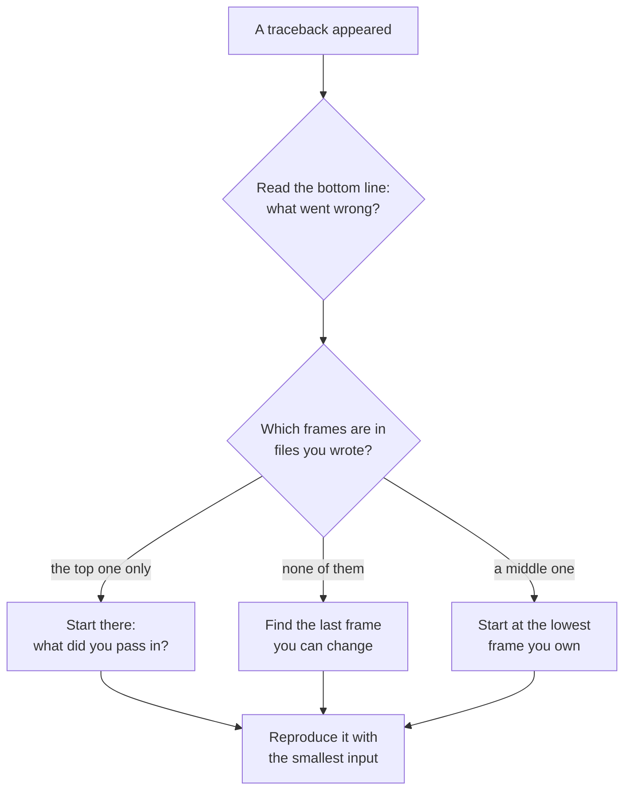

A traceback goes on the board with no program attached. Same two
questions as last year — what does Python mean, and what kind of line
caused it — plus a third that only matters now: **whose code is
broken?** Every traceback in this course comes from a program with
more than one file, and the frame that crashed is very often not the
frame that is wrong.

## The board today

```text
Traceback (most recent call last):
  File "/home/student/main.py", line 4, in <module>
    weekly_summary(weeks_sessions)
  File "/home/student/report.py", line 6, in weekly_summary
    average = average_attendance(sessions)
              ^^^^^^^^^^^^^^^^^^^^^^^^^^^^
  File "/home/student/attendance.py", line 6, in average_attendance
    return total / len(sessions)
           ~~~~~~^~~~~~~~~~~~~~~
ZeroDivisionError: division by zero
```

Three frames, three files, and only the top one belongs to whoever is
running the program. Read it bottom to top and the story is: a
division by zero happened inside `average_attendance`, which was
called by `weekly_summary`, which was called from line 4 of `main.py`.

> [!important] The crash site is not the crime scene
> `attendance.py` divided by zero, but `attendance.py` is not
> necessarily wrong. Somebody handed it an empty list. The bug is
> either in `main.py` for asking about a week with no sessions, or in
> `attendance.py` for not saying what it does with an empty one —
> and *that* is the argument worth having in a code review.

## Which frame do you go to first?



The move that saves the most time is the last one: shrink the input
until the crash still happens. An empty list is usually as small as it
gets, and an empty list is usually the answer.

## The vocabulary, extended

Grade 11's five errors still turn up. These are the ones that arrive
once you are using somebody else's classes and modules.

| Message | What it tells you about the code you did not write |
| --- | --- |
| `AttributeError: 'Session' object has no attribute 'spaces_remaining'` | The method exists under another name — check the class definition, not your memory |
| `AttributeError: 'NoneType' object has no attribute 'name'` | A function returned `None` on failure and nobody checked before using the result |
| `TypeError: Session.__init__() missing 1 required positional argument: 'capacity'` | You called their constructor with fewer arguments than it requires |
| `KeyError: 'Wednesday'` | The dictionary has no such key; the caller assumed a key that the data does not guarantee |
| `RecursionError: maximum recursion depth exceeded` | A base case was never reachable from the argument passed in |

The middle row is the one that hides. `None` travels: a lookup fails
quietly, the `None` gets stored, and the crash happens three
functions later in a file that is entirely innocent.

## How to run it

1. One traceback on the board, no context.
2. Everyone writes the diagnosis in one sentence, then names the
   frame they would open first — and says why.
3. Compare. Then reveal the program and check.

The full method is [[Reading a Traceback in Someone Else's Code]];
this warm-up is the drill that makes it fast.

%%curriculum-start%%
## Curriculum connection

![[A4.1]]
%%curriculum-end%%
