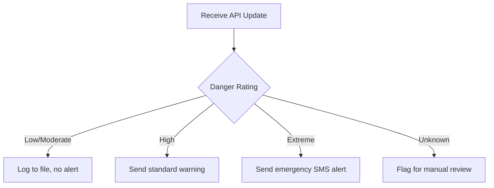

Programs that run the exact same way every time are rarely useful in the real world. A system monitoring the BC Wildfire Service API needs to react differently if the fire danger rating is "Low" versus "Extreme". To do that, the code needs to be able to make decisions. In programming, we call this **control flow**, and we build it using conditional logic.

## Visualizing the Decision

Before writing code, it helps to draw the logic. A flow chart is an excellent tool to map out the branches your program can take. Here is how a simple wildfire alert system might decide whether to send an SMS warning:



Drawing the diagram forces you to account for all possible inputs—including unexpected ones, like an "Unknown" rating from a temporarily unavailable sensor.

## The Python Structure

In Python, we build branches using `if`, `elif` (else if), and `else`. Here is how the diagram above looks in code:

```python
danger_rating = "Extreme"

if danger_rating == "Low" or danger_rating == "Moderate":
    print("Log update. No action needed.")
elif danger_rating == "High":
    print("Warning: Conditions are dry. Standard precautions apply.")
elif danger_rating == "Extreme":
    print("ALERT: Emergency SMS dispatched. Evacuation alert possible.")
else:
    print("Status unknown. Flagging for review.")
```

Notice a few structural requirements:
- The condition (like `danger_rating == "High"`) evaluates to `True` or `False`.
- The line ends with a colon `:`.
- The code that belongs to that branch is **indented**. Python uses this indentation to group code together. When the indentation stops, the branch is over.

## Common Pitfalls

### Assignment vs. Comparison

The single equals sign `=` means "store this value here." The double equals sign `==` means "are these two things equal?" Mixing them up is one of the most common early mistakes.

```python
# WRONG: This will cause a SyntaxError in Python when used in an if-statement
if danger_rating = "High":
    pass

# RIGHT:
if danger_rating == "High":
    pass
```

### Unreachable Branches

Python checks `if` and `elif` conditions from top to bottom. As soon as it finds a `True` condition, it runs that block and **skips the rest**. If you put a broad condition before a specific one, the specific one can never run.

```python
wind_speed_kmh = 95

# WRONG: The order hides the emergency branch
if wind_speed_kmh >= 40:
    print("High winds.")
elif wind_speed_kmh >= 90:
    # This line is unreachable! 95 is already caught by >= 40.
    print("Hurricane-force winds.")

# RIGHT: Most specific/demanding condition first
if wind_speed_kmh >= 90:
    print("Hurricane-force winds.")
elif wind_speed_kmh >= 40:
    print("High winds.")
```

## Flattening Nested Conditionals

Sometimes you need to ask a question inside a question. This is called **nesting**. While legal, too much nesting makes code hard to read.

```python
# Nested version (Harder to read)
if is_summer:
    if region == "Cariboo":
        if precipitation < 10:
            print("High wildfire risk.")
```

You can often flatten these out by combining conditions using `and`:

```python
# Flattened version (Cleaner)
if is_summer and region == "Cariboo" and precipitation < 10:
    print("High wildfire risk.")
```

Flattening your code keeps it closer to the left margin and makes the exact requirements for a branch obvious at a glance.

%%curriculum-start%%
## Curriculum connection

![[K1.8]]
%%curriculum-end%%
