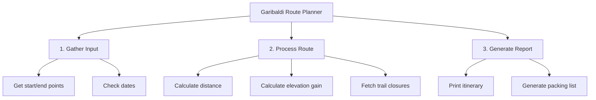

When faced with building a complete hiking route planner for Garibaldi Provincial Park, staring at a blank screen can be paralyzing. The system needs to calculate distances, estimate elevation gain, check current trail closures from BC Parks, and output a packing list based on the weather. 

You cannot write that all at once. The fundamental skill of software engineering is **decomposition**: breaking a massive, impossible problem into smaller, solvable sub-problems.

## Top-Down Design

We start at the highest level of abstraction and work our way down. This is called top-down design. 



By drawing this out, we have transformed one overwhelming task into seven distinct, manageable tasks. You can now assign "Calculate distance" to one team member and "Fetch trail closures" to another.

## Stepwise Refinement

Once you have your sub-problems, you use **stepwise refinement**. This means taking one small box from your diagram and breaking it down into plain English steps before you even touch Python. This is called **pseudocode**.

Let's refine `C2: Calculate elevation gain`:

1.  Find the elevation of the starting point.
2.  Find the elevation of the ending point.
3.  Subtract the start elevation from the end elevation.
4.  If the result is negative, return 0 (it's a net descent).
5.  Otherwise, return the result.

Notice how there is no Python syntax here. Anyone, even a non-programmer, can read this logic and verify if it is correct. 

## Translating to Code

Only when the pseudocode is solid do you translate it into a function. Because you did the thinking up front, the coding is simply translation.

```python
def calculate_elevation_gain(start_elev: int, end_elev: int) -> int:
    """Calculates net elevation gain between two points in meters."""
    gain = end_elev - start_elev
    
    if gain < 0:
        return 0
    else:
        return gain
```

## Why We Do This

Decomposition allows you to build software that is much larger than you can hold in your working memory. By defining what a small piece of code should do (its inputs and outputs), you can build it, test it, and then safely forget exactly *how* it works, trusting it as a building block for the next piece.

%%curriculum-start%%
## Curriculum connection

![[K1.3]]

![[K1.10]]

![[K1.16]]
%%curriculum-end%%
