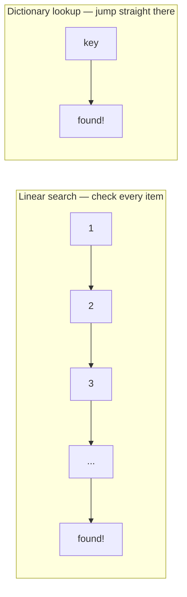

You're looking for one hiker's name, `"R. Okafor"`, in the sign-in sheet
for a Garibaldi Park trailhead. If ten people signed in today, you scan
the list top to bottom and find it in a few seconds, worst case. Now
imagine the same search against BC's entire annual backcountry permit
list — roughly 100,000 names. Scanning top to bottom still works. It just
takes about 10,000 times longer, because on average you have to check
about half the list either way, and the list is 10,000 times bigger.

That's the whole idea this page names. You've already felt it; you just
haven't had a word for it yet.

## Counting the steps, not the seconds

A **linear search** checks each item in a list, one at a time, until it
finds a match or runs out of items:

```python
def find_hiker(sign_in_sheet: list[str], name: str) -> bool:
    for entry in sign_in_sheet:
        if entry == name:
            return True
    return False
```

For a 10-item list, the worst case is 10 comparisons. For a 100,000-item
list, the worst case is 100,000 comparisons — the *number of steps grows
in direct proportion to the size of the list*. Double the list, and you
roughly double the worst-case work. Computer scientists have a compact
name for that relationship: **O(n)**, read "order n," where `n` stands
for however many items you're searching through. It isn't a formula to
memorize so much as a label for a pattern you can already predict:
searching a list gets proportionally slower as the list grows, with
nothing you can do about it short of changing the approach.



## Where you've already met the other side

Earlier in this course, you built lookups with lists — scanning for a
match the way `find_hiker()` does above. Later, you'll meet the
**dictionary**, a data structure built specifically so that looking
something up by its key doesn't require checking every entry — it jumps
almost straight to the answer, in roughly the same handful of steps
whether the dictionary holds ten entries or a hundred thousand. That's
**O(1)**, "order one" — constant time, regardless of `n`.

This is the same trade-off in a different shape: a list is simple and
keeps things in order, but finding one item means checking, on average,
half of them. A dictionary gives up ordering in exchange for near-instant
lookup by key. Neither one is "better" in general — a list is exactly
right when you need order or don't yet know what you're searching for; a
dictionary is exactly right when you'll repeatedly look things up by a
known key, like a hiker's permit number or a trail's name.

## Predicting the effect of a change

Once you can name O(n) and O(1), you can predict what happens to a
program *before* you run it. If a search over a list of trail closures
takes a noticeable pause today with 200 entries, doubling the trail
network to 400 entries should roughly double that pause — that's what
O(n) predicts. If the same lookup were instead backed by a dictionary
keyed on trail name, doubling the number of trails should barely move the
lookup time at all. Being able to make that prediction — and check
whether reality agrees with it — is a genuinely useful skill, well before
you ever need the formal mathematics behind it.

%%curriculum-start%%
## Curriculum connection

![[K1.16]]

![[K1.6]]
%%curriculum-end%%
