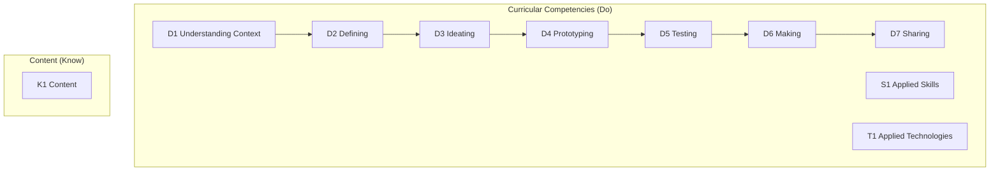

Everything we do in this course points at one or more of these standards,
from **Computer Programming 11**, part of British Columbia's Applied
Design, Skills, and Technologies (ADST) area of learning. Lesson pages
link here so you can always see *why* we are doing something.

> [!info] Where these come from
> The wording below is the Ministry's own. See
> [[About These Standards]] — including a note about the codes.

## Big Ideas

BC's curriculum states these as the through-lines of the whole course,
not as items to check off individually:

> [!quote] Big Ideas
> - The design cycle is an ongoing reflective process. (The Ministry's own
>   glossary note on "design cycle": it includes updating content, tools,
>   and delivery, and the design process can be non-linear.)
> - Personal design choices require self-exploration, collaboration, and
>   evaluation and refinement of skills.
> - Tools and technologies can be adapted for specific purposes.

## Curricular Competencies

### Applied Design

![[D1. Understanding Context]]
![[D1.1]]

![[D2. Defining]]
![[D2.1]]
![[D2.2]]
![[D2.3]]

![[D3. Ideating]]
![[D3.1]]
![[D3.2]]
![[D3.3]]
![[D3.4]]

![[D4. Prototyping]]
![[D4.1]]
![[D4.2]]
![[D4.3]]
![[D4.4]]
![[D4.5]]

![[D5. Testing]]
![[D5.1]]
![[D5.2]]
![[D5.3]]
![[D5.4]]

![[D6. Making]]
![[D6.1]]
![[D6.2]]

![[D7. Sharing]]
![[D7.1]]
![[D7.2]]
![[D7.3]]
![[D7.4]]
![[D7.5]]

### Applied Skills

![[S1. Applied Skills]]
![[S1.1]]
![[S1.2]]

### Applied Technologies

![[T1. Applied Technologies]]
![[T1.1]]
![[T1.2]]
![[T1.3]]
![[T1.4]]

## Content

*The Ministry lists Content as one flat set of items, not grouped into
strands — see [[About These Standards]].*

![[K1. Content]]
![[K1.1]]
![[K1.2]]
![[K1.3]]
![[K1.4]]
![[K1.5]]
![[K1.6]]
![[K1.7]]
![[K1.8]]
![[K1.9]]
![[K1.10]]
![[K1.11]]
![[K1.12]]
![[K1.13]]
![[K1.14]]
![[K1.15]]
![[K1.16]]
![[K1.17]]
