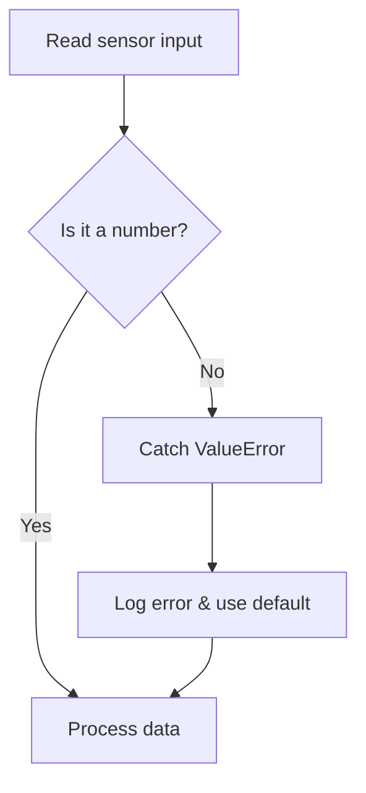

When parsing telemetry data or validating user inputs, things go wrong. Try/except
blocks let your program catch the crash, recover safely, and keep running.



## Reading

1. What happens when this code receives `"12.5"`? What about `"calm"`?
   ```python
   raw_data = input("Wind speed: ")
   try:
       speed = float(raw_data)
       print(f"Speed is {speed}")
   except ValueError:
       print("Invalid sensor reading.")
   ```
2. Why is it dangerous to write a bare `except:` without naming the error (like `except ValueError:`)?
3. What prints if `data` is `[10, 20]` and the code tries to access `data[5]`?
   ```python
   try:
       value = data[5]
       print(value)
   except IndexError:
       print("Data stream incomplete.")
   ```
4. **Trace it.** What does this loop print?
   ```python
   for reading in ["14", "error", "16"]:
       try:
           temp = int(reading)
           print(temp)
       except ValueError:
           print("0")
   ```

## Writing

5. Write a validation loop that keeps asking the user for a BC Ferries route number (an integer) until they type a valid number.
6. Write a function `parse_telemetry(raw_string)` that tries to convert the string to a float. If it succeeds, return the float. If it fails, return `-999.0` (a common missing-data flag).
7. You are reading a dictionary `station = {"temp": 12, "status": "online"}`. Write code that safely tries to print `station["wind"]`. If the key is missing, catch the `KeyError` and print `"Wind data unavailable"`.
8. **Challenge.** Write a function `validate_reading(temp)` that raises a custom `ValueError("Unrealistic temperature")` if the temp is below -50 or above 60.

## Answers

> [!success]- Answer 1
> For `"12.5"`, it prints `Speed is 12.5`. For `"calm"`, `float()` crashes, the `except` block catches it, and it prints `Invalid sensor reading.`

> [!success]- Answer 2
> A bare `except:` catches *everything*, including `KeyboardInterrupt` (when you try to stop the program with Ctrl+C) and syntax errors. It hides bugs because it intercepts crashes you didn't anticipate.

> [!success]- Answer 3
> `Data stream incomplete.` The `IndexError` is caught safely.

> [!success]- Answer 4
> ```
> 14
> 0
> 16
> ```
> The loop continues even after the exception is caught, which is the main advantage of handling errors cleanly.

> [!success]- Answer 5
> ```python
> while True:
>     route = input("Enter route number: ")
>     try:
>         route_num = int(route)
>         break # Exit the loop if successful
>     except ValueError:
>         print("Please enter a valid integer.")
> print(f"Selected route: {route_num}")
> ```

> [!success]- Answer 6
> ```python
> def parse_telemetry(raw_string):
>     try:
>         return float(raw_string)
>     except ValueError:
>         return -999.0
> ```

> [!success]- Answer 7
> ```python
> station = {"temp": 12, "status": "online"}
> try:
>     print(station["wind"])
> except KeyError:
>     print("Wind data unavailable")
> ```

> [!success]- Answer 8
> ```python
> def validate_reading(temp):
>     if temp < -50 or temp > 60:
>         raise ValueError("Unrealistic temperature")
>     return True
> ```
> `raise` is how you *create* an exception when the data is technically the right type (a number) but semantically invalid.

%%curriculum-start%%
## Curriculum connection

![[K1.15]]
%%curriculum-end%%
