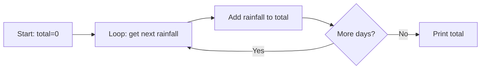

These questions give you practice with loops and accumulators. Every loop needs
a starting state, a continuing condition, and a step that moves it forward.

Here is a visual model of how an accumulator builds up a total:


## Reading

1. What does this loop print?
   ```python
   total_rain = 0
   for day_rain in [12.5, 0.0, 5.2]:
       total_rain = total_rain + day_rain
   print(total_rain)
   ```
2. Trace the value of `count` through this loop. What is printed at the end?
   ```python
   count = 0
   for reading in [15, 22, 18, 9, 21]:
       if reading > 20:
           count = count + 1
   print(count)
   ```
3. What happens if you forget to indent the `total = total + reading` line inside a `for` loop?
4. **Trace it.** What prints when this code runs?
   ```python
   highest = -1
   for wave_height in [2.4, 3.1, 1.8, 4.0, 2.9]:
       if wave_height > highest:
           highest = wave_height
   print(highest)
   ```

## Writing

5. Write a loop that multiplies every number in `[2, 3, 4]` together and prints the final product. Hint: what should your accumulator start at?
6. Write a program that counts how many times the temperature in `temps = [5, -2, -6, 3, 0]` drops below zero.
7. Write a linear search that looks for the value `"Vancouver"` in `cities = ["Victoria", "Nanaimo", "Vancouver", "Kelowna"]` and prints its position. Print `-1` if not found.
8. **Challenge.** Write a loop that finds both the minimum *and* the maximum daily rainfall in a list of readings, without using the built-in `min()` or `max()` functions.

## Answers

> [!success]- Answer 1
> `17.7`. The loop adds `12.5`, then `0.0`, then `5.2` to the `total_rain` accumulator.

> [!success]- Answer 2
> `2`. The `count` increases only when a `reading` is strictly greater than `20`. The values `22` and `21` trigger the `if` statement.

> [!success]- Answer 3
> If `total = total + reading` is not indented, it is not part of the loop. Python will loop over the items doing nothing, and then try to add the very last `reading` to `total` once at the end. Or, if there is no code indented under the `for`, you will get an `IndentationError`.

> [!success]- Answer 4
> `4.0`. The variable `highest` acts as a "king of the hill" accumulator, replacing its value whenever it sees a larger wave height.

> [!success]- Answer 5
> ```python
> product = 1
> for num in [2, 3, 4]:
>     product = product * num
> print(product)
> ```
> The accumulator must start at `1` for multiplication, otherwise the result would always be `0`.

> [!success]- Answer 6
> ```python
> temps = [5, -2, -6, 3, 0]
> freezing_days = 0
> for temp in temps:
>     if temp < 0:
>         freezing_days = freezing_days + 1
> print(freezing_days)
> ```
> `0` is technically not below zero, so we use `<` instead of `<=`.

> [!success]- Answer 7
> ```python
> cities = ["Victoria", "Nanaimo", "Vancouver", "Kelowna"]
> position = -1
> for i in range(len(cities)):
>     if cities[i] == "Vancouver":
>         position = i
> print(position)
> ```
> Looping over indices allows us to record the position `i` when a match is found.

> [!success]- Answer 8
> ```python
> readings = [12.5, 0.0, 5.2, 18.1, 2.0]
> highest = readings[0]
> lowest = readings[0]
> for reading in readings:
>     if reading > highest:
>         highest = reading
>     if reading < lowest:
>         lowest = reading
> print(f"Max: {highest}, Min: {lowest}")
> ```
> Starting the accumulators at `readings[0]` is safer than `0`, especially for the minimum.

%%curriculum-start%%
## Curriculum connection

![[K1.8]]
%%curriculum-end%%
