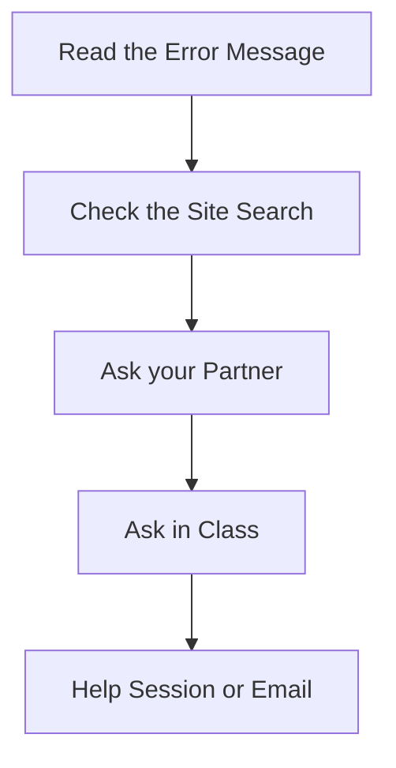

Stuck is a normal working condition in programming, and half this course is learning to be 
stuck *well*. 

## The order to try things in

1. **Read the error message, twice.** It names the line and usually the crime. 
2. **Check the site.** Use the search bar in the top right. The [[Concepts/index|concept pages]] 
   state each idea cleanly, and every practice set folds its worked answers underneath the 
   question.
3. **Ask your partner or your table.** Explaining a problem out loud fixes a startling 
   fraction of it before anyone answers.
4. **Ask me in class.** Build time is exactly what it is for, and no question during build 
   time is an interruption.
5. **Come to a help session or email me.** Times are posted on the board (Schedule: TBD). 
   Bring the specific broken thing — one error message is easy to help with, "my program 
   doesn't work" is not.

> [!tip] Name where it broke
> "It crashes when the user inputs a negative number for the temperature, on line 14" is a 
> bug report a professional would be proud of, and it is already halfway to the fix. 
> Precision is kindness to whoever helps you next.

## Help with the project, not just the code

When you start working on tasks like the Salish Sea Tracker or the Wildfire Dashboard, a 
different kind of stuck shows up: the data format is confusing, or the problem turned out 
to be bigger than you thought. Bring that to me early. It is far easier to renegotiate 
scope in week two than to apologise the day before it's due.
