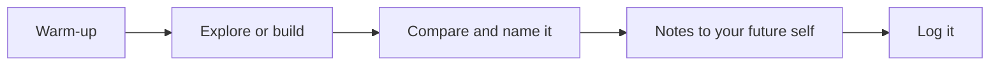

This course is a design workshop, not a traditional lecture. Most days you will build,
break, and repair code — sometimes at a keyboard, sometimes deliberately away from one — 
and concepts get their proper names *after* you have run into the need for them. 

## Warm-up

Five minutes at the door: a [[Predict the Output - Mutating Lists in Place]] on the board, a [[Spot the Off-by-One Bug]] hunt, 
or a [[Algorithmic Transparency and Social Impact]] scenario. Small daily reps compound faster than anything else 
in this course, and they cost almost nothing.

## Explore or build

The heart of the period. Some days start unplugged — you will find out the hard way what a 
computer does with an ambiguous instruction — and most days are at the keyboard, often in 
**pairs**: one person drives with hands on the keys, one navigates with eyes on the plan, 
and you swap on a timer.

The problem almost always arrives before the technique. You will copy a line a hundred 
times before anyone says the word "loop". Being stuck is part of the design, not a sign 
the design failed. We apply design thinking to real BC problems, testing our code against 
situations we might face in our communities.

## Compare and name it

We finish the build by touring what different groups did: different programs that solve 
the same problem, different diagnoses of the same bug. Only then does the idea get its 
clean statement on a [[Concepts/index|concept page]], where you can look it up forever after.

## Notes to your future self

A few sentences and one small example in your own words, written for the version of you 
who opens this months from now having forgotten everything. The concept pages hold the 
full statements; your notes hold what *you* needed.

## Log it

The last minutes of class belong to your [[Learning Journey Log]]: what you built, what broke, 
what you would try next. Every professional developer keeps a version of this. Yours starts 
in week one.

## The thread through all of it

One question runs from the first class to the last: **who is this for?** Every task names a 
user, whether it's predicting BC Wildfire Service conditions or planning a route on a 
Pacific trail. The culminating project is built for a real context. That is not a bonus 
round at the end of the course. It is the reason for the rest of it.

> [!tip] If you were away
> Check the class page, run the warm-up yourself, and attempt the build before reading 
> anything about it. A genuine attempt teaches more than a perfect summary of someone else's.
