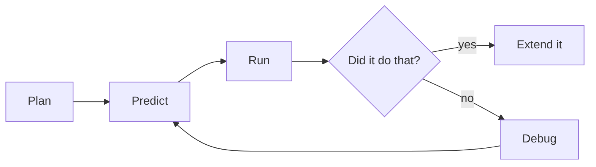
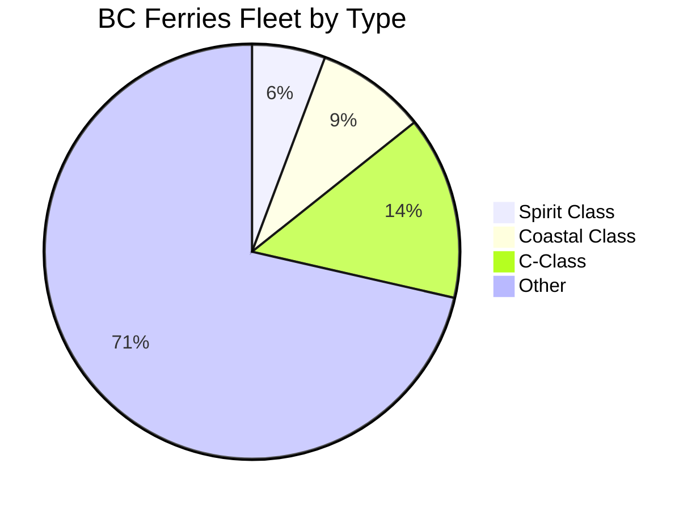

This page exists for two audiences. Students: it explains why the
notes look the way they do. Teachers: it is a working reference for
everything a page can contain, with the source shown for every
example.

Everything below is written in **Markdown** — plain text with a few
marks of punctuation that mean something. If you can write a text
message, you can write this.

---

## Text that carries meaning

You get **bold**, *italic*, ~~struck through~~, and ==highlighted==
text. Highlighting is the one worth knowing: it draws the eye better
than bold when a single ==key term== needs to stand out in a
paragraph.

**How that was made:**

```markdown
**bold**, *italic*, ~~struck through~~, ==highlighted==
```

Arrows written as `->` become real arrows: predict -> run -> compare.

Keyboard keys look like keys: press <kbd>⌘</kbd> + <kbd>K</kbd> to
search.

---

## Code, coloured and exact

This is the feature a programming course lives on — runnable examples
with the spacing and quotation marks preserved, coloured by meaning:

```python
city = input("Which BC city are you in? ")
if city.lower() == "vancouver":
    print("Don't forget your umbrella!")
else:
    print(f"Enjoy the weather in {city}.")
```

Plain blocks with no language named are for things that are not
Python, such as terminal sessions and the tracebacks all over
[[Defensive Programming and Exception Handling]]:

```
Traceback (most recent call last):
  File "/home/student/ferry.py", line 2, in <module>
    passengers = int(answer)
ValueError: invalid literal for int() with base 10: 'two'
```

**How that was made:** three backticks and the language name, the
code, then three backticks to close. Every page in
[[Programs/index|Programs]] is built on this.

---

## Headings, and the table of contents

Every `##` heading becomes an entry in **Navigate this page** on the
right, generated from the headings themselves, so it can never fall
out of step with the page. Short pages read better without it; one
line of frontmatter (`enableToc: false`) turns it off, which every
class page does — an agenda of six items does not need navigating.

---

## Callouts

Callouts lift something out of the flow of the page, each kind with
its own colour and icon:

> [!note] Note
> Neutral information worth setting apart.

> [!tip] Tip
> A shortcut, a habit, or something that makes the work easier.

> [!important] Important
> The one thing to take away if you take away nothing else.

> [!warning] Warning
> Where people usually go wrong — off-by-one traps live in these.

> [!question] Question
> Something to think about rather than something to know.

> [!abstract] At a glance
> Used at the top of task pages for format and timing.

**How that was made:** a blockquote with the kind named in brackets.

```markdown
> [!warning] Where people usually go wrong
> The text of the callout goes here.
```

### Foldable callouts

Add a `-` after the kind and the callout starts collapsed. Every
practice set hides its worked answers this way — try first, and the
answer is always there when you want it:

> [!success]- Answer 1
> The loop runs four times, because `range(4)` stops *before* 4, so
> the program prints 0, 1, 2, 3. If you predicted a 4, you have just
> met the most famous off-by-one in programming.

```markdown
> [!success]- Answer 1
> The hidden solution.
```

---

## Diagrams

Diagrams here are **written, not drawn** — edited in seconds, never
needing a graphics program.



**How that was made:**

````markdown

````

Proportions draw themselves too:



---

## Tables

**How that was made:** rows of text separated by `|`, with a line of
dashes under the headings.

| Kind of error | Happens when | Example message |
| --- | --- | --- |
| Syntax | Python cannot read the file at all | `SyntaxError: '(' was never closed` |
| Name | A name is used before it exists | `NameError: name 'aqhi_index' is not defined` |
| Value | The type is right, the value is not | `ValueError: invalid literal for int() with base 10: 'abc'` |

---

## Mathematics, if a page ever needs it

This course has almost nothing to typeset, but the site handles
mathematics anyway — inline like $E = mc^2$, or given a line of its
own:

$$\text{average wage} = \frac{\text{total of all minimum wages}}{\text{number of provinces}}$$

**How that was made:** single dollar signs keep it inside the
sentence; double ones give it a line to itself.

---

## Checklists

**How that was made:** a list where each line starts with `- [ ]`, or
`- [x]` for something already done.

- [ ] Predicted the output before running it
- [x] Variable names say what they hold
- [ ] Comments explain the why, not the what
- [ ] Somebody who is not me could run this from my instructions

On the site they are read-only — the boxes show what the page says, and
clicking one does nothing. Copied into your own notes, they are how
[[Learning Journey Log]] turns from advice into habit.

---

## Links between pages

This is what makes the site more than a pile of documents.

- A plain link: [[Functions, Parameter Scope, and Pure Decomposition]]
- A link with different words: [[Functions, Parameter Scope, and Pure Decomposition\|naming a chunk of thinking]]
- A link to a section: [[Functions, Parameter Scope, and Pure Decomposition#What the parts are called]]

**How that was made:** double square brackets.

```markdown
[[Functions, Parameter Scope, and Pure Decomposition]]
[[Functions, Parameter Scope, and Pure Decomposition\|different words for the link]]
[[Functions, Parameter Scope, and Pure Decomposition#What the parts are called]]
```

### Transclusion — one page inside another

**How that was made:** `![[Page name]]` — a link with an exclamation
mark in front of it. The page's content appears here, live:

![[Help Sessions]]

Change the source page and every page that embeds it updates. That is
how the class landing page always shows current information without
anybody maintaining three copies of it.

### Backlinks

At the bottom of any page is **Backlinks** — every page that links
*to* this one, gathered automatically. Open [[Functions, Parameter Scope, and Pure Decomposition]] and the
backlinks name every exploration, exercise, and task that leans on it.
Nobody maintains that list.

---

## Hover previews

Hover over [[Help Sessions]] without clicking and the page appears
in a small window. Checking one definition mid-problem does not cost
you your place.

---

## Footnotes

**How that was made:** `[^bug]` where the marker goes, and a matching
`[^bug]:` line anywhere in the page. The label can be any word, and
the note appears at the bottom no matter where you write it.

The word "bug" is older than the computer.[^bug]

---

## Tags

**How that was made:** a `tags` list in the frontmatter at the top of
the page.

```yaml
---
tags:
  - concepts
  - unit-2
---
```

Every tag becomes a page listing everything filed under it.

---

## What you cannot see

Two things on this page are invisible in the browser:

1. **Comments.** Text wrapped in `%%` double percent marks `%%` never
   reaches the site — useful for notes to yourself in a page you are
   still writing.
2. **Holding a page back.** A page with `publish: false` in its
   frontmatter is skipped entirely when the site is built. Write next
   week's lesson today and publish it when you are ready.

%% This sentence is a comment. If you can read it on the website, something is broken. %%

> [!tip] For teachers reading this
> With more than one section, per-section keys such as
> `publishForSection1` and `publishForSection2` let a single shared page
> be published to one class and held back from another — useful when two
> sections sit a few days apart.

---

## The point of all this

None of it is decoration. Each feature removes a reason for a page to
go out of date:

| Feature | The problem it solves |
| --- | --- |
| Coloured code | Screenshots of code nobody can copy or run |
| Transclusion | The same text copied into six places, five of them stale |
| Backlinks | "Where did we use this again?" |
| Folded answers | Solutions that spoil the attempt |
| Holding a page back | Next week's lesson hiding in a file somewhere |

Write it once, link to it everywhere.

[^bug]: Engineers were calling mechanical faults "bugs" in the 1800s.
    The famous computing example came in 1947, when Grace Hopper's
    team taped an actual moth into their logbook after it jammed a
    relay: "first actual case of bug being found".
