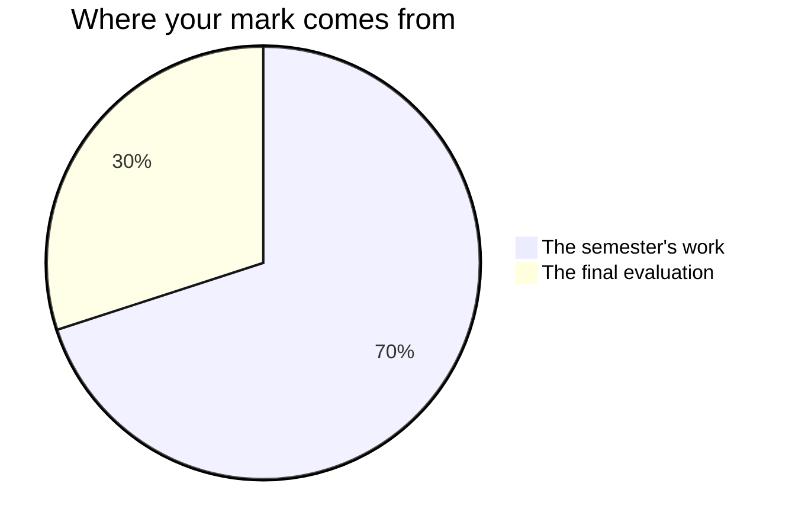

Marks in mathematics worry people, usually because of one misunderstanding:
that you are marked on speed, or on being a "math person". You are not —
no such person exists.[^1] You are marked on **reasoning, growth, and
communication** — things entirely inside your control.

## The seventy and the thirty

Every Grade 11 credit in Ontario is assembled the same way, and this one is
no exception. Seventy per cent of your mark is gathered while the course is
running, and it leans on your **most consistent** level of work and on your
**most recent** work rather than averaging the start of the course flatly
against the end of the course. That is deliberate: a course is a thing you
get better at, and the mark is supposed to describe the mathematician who
walks out at the end of the course, not the one who walked in. The last
thirty per cent is a final evaluation at the end.

**The seventy** is the four tasks you hand in during the semester —
[[The Transformation Gallery]], [[Double or Nothing]],
[[The Tide Problem]] and [[Your Financial Future]] — together with the
milestone entry you write in class on each of those four days. They do not
weigh the same. [[Your Financial Future]] carries the most: it runs across
five working periods, it is yours from first page to last, and it asks for
three separate pieces of mathematics pointed at one real decision.
[[The Tide Problem]] is the narrowest — one data set, one model, one
prediction — and counts for least. Ask me for the exact split any time you
want it; it is not a secret, it is just a poor thing to carry around in
your head.

A task's evidence is not only the thing you hand in. What you tell me at
its conference belongs to that task, and so does what I watch you do in
its working periods — three sources, one mark, as below. There is no
separate line anywhere in this course for turning up or joining in.

**The thirty** is two things, in two rooms that could not be less alike:
[[The Functions Symposium]], where you stand beside your own model and
defend it to people who did not take this course, and the
[[Final Examination]], written alone on paper. The examination is the
larger of the two. Two rooms on purpose, so that neither one afternoon nor
one exhibit decides this by itself.

Every one of those four tasks has a conference with me inside a working
period, and at least one working period afterwards whose first job is
whatever the conference asked for. On [[The Tide Problem]] that is the
first twenty minutes of the following class rather than a whole period,
because the trigonometry unit is short and I would rather tell you that
than pretend otherwise.

## Four kinds of thinking, not one

Every task asks for more than one of these, and which one leads changes
with the task. The final number is never the whole of it.

| What is being judged | What it means here |
| --- | --- |
| What you know | Notation, vocabulary, what a form of an equation tells you at a glance |
| How you think | Choosing a method, conjecturing, proving, deciding whether an answer deserves belief |
| How you communicate | Graphs, captions, notation, the written argument, and saying it out loud |
| Where you apply it | Getting the mathematics onto a situation nobody worked through for you first |

The fourth is why every task in this course is set in the world rather
than on a worksheet. Anyone can fit the curve they were shown; the course
is asking whether you can find the function inside a cooling mug, a tide
table, or a loan somebody in your family is about to sign.

## Three kinds of evidence, and two of them are not paper

**What you make** is the obvious one: galleries, data stories, models,
plans, milestone journal entries. **What I watch you do** is the second —
how a piece of mathematics gets built, which is a different thing from how
it ends up looking, and the only place some of it is ever visible.
**What you tell me** is the third, and the conferences on task working
days are not a progress check: they are evidence in their own right, and
some of what you understand will only ever appear there.

Board work is group work. When the boards are being used for a task, what
I watch you do on that task is evidence for it, judged against the same
expectations the task hands in against. The rest of the time — and that is
most of the time — the boards are for learning, and nothing that happens
at them is a mark. Either way, there
is never a score for taking part. If you are quiet and your page is
unfinished, the conference is often where the strongest evidence of the
day comes from. That is not a consolation prize. It is how the mark is
built to work.

## What is not in your mark

**Practice is not marked.** The check-your-understanding questions, the
practice sets, the work you do between classes: none of it is collected
for a mark. It is there so that you, rather than a piece of paper, are the
first to know where you stand.

**The unit checkpoints are not marked either.** At the close of each of
the first three units you write one alone, mark your own, and leave with a
revision list. (The fourth unit ends in the review classes instead.)
A judgement you make about your own work is never part of your mark — that
is Ontario policy, not a house rule, and it is also the thing that makes
those days safe to be honest on. Your classmates' judgements are not part
of it either, which is why trading pages and attacking each other's
reasoning costs nobody anything.

**Your [[Math Journal]] is read, not scored.** It comes in at the end of
each unit, I read every page and I write back. The only entries that are
part of a mark are the four written **in class** — ten minutes set aside on
each task's hand-in day — and those belong to their task, not to the
journal. What you write at home between classes is yours, and so is
[[Final Reflection]] — the piece of writing in this course I most want to
read and least want to put a number on. It is worth writing, and
[[Showing Growth]] explains why it becomes the best evidence you own; it
is not something I mark.

**Number talks carry no line of their own.** Asking the question half the
room needed is how this course runs, and it is not a category in your
percentage.

**How you work is reported separately**, on the same report card, as
**E, G, S or N** — six habits: responsibility, organization, independent
work, collaboration, initiative, and self-regulation. They matter, we will
talk about them, and they do not move your percentage. How often you
volunteer at the boards and how tidy your binder is belong in that column
and nowhere else.

There is one exception, and it is narrower than it looks. Of the seven
mathematical processes this course is built on — see [[Learning Goals]] —
one of them is a habit that the curriculum then defines in detail:
*reflecting on and monitoring your thinking*, which it spells out as
judging whether a result is reasonable and verifying your own solutions.
That is not self-regulation smuggled back into the mark. It is an
expectation, and it is where the trust boundary in [[Double or Nothing]],
the measured miss in [[The Tide Problem]], the two-way check in
[[Your Financial Future]], and the failure boundary at
[[The Functions Symposium]] each come from. Where a task asks for it, it
is marked like anything else in the curriculum.

**Work done in pairs and threes gets an individual mark, never a shared
one.** Every task page that puts you with somebody else names the piece
that is evaluated as yours alone — the trust sentence you signed, the
letter-paragraphs you wrote, the panel with your name on it, and what you
said when I asked you about it.

> [!important] First attempts are never penalised
> Rough work, wrong turns, and revised answers are how mathematics
> actually gets done. The mark follows where your understanding ends up
> and how visibly you got there — [[Showing Your Thinking]] is most of
> the discipline, and a model whose every parameter you can defend
> outranks a perfect fit you cannot explain. That standard is
> [[What Makes a Model Good]], and every task applies it.

Each task page lists its success criteria before you start, phrased as
things an observer could see in your work. [[Judging Your Own Work]] is
how to use them while there is still time to act on what you find. If a
mark ever surprises you, ask — those criteria are the whole story, and
[[Getting Help]] lists the ways to reach me.

[^1]: Decades of research find no "math brain" — only differences in
    preparation, confidence, and how safe people feel making mistakes.
    That last one is why [[Our Classroom Norms]] exist.
