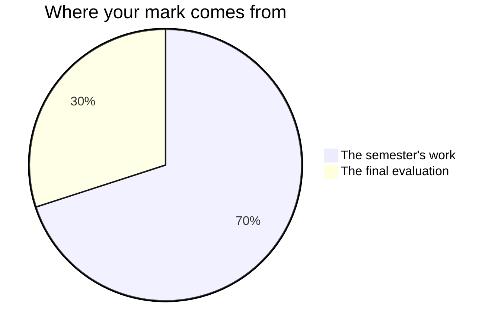

Marks in mathematics worry people, usually because of one misunderstanding:
that you are marked on speed, or on being a "math person". You are not —
no such person exists.[^1] You are marked on **reasoning, growth, and
communication** — things entirely inside your control. That does not
change in the last mathematics course of high school, and it will not
change in the first one of university.

## The seventy and the thirty

Ontario builds every Grade 12 credit to the same shape, and this one is
no exception. Seventy per cent of the mark is gathered while the course
runs, weighted towards the work that is **most recent** and towards the
level you reach **most consistently** — not averaged flatly from
the first class to the last, which would hold the first fortnight of limits
against you for five months. That is what "growth" means once it is
inside a mark: the later evidence counts for more, because it is the
truer picture of what you can now do. The last thirty per cent is a
final evaluation, at the end.

**The seventy** is the four unit tasks, in the order you meet them:
[[The Speed Camera]], [[Smooth Landing]], [[The Packaging Brief]], and
[[The Flight Path]]. They do not weigh the same — the flight path runs
longest and asks for two acts of mathematics at once, and the speed
camera is the shortest because it is the rehearsal that makes the other
three possible. The precise numbers are yours for the asking, any time;
they are just a poor thing to carry around in your head, and a worse
thing to plan your semester by.

**The thirty** is two things, in two very different rooms:
[[The Math Symposium]], where you explain four units of thinking to
strangers, and the [[Final Examination]], written alone on paper. The
examination is the larger of the two. Two rooms, deliberately, so that
neither one afternoon nor one conversation decides this alone.

## Four kinds of thinking, not one

Every task asks for more than one of these, and the balance shifts with
the task. A right answer is never the whole of it.

| What is being judged | What it means here |
| --- | --- |
| What you know | Notation, definitions, the rules — and which one this is |
| How you think | Choosing a method, building a model, testing a critical point instead of assuming it |
| How you communicate | The diagram, the write-up, the units in the last sentence, the defence out loud |
| Where you apply it | Mathematics in a situation nobody worked through with you first |

The fourth is why every task is set somewhere real — a ticket, a descent,
a package, a runway. Anyone can repeat the problem the room solved
together; the course is asking whether you can build the model when the
situation is new and nobody has drawn it for you.

## Three kinds of evidence, and two of them are not paper

**What you make** is the obvious one: write-ups, tables, sketches,
models. **What I watch you do** is the second: whether you draw before
you compute, whether you go back to the picture when the algebra turns
strange, how you attack a problem you have not been shown. **What you
tell me** is the third — the conference in the middle of every unit
task, and the defences on the due days, are not progress checks. They
are evidence in their own right, and some of what you understand will
only ever show up there.

If you are quiet and your write-up is unfinished, the conference is often
where the strongest evidence of the day comes from. That is not a
consolation. It is how the mark is meant to work.

## Worked with a partner, marked as yourself

Every task except the [[Final Examination]] is worked with a partner, and
the page your pair hands in is shared. Your mark is not. Two pieces of
the evidence are yours alone, and they are the ones I lean on when the
two of you have handed in one page:

- **The note you write in class at the close of the task** — in your
  [[Math Journal]], the entry that says what your evidence or your model
  could not settle, and what that cost. I set it in the period, not as
  homework, because it is part of the task's mark.
- **The question I put to you**, and not to your partner. On three of the
  four unit tasks that happens when your pair defends on the due day; on
  [[The Flight Path]], which lands at the symposium rather than on a
  defence day of its own, it happens at the conference in the middle.

At [[The Math Symposium]] the same rule holds: the two-minute tour you
give me before the doors open, and your own written answers to the two
questions every station faces.

## What is not in your mark

**Practice is not marked.** The check-your-understanding questions, the
practice sets, the work you do between classes — none of it is collected
for a mark. It exists so that you, and not a test, are the first to know
where you stand.

**The unit checkpoints are not marked either.** You write them alone, you
mark them yourself, and you leave with a revision list the timetable
makes room for: the top item opens the next class in the first three
units, and in the last one the review classes begin with them. A
judgement you make about your own work is never part of your mark — that
is Ontario policy, and it is also what makes it safe to be honest on
those days. Your classmates' judgements are not part of it either, which
is why trading work and challenging a step costs nobody anything.

**Your [[Math Journal]] is read, not scored.** I read every volume and I
write back. [[Final Reflection]] is the piece of writing in this course I
most want to read and least want to put a number on. The only entries
that are part of a mark are the four I set in class, one at the close of
each unit task — what the data could not settle, what the model left
out — and those belong to their task.

**How you work is reported separately**, on the same report card, as
**E, G, S or N** — six habits: responsibility, organization, independent
work, collaboration, initiative, and self-regulation. They matter, we
will talk about them, and they do not move your percentage. How often you
volunteer at the boards and how tidy your binder is belong in that column
and nowhere else.

The one exception is narrow, and it is a real one. Among the seven
mathematical processes this course is built on — see [[Learning Goals]] —
one of them is a habit: *reflecting on and monitoring your thinking*, and
the curriculum spells out what it means by that, including judging
whether your own result is reasonable and verifying your own solutions.
That is not self-regulation borrowed back into the mark. It is an
expectation, it is named in the curriculum, and where a task asks for it
— testing a critical point rather than assuming it, substituting a
touchdown point back into the plane — it is marked like anything else in
the curriculum.

> [!important] First attempts are never penalised
> Rough work, wrong turns, and revised answers are how mathematics
> actually gets done. The mark follows where your understanding ends up
> and how visibly you got there.

Each task page lists its success criteria before you start, phrased as
things an observer could see in your work. [[Judging Your Own Work]] is
how to use them while there is still time to act on what you find. If a
mark ever surprises you, ask — those criteria are the whole story, and
[[Getting Help]] lists the ways to reach me.

[^1]: Decades of research find no "math brain" — only differences in
    preparation, confidence, and how safe people feel making mistakes.
    That last one is why [[Our Classroom Norms]] exist.
